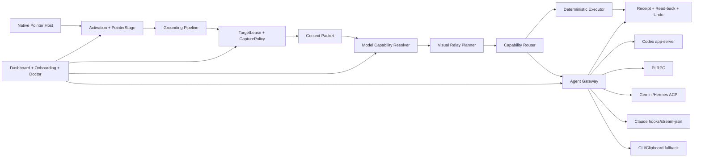

# Magic Pointer 产品生态重构：调研结论与详细实施规划

日期：2026-07-27
性质：研究、架构与实施交接，不代表本轮已实现
执行对象：后续 Terra 单 Agent

## 0. 一句话定义

Magic Pointer 不是另一个聊天框、快捷键启动器或固定 Recipe 菜单，而是一个跨 Windows/macOS、跨应用、跨模型、跨 Agent 的“指针意图与可信执行层”：

> 用户晃动鼠标唤醒，指向屏幕上的真实对象并说一句短话；系统冻结目标、恢复结构、按接收模型能力组织上下文，直接交给用户已在使用的 Agent 或确定性执行器，并对写回结果进行确认、回读、审计与撤销。

产品最短闭环固定为：

`Wiggle → Point → Speak/Type → Freeze Object → Resolve Context → Route → Confirm if risky → Execute/Handoff → Verify → Receipt`

## 1. 调研后的产品判断

### 1.1 Google 已经证明的不是“气泡”，而是四个交互原则

Google DeepMind 官方把 AI Pointer 总结为：

1. Maintain the flow：能力来到用户正在工作的应用，不把用户拖进另一个 AI 窗口。
2. Show and tell：指针位置承担上下文，用户不再手写长 Prompt。
3. This/That：自然语言中的“这个、那个、这里”由手势和共享屏幕语境消歧。
4. Turn pixels into actionable entities：把像素恢复成日期、地点、对象、段落、表格等可操作实体。

Google 官方同时说明：网页中的指向询问开始进入 Gemini in Chrome；更完整的 Magic Pointer 将随 Googlebook 推出。因此它不是“只存在于研究视频”，但其完整系统级形态仍主要绑定 Google 产品与新硬件。Magic Pointer 的机会不是否认 Google，而是把这一工作流做成 Windows/macOS、任意硬件、任意模型和任意 Agent 都能使用的中立层。

来源：

- [Google DeepMind：Reimagining the mouse pointer for the AI era](https://deepmind.google/blog/ai-pointer/)
- [Google：Introducing Googlebook](https://blog.google/products-and-platforms/platforms/android/meet-googlebook/)

### 1.2 Microsoft 已在做相邻方向，但形态并不等于本产品

Microsoft 当前有三条相关产品线：

- Click to Do：在 Copilot+ PC 屏幕上识别文字/图片并给出上下文动作，支持 Win+Click、Win+Q、Snipping Tool 等入口；已有摘要、改写、图片处理，并扩展到 Excel、Word、Teams。
- Copilot Vision：用户主动共享一个或多个应用窗口，Copilot 分析屏幕并用 Highlights 指示用户点击位置。
- Windows App Actions / Agent Launchers：应用注册强类型动作和 Agent 入口，让系统或其他应用发现并调用。

这证明“屏幕对象 → 上下文动作 → 跨应用交付”是平台级方向。但它们仍受 Windows、Copilot+ 硬件、微软账户/产品和规定入口约束。Magic Pointer 的差异必须是：

- Windows 10/11 与 macOS，而非仅 Copilot+ PC；
- 晃动鼠标和指向语音作为主入口，而非组合键和菜单；
- 任意 API、本地模型、文本模型与现有 Coding Agent；
- 不只给出动作建议，而是保留目标租约、隐私边界、任务状态、回读验证和撤销；
- 用户已有 Agent 会话优先，不再制造一个新的 Magic Pointer 聊天工作台。

来源：

- [Microsoft：Click to Do 一般可用性与能力](https://blogs.windows.com/windowsexperience/2025/04/25/copilot-pcs-are-the-most-performant-windows-pcs-ever-built-now-with-more-ai-features-that-empower-you-every-day/)
- [Microsoft：Click to Do 的 Excel、Word、Teams 扩展](https://blogs.windows.com/windowsexperience/2025/05/06/introducing-a-new-generation-of-windows-experiences/)
- [Microsoft：Copilot Vision Highlights](https://blogs.windows.com/windows-insider/2025/05/12/copilot-on-windows-windows-insiders-can-now-use-vision-with-2-apps-and-new-highlights-feature-with-1-app/)
- [Microsoft：Agent Launchers](https://learn.microsoft.com/en-us/windows/ai/agent-launchers/)

### 1.3 Agent 接入不能继续把 MCP 当主干

MCP 适合工具兼容，不适合承担“把一个实时指针对象送进正在运行的 Agent 会话”的全部职责。主路径应按以下顺序选择：

1. Agent 原生长连接/会话协议；
2. ACP 或官方 app-server/RPC；
3. Agent hooks，把当前对象注入用户下一条真实消息；
4. 结构化 CLI 的 JSON/JSONL 会话；
5. 明示的剪贴板交付；
6. MCP 仅作兼容入口和能力发现。

本机已经提供可利用的正式接口：

- Codex：`app-server`、`exec --json`、hooks；
- Pi：JSONL RPC、extension；
- Gemini CLI：`--acp`、hooks、stream-json；
- Claude Code：hooks、stream-json、resume；
- Hermes：ACP；
- Copilot CLI：ACP 为公开预览。

ACP 采用 JSON-RPC，专门连接 Agent 与客户端，支持会话、流式内容、工具调用和 diff，适合把 Magic Pointer 做成 Agent 客户端而非 MCP 工具堆。

来源：

- [Agent Client Protocol](https://agentclientprotocol.com/get-started/introduction)
- [Gemini CLI ACP mode](https://github.com/google-gemini/gemini-cli/blob/main/docs/cli/acp-mode.md)
- [Hermes ACP](https://github.com/NousResearch/hermes-agent/blob/main/website/docs/user-guide/features/acp.md)
- [GitHub Copilot CLI ACP](https://docs.github.com/en/enterprise-cloud@latest/copilot/reference/copilot-cli-reference/acp-server)

### 1.4 开源项目应“拿成熟结构”，不是把别人的整套产品塞进来

| 参考 | 可以复用 | 不应复用 |
|---|---|---|
| AionUi，Apache-2.0 | 多 Provider 配置思路、CLI 自动发现、ACP 后端、模型/工作区分层 | 整套聊天工作台、无边界的 YOLO 模式、全部前端依赖 |
| Hermes，MIT，本地 `D:\AI_Agents\HermesAgent` | manifest 驱动的逐项初始化、doctor、明确的 running/succeeded/skipped/failed、flat not boxed、tokens over literals | React UI 整体搬运、与 Magic Pointer 无关的 Agent 功能 |
| `emilkowalski/skills` 的 apple-design，MIT | 即时按下反馈、连续可中断动画、空间对称、透明材质层级、减少动态/透明度适配 | 苹果商标与视觉资产、为“像苹果”而增加装饰 |
| FrameCue | “选中图片/区域 → 可复用视觉 Prompt”、自定义视觉 API 的用户路径 | 未发现开放源码，不复制代码或资产 |
| RapidOCR / Whisper / Pi | 当前已固定版本并有许可证记录，可继续使用 | 不重复造 OCR、STT、Agent loop |

来源：

- [AionUi](https://github.com/iOfficeAI/AionUi)
- [Hermes Agent](https://github.com/NousResearch/hermes-agent)
- [Apple design skill source](https://github.com/emilkowalski/skills)
- [FrameCue Chrome listing](https://chromewebstore.google.com/detail/framecue/ominnoofpoiipbbghbclcgdondgpehba)

## 2. 当前仓库审计

### 2.1 应保留的底座

- `WiggleDetector`、激活门控和鼠标主入口；
- `TargetLease`、Capture Policy、Context Packet v2；
- 有界 Capability Search、签名 Operation Plan；
- Task Store、真实状态、审计、Artifact Registry；
- Pi/Claude/Gemini/Codex 已有连接器与 hooks；
- RapidOCR、Whisper、本地语音桥；
- Windows UIA/截图桥、现有 macOS pointer host 接口；
- Calendar、Route、Shopping List 等已经存在的确定性写入闭环。

这些是产品资产，不重写。

### 2.2 必须重构的部分

| 当前部分 | 问题 | 目标 |
|---|---|---|
| `app/ai_client.py` | 环境变量/文本 secrets 单模型；文本与视觉调用写死；不知道模型能力 | 模型档案、能力解析、凭据引用、统一 Runtime Client |
| `AgentSettings.profiles` | 无类型字典 | 明确定义 Agent Session Profile 和 Model Profile |
| `app/fabric/providers.py` | 只探测可执行文件和版本；协议声明静态 | 健康检查、协议协商、活跃会话、能力真值 |
| `app/fabric/agents.py` | 大多是一发即走的 CLI argv | Agent Gateway 与长连接 Session Adapter |
| `electron/main.js` | 1518 行且窗口、语音、桥、设置混在一起 | 只做编排；逐步抽出 credential、preflight、stage controller、agent session |
| `stage.css/js` | 深色重气泡、宽度估算、结果卡和 chips 过多、错误远离指针 | 轻量、随指针、单气泡、连续状态机 |
| `dashboard.*` | 工业控制台、编号导航、卡片嵌套、没有首次启动与模型配置 | 完整设置应用与逐项体检 |
| Windows 文本 secrets | 明文、配置不可管理 | 平台加密凭据库，仅保存引用 |

### 2.3 应退出主路径的内容

- `panel/reader/result` 旧浮层：从热路径删除；确认无引用后再删文件。
- `stage-chips`：语音主路径彻底禁用；点击空闲建议默认关闭，只作为以后实验开关。
- Windows `Win+H` 脚本：仅保留兼容诊断，不作为默认输入。
- 深色网格、DIN/Consolas 控制台风格、导航编号、所有大写状态词：从 Dashboard 视觉系统移除。
- 通过 `secrets/openai_key.txt` 配置主模型：保留一次迁移读取，迁移后不再写入。
- 未连接 Provider 的假按钮、假结果和“部分完成”能力：不显示在普通用户能力页。

## 3. 不可更改的产品合同

1. 默认不可见；只有晃动唤醒后出现界面。
2. 晃动鼠标是主入口；快捷键只作可配置的无障碍/故障备用。
3. Voice/Text 模式在 Dashboard 预设，临时气泡不出现模式切换。
4. 语音路径始终只有一个随转写增长的气泡，不出现菜单、模型选择器、Agent 下拉框和 chips。
5. 指针语义必须冻结成对象与 Target Lease；不能执行时再读取“当前焦点”代替。
6. 截图、OCR、截图上传是三个不同权限。
7. `accepted/queued/running` 永不显示为“完成”；完成必须有目标表面回读或明确的外部终态。
8. 对已有 Agent 会话交付优先；Magic Pointer 不与 Codex/Claude/Gemini/Pi 争夺工作台。
9. 文本模型和视觉模型都能工作，但收到的上下文不同。
10. 任何外部动作、发送、预约、写回都走同一个权限、审计、确认、验证合同。

## 4. 目标架构



### 4.1 新增模块边界

| 文件 | 单一职责 |
|---|---|
| `app/models/profiles.py` | ModelProfile 数据结构、验证与迁移 |
| `app/models/catalog.py` | 有日期和证据的模型能力目录 |
| `app/models/capability_resolver.py` | 目录、Provider 元数据、显式探测和人工覆盖的合并 |
| `app/models/visual_relay.py` | 为视觉/文本模型生成不同上下文 |
| `app/models/runtime_client.py` | 接收运行时凭据和 Profile，统一文本/视觉调用 |
| `app/fabric/agent_gateway.py` | 会话发现、附着、发送、流式事件、steer/cancel |
| `app/fabric/acp_client.py` | 官方 ACP SDK 的薄封装 |
| `app/fabric/preflight.py` | 首次启动和 Diagnostics 共用的逐项检查 |
| `electron/credential_store.js` | Electron `safeStorage` 加密/解密，设置只保存引用 |
| `electron/bootstrap_runner.js` | manifest 驱动的检查、事件、重试和完成标记 |
| `electron/renderer/tokens.css` | Dashboard 与 PointerStage 共用的设计 token |
| `electron/renderer/ui_primitives.css` | Button、Field、ListRow、StatusRow、Notice、Switch |
| `data/model_capabilities.v1.json` | 可版本化模型能力目录 |
| `data/preflight_manifest.v1.json` | 首次启动/Doctor 阶段定义 |

不引入 React，不迁移整套前端，不为简单状态机增加 GSAP。当前 Electron + 原生 DOM + CSS/WAAPI 足够，而且更容易保持 overlay 轻量。

## 5. N06：模型感知的视觉转述

### 5.1 纠正后的需求

Dashboard 已经知道用户配置的 API、Provider 和模型。系统应先判断目标模型是否能原生接收图片：

- 能接收图片：发送经过隐私策略允许的局部截图/标注图，只补充很短的文本定位，避免重复描述整幅图。
- 不能接收图片：不附图，生成完整结构化视觉转述，让文本模型也能可靠引用对象。
- 能力未知：不得假设“能看图”；默认走文本转述，并在 Dashboard 提供一次显式能力测试或人工覆盖。

### 5.2 ModelProfileV1

```json
{
  "schemaVersion": 1,
  "id": "primary",
  "displayName": "工作模型",
  "provider": "openai-compatible",
  "baseUrl": "https://example/v1",
  "model": "model-id",
  "apiMode": "chat-completions",
  "credentialRef": "credential:model:primary",
  "enabled": true,
  "overrides": {
    "visionInput": "auto",
    "audioInput": "auto",
    "toolCalls": "auto"
  },
  "resolved": {
    "visionInput": "yes",
    "source": "catalog",
    "evidence": "provider/model family entry",
    "checkedAt": "ISO-8601"
  }
}
```

能力必须是 `yes/no/unknown` 三态，不使用普通布尔值掩盖未知状态。能力优先级：

`manual override > successful explicit probe > provider metadata > dated local catalog > unknown`

自定义 Base URL 不能仅凭模型名字判定为 `yes`。一次 1×1 测试图探测可能产生费用，只有用户点击“测试模型”时执行，并显示结果与时间。

### 5.3 凭据处理

1. Renderer 只把用户输入的 key 通过 context-isolated IPC 发送给 main。
2. Main 使用 Electron `safeStorage.encryptString()` 保存到用户数据目录的独立二进制文件。
3. `fabric-settings.json` 只保存 `credentialRef`，不保存 key。
4. Python 调用时，main 将解密结果作为该次 bridge 的 stdin 字段传入；禁止放在 argv、日志、审计和环境快照中。
5. bridge 在解析后立即从可序列化 payload 中删除 credential；所有异常统一脱敏。
6. `safeStorage.isEncryptionAvailable()` 为 false 时，Dashboard 明确显示不可安全保存，只允许“本次会话使用”。

### 5.4 VisualRelayV1

```json
{
  "schemaVersion": 1,
  "mode": "direct_visual",
  "target": {
    "objectId": "screen-1",
    "kind": "ui-control",
    "label": "Save",
    "bbox": [812, 124, 884, 158],
    "app": "code.exe",
    "windowTitle": "Settings"
  },
  "grounding": {
    "ocr": "Save",
    "role": "button",
    "hierarchy": ["Settings", "Model profile", "Actions"],
    "locatorHints": ["role=button", "name=Save"]
  },
  "appearance": {
    "foreground": "#1266D4",
    "background": "#FFFFFF",
    "shape": "rounded-rectangle"
  },
  "spatial": {
    "relativeToPointer": "under-pointer",
    "neighbors": ["Cancel is 12px left"]
  },
  "uncertainty": [],
  "provenance": ["UIA", "RapidOCR"],
  "attachments": ["allowed-local-crop.png"]
}
```

`VisualRelayPlanner` 决策表：

| 模型视觉能力 | Capture Policy | 输出 |
|---|---|---|
| yes | 允许上传截图 | 局部截图/标注图 + 2–5 行轻量定位 |
| yes | 仅本地截图/OCR | 不附图；结构化转述，并说明视觉附件被策略阻止 |
| no | 任意允许结构读取 | 完整 VisualRelayV1 文本化，不附图 |
| unknown | 任意 | 按 no 处理；Dashboard 显示“能力未确认” |
| 任意 | deny | 规划失败 `capture_policy_denied` |

视觉模型的轻量转述仅包含：对象名称、指针关系、来源应用、必要 OCR 和用户意图，不重复整屏场景。文本模型转述必须包含：OCR、层级/role、相对位置、颜色/形状、相邻对象、不确定性和来源。

禁止为了让一个文本模型“看懂”而暗中调用另一个云端视觉模型。只有用户单独配置 Visual Relay Provider 且隐私策略允许时才可这样做。

### 5.5 Bridge 操作

在 `scripts/fabric_bridge.py` 增加：

- `models.list`
- `models.inspect`
- `models.save`
- `models.delete`
- `models.test`
- `models.set_default`
- `visual_relay.plan`

每个操作返回 `ok/state/error/evidence`，模型测试不得只返回字符串。

## 6. Agent Gateway 的实施规格

### 6.1 统一接口

```python
class AgentAdapter(Protocol):
    def discover(self) -> AgentAvailability: ...
    def healthcheck(self) -> HealthResult: ...
    def list_sessions(self, cwd: str) -> list[AgentSession]: ...
    def start_or_attach(self, request: AgentRequest) -> AgentSession: ...
    def send(self, session: AgentSession, packet: ContextPacket) -> str: ...
    def steer(self, session: AgentSession, text: str) -> None: ...
    def cancel(self, session: AgentSession) -> CancelResult: ...
    def events(self, session: AgentSession) -> Iterator[AgentEvent]: ...
```

统一事件：

`session_started / prompt_accepted / text_delta / tool_started / permission_required / artifact / completed / failed / cancelled`

只有 `completed` 且 Provider 提供终态，或 Magic Pointer 对目标表面回读成功，才能生成成功 Receipt。

### 6.2 Provider 顺序

| Provider | 第一协议 | 第二协议 | 最后回退 |
|---|---|---|---|
| Codex | app-server | `exec --json` | clipboard |
| Pi | JSONL RPC + extension | print JSON | clipboard |
| Gemini CLI | ACP | hook / stream-json | clipboard |
| Hermes | ACP | structured CLI | clipboard |
| Claude Code | hook + active session / stream-json | print stream-json + resume | clipboard |
| GitHub Copilot CLI | ACP（若本机版本支持） | structured CLI | clipboard |
| OpenCode/Cursor | 官方 plugin/http/stream-json | structured CLI | clipboard |

MCP 只暴露 `current_object`、`capabilities.search`、`plan/execute` 等兼容工具，不作为向所有 Agent 注入全部 Recipe 的路径。

### 6.3 用户设置

Dashboard 的“模型与 Agent”页应让用户设置：

- 默认 Agent；
- 默认交付模式：`active_session / managed_session / clipboard`；
- 每个 Agent 的 cwd 匹配规则；
- 是否允许自动附着到当前项目会话；
- read/write 默认权限；
- 图片附件策略；
- 会话健康状态、协议、版本、最后测试时间；
- “测试连接”按钮和真实结果。

普通用户不需要看到 `RPC/ACP/JSONL` 术语；展开“技术详情”才显示。

## 7. 首次启动、Dashboard 与 Doctor

### 7.1 信息架构

左栏只保留：

1. 概览
2. 唤醒
3. 模型与 Agent
4. 能力
5. 隐私
6. 活动
7. 诊断

“Recipes”改名为“能力”；只展示当前环境可用、可实际完成的能力。Connector、协议、原始日志放在高级区。

### 7.2 PreflightStage

每一项检查统一返回：

```json
{
  "id": "microphone",
  "title": "麦克风与本地听写",
  "state": "pass",
  "blocking": true,
  "evidence": "device=..., whisperModel=...",
  "fixAction": "request_permission",
  "retryable": true,
  "durationMs": 83
}
```

状态固定为：

`pending / running / pass / warn / fail / skipped / needs_user`

manifest 顺序：

1. Runtime：Node、Python、Electron、可写用户目录；
2. OS Permissions：Accessibility/UIA、Screen Capture、Microphone；
3. Pointer Host：鼠标采样、晃动校准；
4. Voice：音频设备、Whisper 模型、一次本地短录音；
5. Grounding：UIA/AX、RapidOCR、局部截图；
6. Agents：本机 Agent 探测、版本、协议；
7. Model Profile：API/本地模型与能力；
8. Privacy：默认捕获、敏感应用；
9. End-to-end smoke：不执行外部副作用的指向 → 转写 → Context Packet。

初始化与 Diagnostics 调用同一组 check 函数；前者是引导 UI，后者是可重跑的检查页。只在所有 blocking 项通过或用户明确跳过允许跳过的项后写 `onboarding.json` 完成标记。

### 7.3 Dashboard 视觉规则

- 使用系统字体：Windows `Segoe UI Variable`，macOS `SF Pro` 系统回退；
- 去除网格背景、编号导航、大写等宽状态词和卡片迷宫；
- 内容以列表行、分组标题和留白组织；不嵌套卡片；
- 间距：4/8/12/16/24/32；
- 圆角：8 控件、12 面板、16 浮层；
- 正文 14–15px，次要 12–13px，页面标题 28–30px；
- 单一蓝色强调，只用于 active/focus/progress；
- 支持 `system/light/dark`；
- Windows Mica/macOS vibrancy 仅作可用时增强，必须有纯色回退；
- Direct manipulation 先更新视图，再持久化；失败时回滚并给出行内错误；
- Escape 一次只取消一个当前层级。

## 8. PointerStage 像素与行为规格

### 8.1 状态机

`hidden → awakening → listening|typing → resolving → accepted|completed|error → dismissing`

- 新一次唤醒可以中断旧动画，从当前几何状态继续；
- `accepted` 只表示已交给 Agent，文字必须是“已交付，正在运行”；
- 只有需要立即确认的风险动作才展开确认面；
- 详细结果、日志、Artifacts 默认进入 Dashboard Activity，不占据指针旁边。

### 8.2 气泡

- Surface：`rgba(252,253,255,.94)`；
- Border：`1px rgba(38,115,235,.30)`；
- 主文字/图标：`#1266D4`，错误使用克制的红色文字和浅色底；
- 高度：40–44px；
- 圆角：20–22px；
- voice idle：38–40px 圆；
- padding：左右 12–14px；
- 字号：13–14px，medium；
- 最大宽度：440px；
- 阴影：一层中性投影 + 一层极弱蓝色环境光；
- 位置：以当前指针为锚，优先 `(x+18, y-18)`，碰撞时选择最近可见象限，屏幕边缘保留 12px；
- 宽度：Canvas `measureText()` + 图标/内边距计算，不使用 `chars * 9`；
- voice 转写更新同一个文本节点或按词组更新，不生成数百个逐字 span；
- processing 复用同一气泡，只把声纹变成小进度形态；
- no-speech、权限错误等保持指针附近最多两行，不出现屏幕底部巨型红条；
- 无常驻 close/send/mic 按钮；
- voice 流永不出现 chips。

### 8.3 动画

- 按下反馈在当前帧；
- 气泡展开 160–220ms；
- 状态变形 180–260ms；
- 退出 120–180ms；
- 使用可中断 WAAPI/CSS 动画，从 presentation state 继续；
- `prefers-reduced-motion` 下只做 opacity/极短尺寸变化；
- `prefers-reduced-transparency` 或高对比模式使用不透明 surface 和清晰边框；
- 动画不延迟真实状态。

### 8.4 视觉验收证据

必须保存以下状态截图，统一真实 Electron 运行路径，不使用另一套 preview CSS：

1. hidden；
2. awakening small dot；
3. voice partial transcript；
4. long transcript near max width；
5. processing；
6. accepted/running；
7. compact error；
8. confirmation；
9. completed；
10. 四角和多显示器边缘定位。

与 `演示7.webm`–`演示10.webm` 的接触表逐帧核对：默认不可见、同一气泡渐进增长、processing 复用、无工具栏。

## 9. 20 个真实黄金工作流

这些是验收场景，不是 20 个按钮。能力页只在所需 Provider 可用时显示。每个场景必须通过真实对象、真实 Agent/目标应用和真实 Receipt 验收。

| ID | 场景 | 必须交付的真实结果 |
|---|---|---|
| G01 | 指向终端错误，说“让当前 Agent 修这个” | 当前 cwd/branch/diff/终端摘录/目标对象进入已打开的 Agent 会话 |
| G02 | 指向应用 UI 缺陷，说“按这里修” | bbox、OCR、窗口来源和局部图进入 Coding Agent，不要求用户找三个文件 |
| G03 | A/B/C 多对象比较 | 三个冻结对象不串位，Agent 收到标签和空间关系 |
| G04 | 视觉模型接收现场 | 合规局部图 + 轻量定位，不重复整屏 OCR |
| G05 | 文本模型接收现场 | 无图的完整 VisualRelayV1，模型能引用具体控件 |
| G06 | 指向文件/文件夹交给 Agent | 真实路径、repo 状态和当前会话绑定，不复制长 Prompt |
| G07 | 选中文字改写并写回 | 显示 diff，确认后写回原选择，回读一致 |
| G08 | 选中文字翻译并写回 | 语言自动/手动设置生效，原格式尽量保留，可撤销 |
| G09 | PDF 段落摘要到邮件草稿 | PDF 页码/选区保留，生成草稿而非声称发送 |
| G10 | PDF/截图公式转 LaTeX | 输出可编辑 LaTeX，复制后可在目标编辑器粘贴 |
| G11 | 屏幕表格转 CSV/XLSX | 行列网格保留，写入前显示预览和低置信单元格 |
| G12 | 图表局部转结构数据 | 输出数据表、单位和不确定点；无法可靠恢复时拒绝伪造 |
| G13 | 指向图片生成可复用图像 Prompt | 输出主体、构图、材质、光线、镜头、负面约束和来源区域 |
| G14 | 指向日期/时间创建日历草稿 | 日期实体解析、冲突提示、确认后真实写入并回读 |
| G15 | 指向地址/地点规划路线 | HERE/THAT 消歧，生成真实路线草稿或打开可验证地图结果 |
| G16 | 手写便签/截图生成购物清单 | OCR 后结构化、去重、用户确认后写入本地清单 |
| G17 | 指向邮箱地址创建邮件/会议草稿 | 识别收件人和上下文；只创建草稿，发送需二次确认 |
| G18 | 暂停视频指向餐厅/地点 | 局部帧识别，给出地点候选与可验证链接，不能假装已预订 |
| G19 | 指向两张图说“把这个放进那里” | 生成带对象 A/B、位置、遮挡和比例的编辑请求，交给图像 Agent |
| G20 | 选中文本朗读/解释 | 不离开当前应用；TTS 可停止，解释结果贴近指针 |

建议继续作为第二批但仍共用底座：消息转任务、跨应用工单更新、表格行转 CRM 草稿、批量文件命名、图像局部无障碍描述、屏幕对象搜索本地历史。

### 9.1 “完成”的计数规则

- 只有真实目标应用/Agent 上通过才计数；
- 仅生成 JSON、单测通过、显示按钮、排队成功均不计数；
- 缺 API、账号或平台硬件时，能力必须隐藏或显示明确不可用，不能用 mock 计数；
- Windows 通过不等于 macOS 通过；
- 无法可靠恢复的内容应输出不确定性或拒绝，不得补写看似合理的数据。

## 10. 实施里程碑

### M0：保护现场与建立基线

1. 读取本文件、现有需求/实现文档和视频分析。
2. 记录 `git status`、现有未提交文件、当前测试结果。
3. 明确保护 `PROGRESS_20260726_NIGHT2.md`，不修改、不删除、不覆盖。
4. 不回滚现有用户改动，不执行 `reset --hard`、`checkout --`。
5. 生成一次当前 Dashboard/Stage 截图作为 before。

完成证据：基线日志、测试失败清单、before 截图。

### M1：先建立合同与测试

1. 写 ModelProfileV1、VisualRelayV1、AgentEvent、PreflightStage 数据结构和迁移测试。
2. 给 Python/Electron settings 建立同一 fixture，防止两套验证漂移。
3. 写能力三态、凭据不落盘、Capture Policy 矩阵测试。
4. 写 Agent Gateway adapter contract 测试。
5. 写 Stage 状态和锚点算法测试。

完成证据：新增测试先失败，接口签名固定。

### M2：模型能力与 N06

1. 实现 `app/models/*`。
2. 把 `ai_client.py` 改为兼容 façade，旧调用逐步迁移到 Runtime Client。
3. 实现 safeStorage credential store 和旧 secrets 一次迁移。
4. 增加 bridge operations。
5. Dashboard 增加模型 Profile 列表、编辑、测试、默认模型。
6. Context Packet 接入 VisualRelayPlanner。

完成证据：yes/no/unknown、视觉允许/禁止、文本模型、凭据脱敏的端到端测试。

### M3：Agent Gateway

1. 抽象 Adapter 与 Session/Event。
2. 先完成 Pi RPC、Codex app-server、Gemini ACP 三条长连接。
3. 接上 Claude hook/stream-json 与 Hermes ACP。
4. Provider discovery 增加协议健康检查和活跃会话。
5. Dashboard 支持默认 Agent、交付模式和真实测试。
6. 保留现有 one-shot CLI 为回退，不删除直至回归通过。

完成证据：同一 Context Packet 分别进入至少 Pi、Codex、Gemini 的真实会话；状态可追踪。

### M4：Preflight、Dashboard 与设计系统

1. 添加共享 tokens/primitives。
2. 实现 preflight manifest、runner、marker、retry。
3. 重构 Dashboard IA 和视觉，不改变后端真值。
4. 加入主题、激活方式、模型/Agent、隐私、Activity、Diagnostics。
5. 删除普通界面中的开发者术语和不可用假能力。

完成证据：首次启动从 0 到 ready 的逐项状态；失败项可重试且日志可展开。

### M5：PointerStage 重构

1. 先重写锚点/碰撞和尺寸计算。
2. 再实现单气泡状态机和可中断动画。
3. 移除语音 chips、旧结果面和大错误条。
4. 统一 preview 与 production stylesheet。
5. 接入真实 partial/final transcript 和 Agent 状态。

完成证据：10 张状态截图、视频对照、真实晃动 → 本地语音 → Agent accepted/complete。

### M6：黄金工作流

按共享底座优先完成：

1. G01–G06 Agent handoff；
2. G07–G10 文本/PDF；
3. G11–G13 结构恢复；
4. G14–G20 普通用户跨应用场景。

每完成一项，在 `data/runtime/golden-flows/<id>/` 保存：

- 输入来源说明；
- 脱敏 Context Packet；
- UI 截图；
- Receipt；
- 目标应用回读；
- 失败/边界用例。

### M7：平台与发布门

Windows：

- 普通 Windows 10/11；
- Copilot+ 不是硬要求；
- 安装包、升级、权限、双屏、125/150/200% DPI；
- 签名后的 smoke。

macOS：

- Intel 与 Apple Silicon；
- Accessibility、Screen Recording、Microphone；
- AXUIElement、坐标翻转、多显示器；
- 签名、公证、权限重启；
- 不具备实机就不得声称完成。

## 11. 测试文件清单

新增：

- `tests/model_profile_test.py`
- `tests/model_capability_resolver_test.py`
- `tests/visual_relay_test.py`
- `tests/model_runtime_client_test.py`
- `tests/credential_redaction_test.js`
- `tests/agent_gateway_test.py`
- `tests/acp_client_test.py`
- `tests/preflight_test.py`
- `tests/bootstrap_runner_test.js`
- `tests/stage_anchor_test.js`
- `tests/stage_visual_contract_test.js`
- `tests/dashboard_model_profiles_static_test.js`
- `tests/golden_flow_contract_test.py`

必须保持：

```powershell
npm test
python -m pytest -q --basetemp .tmp/pytest-terra
python scripts/smoke_fabric.py
```

此外运行真实桌面 smoke：

1. 晃动鼠标唤醒；
2. Voice partial 实时增长；
3. 指向真实终端/UI/PDF；
4. 分别交给视觉模型、文本模型、Pi/Codex/Gemini；
5. 切换目标窗口验证 lease 拒绝；
6. 禁止截图上传验证零附件；
7. queued/running 不显示完成；
8. 完成后目标表面回读。

## 12. No-Ship Gate

任一项存在就不得称为成品：

- 主入口仍依赖快捷键；
- 气泡仍远离指针或出现工具栏/chips；
- Voice/Text 仍在临时 UI 里切换；
- Dashboard 仍是网格控制台和嵌套卡片；
- API key 出现在 settings、argv、日志、审计或异常；
- 未知模型被默认当成视觉模型；
- Capture Policy 关闭后仍有截图路径进入 Agent；
- Agent 只是排队却显示完成；
- 用户仍要手动找文件才能让 Coding Agent理解现场；
- 20 个黄金场景只用 mock/JSON 验收；
- Windows 的通过被宣传为 macOS 已完成；
- 旧 panel/reader/result 仍在生产热路径；
- UI preview 与真实应用使用不同样式；
- 外部 Provider 未连接却显示可用能力。

## 13. Terra 最终交付格式

Terra 完成实施后必须提交：

1. 修改文件清单与保留/删除理由；
2. 20 个黄金场景状态表，只允许 `verified / blocked`；
3. 自动测试命令与完整结果；
4. Windows 实机证据路径；
5. macOS 实机证据或明确 blocker；
6. Dashboard、Onboarding、PointerStage 关键截图；
7. 模型能力矩阵和 Agent 协议矩阵；
8. 尚未完成的内容，不得使用“部分完成”掩盖；
9. 一段 60 秒 CEO 汇报。
