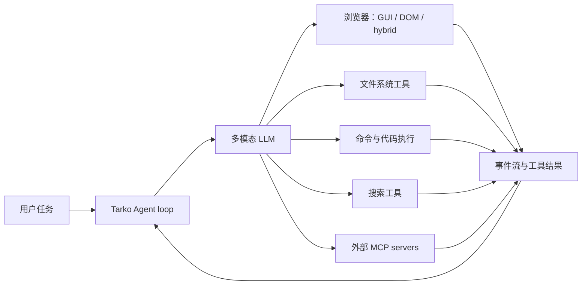

# UI-TARS、Codex Computer Use 与 Magic Pointer 的源码比较

> 日期：2026-08-14
>
> 结论状态：基于本地源码逐文件抽查与 OpenAI 当前官方文档形成的架构判断；不是跑分报告，也不代表已经把 UI-TARS 接入 Magic Pointer。

## 1. 先说结论

Magic Pointer **没有被完全取代**，但它原来最容易被理解的那层卖点——“AI 能看屏幕、点击、输入并跨应用完成任务”——已经迅速变成平台通用能力。UI-TARS Desktop、Agent TARS 和 ChatGPT/Codex Computer Use 都能覆盖这类宽泛叙述。如果 Magic Pointer 最终只是“圈一下，再让一个通用 GUI Agent 接管电脑”，用户确实没有充分理由安装和切换。

Magic Pointer 仍然有成立空间，前提是坚持自己真正不同的工作单元：

1. 用户不是先写一段模糊 Prompt，让 Agent 在整个桌面寻找对象；用户用手势直接完成指代，把“这个、这段、这里、这几个对象”编译成结构化任务上下文。
2. 手势结束的瞬间先冻结用户实际看到的历史像素，后续 UIA、DOM、OCR、模型和浮层不能偷换观察时刻。
3. 一个很小的手势裁剪不是唯一证据；本地目标表面的完整证据、窗口身份、结构化语义和像素证据并发融合。
4. 写入不沿用旧截图坐标；ActionLease 在动作前重新确认窗口、对象、内容和状态版本仍然匹配。
5. 产品主战场是几秒到几分钟、通常几轮完成的日常短任务，而不是与 Codex、Claude Code、Agent TARS 正面对打长时间项目执行。
6. Codex、UI-TARS、Claude Code、Pi 等可以成为 Magic Pointer 的可插拔执行后端或交付目标，而不必都成为竞争对手。

因此，正确方向不是再复制一套 UI-TARS Desktop，而是把 UI-TARS/Codex Computer Use 当作“通用计算机操作能力插件”，接到 Magic Pointer 的手势编译、冻结证据和确定性动作安全层之后。

## 2. 本次取得的源码

为了避免污染 Magic Pointer 仓库，两个官方仓库都放在 `D:\AI_Agents`：

| 仓库 | 本地路径 | 当前 clone 提交 | 规模 | 许可证 |
|---|---|---:|---:|---|
| `bytedance/UI-TARS-desktop` | `D:\AI_Agents\UI-TARS-desktop` | `c2ad42e3eb9b27830db41a3e6f51ca7179d9b168` | 2,491 个文件 | Apache-2.0 |
| `bytedance/UI-TARS` | `D:\AI_Agents\UI-TARS` | `582f3a7ea5d285ee8ed9e2e84048d1ab01453c49` | 28 个文件 | Apache-2.0 |

这里必须先纠正一个容易混淆的叫法：现在大家口中的“UI-TARS”至少包含三个不同层次。

### 2.1 UI-TARS 模型仓库

`D:\AI_Agents\UI-TARS` 主要是模型研究与最小推理配套，不是完整 Harness。它包含论文、模型 Prompt、坐标处理和 action parser：

- `codes/ui_tars/prompt.py` 定义 desktop/mobile 的点击、拖动、热键、输入、滚动、等待和完成动作空间。
- `codes/ui_tars/action_parser.py` 把模型文本动作解析为结构化动作，并把模型图像空间的绝对坐标换算回原始屏幕的相对坐标。
- `README_coordinates.md` 说明图像 resize 后的坐标如何映射回原图。

本质上，它回答的是：“给定当前截图和动作历史，模型下一步想点哪里、输入什么？”它不负责完整会话持久化、插件生命周期、工具权限、目标租约、桌面应用分发等 Harness 问题。

### 2.2 UI-TARS Desktop

`D:\AI_Agents\UI-TARS-desktop\apps\ui-tars` 与 `packages\ui-tars` 是原生 GUI Agent 桌面产品及 SDK。它围绕 UI-TARS/Seed 视觉模型执行本地或远程 computer/browser operator。

### 2.3 Agent TARS

同一个 monorepo 后来又发展出 `multimodal\agent-tars` 和通用框架 `multimodal\tarko`。这才是更接近完整 Agent Harness 的部分：有 LLM 循环、命令、文件、搜索、浏览器、MCP、事件流、服务端会话、CLI/Web UI 和隔离 AIO sandbox。

把 UI-TARS Desktop 的纯截图点击能力和 Agent TARS 的完整工具栈混在一起，会高估“GUI 模型单独完成复杂项目”的能力。

## 3. UI-TARS Desktop 到底怎么运行

核心循环在 `packages/ui-tars/sdk/src/GUIAgent.ts`：

1. 每轮检查暂停、停止、abort 和最大循环数。
2. 调用 operator 截取当前屏幕。
3. 把截图加入 conversation；只保留有限数量的历史图像。
4. 调视觉模型，解析 `Thought + Action`。
5. 顺序执行这一轮解析出的动作。
6. 遇到 `finished`、`call_user`、环境错误或循环上限时退出，否则重新截图进入下一轮。

当前源码事实：

- 默认最大循环数是 100：`packages/ui-tars/shared/src/constants/vlm.ts:6`。
- 默认最多保留 5 张历史截图：同文件第 7 行以及 `packages/ui-tars/sdk/src/utils.ts:58-87`。
- 连续截图异常另有 10 次错误上限：`packages/ui-tars/sdk/src/constants.ts:9`。
- 模型没有动作时不会自然形成可靠的语义停滞判断；主要兜底仍是次数、错误和显式 `finished/call_user`。
- operator 通过 `nut-js` 实际控制鼠标、键盘、剪贴板：`packages/ui-tars/operators/nut-js/src/index.ts`。
- 点击坐标取模型预测框中心，再按屏幕尺寸换算：`packages/ui-tars/sdk/src/utils.ts:29-55`。

它是一条很直接的 GUI Agent 线路：

```text
当前屏幕截图 -> 视觉模型 -> 坐标/键盘动作 -> 操作系统 -> 新截图 -> 重复
```

这条线路的优点是通用：只要人能看见并点击，它理论上就能尝试。缺点也来自同一点：定位依赖当前画面和视觉预测，执行一步后界面可能变化；复杂、长链任务会累积误差和延迟。

### 3.1 它与 Magic Pointer 的 FrameLease 不同

UI-TARS 每一轮截图是“Agent 此刻看到什么”，服务于下一步动作。Magic Pointer 的 FrameLease 是“用户完成手势时看到了什么”的不可变历史事实。二者不是同一概念：

- UI-TARS 的截图循环适合主动探索和持续控制。
- FrameLease 适合保存用户指代发生时的语义，防止浮层、切屏、动画或稍后的结构化读取把用户原本圈中的内容换掉。

Magic Pointer 最合理的组合方式是：首轮上下文由 FrameLease 和本地融合证据确定；如果任务随后需要开放式探索，再把 UI-TARS/Codex operator 作为工具唤醒。

### 3.2 安全边界

在本次审阅到的 UI-TARS Desktop 核心动作路径里，系统级权限主要是屏幕录制与 Accessibility 权限；未看到与 Magic Pointer ActionLease 等价的“动作前重新校验同一目标、同一内容、同一状态版本”的确定性协议。应用提供暂停、终止、`call_user` 和部分确认 UI，但这不等于每个有副作用动作都做对象身份重验。

这不是说 UI-TARS 完全没有安全措施，而是说其核心 operator 的抽象重点是“把预测动作执行出来”，不是“证明此刻仍在操作用户刚才授权的那个对象”。

## 4. Agent TARS 为什么能做复杂任务

Agent TARS 的能力不是来自连续点击本身，而是来自完整工具组合：



### 4.1 通用循环

Tarko 的 `Agent` 默认 `maxIterations` 是 1000（`multimodal/tarko/agent/src/agent/agent.ts:90`）。`loop-executor.ts` 在每轮调用模型，若最新 assistant message 没有 tool calls，就把它视为 final answer；上层 hook 还可以拒绝结束并要求继续。耗尽循环才返回通用 max-iterations 错误。

这比 UI-TARS Desktop 的视觉操作循环更通用，但它仍主要依靠模型自然完成和一个很大的硬上限。本次审阅没有在核心 loop 中发现 Magic Pointer 当前新增的重复失败、重复读同一证据、重复同值写入、无新信息循环等语义停滞检测。

这也再次证明：把最大轮数从 6 改成 100、1000 或无限都不是解决空转。正确做法是正常任务让模型自然结束，真正重复时根据语义和工具结果识别 `stalled`，最后才保留极高的 invariant fuse 防代码失控。

### 4.2 工具执行

`multimodal/tarko/agent/src/agent/runner/tool-processor.ts` 会发出 tool-call 事件、调用 before/after/error hooks，再顺序执行模型返回的工具调用。异常会转成 tool result 返回给模型。当前主路径是顺序 `for`，不是 DSH 那种有界并行调度与模型顺序提交。

### 4.3 Hybrid browser

Agent TARS 真正值得吸收的一点是 browser strategy：

- GUI grounding 负责视觉界面、canvas、复杂控件等 DOM 难以处理的目标。
- DOM/MCP 工具负责表单、结构化元素、链接、tab 和脚本读取。
- hybrid 模式同时注册 GUI Agent 和 DOM 工具，由上层模型按情况选择。

源码位置：

- `multimodal/agent-tars/core/src/environments/local/browser/browser-control-strategies/browser-hybrid-strategy.ts`
- `browser-visual-grounding-strategy.ts`
- `browser-dom-strategy.ts`

这一思路与 Magic Pointer 的并发证据融合方向一致，但 Agent TARS 主要是在“有哪些操作工具可选”的层面混合；Magic Pointer 还必须解决“用户手势发生时的历史证据、指代对象和动作前身份校验”。

### 4.4 MCP 内核

Agent TARS 内置四类 MCP server：`browser | filesystem | commands | search`。Tarko MCPAgent 也能连接外部 MCP server，读取工具 schema，把工具包装到统一 registry，再将调用转发给 MCP client。

这解释了为什么它能做图表、网站、资料分析等复杂任务：模型不是靠鼠标逐像素完成所有工作，而是能读写文件、运行命令、调用专用服务，只在需要时使用浏览器或视觉操作。

### 4.5 事件流和持久化

Tarko 的 Event Stream 是重要的可观测性和上下文基础：assistant、tool call、tool result、system 等事件都进入同一流，Web UI 可以据此渲染和调试。Agent Server 可以把事件保存到 JSON、SQLite 或 MongoDB，并在恢复 session 时把历史事件重新注入 Agent。

不过需要精确区分：

- Agent 内存事件处理器默认最多 1000 项并自动裁掉最旧事件：`multimodal/tarko/agent/src/agent/event-stream.ts:14-17, 58-79`。
- 服务端确实逐事件持久化并按时间/id 恢复：`multimodal/tarko/agent-server/src/core/AgentSession.ts:112-126, 159-170` 与 `storage/SQLiteStorageProvider.ts`。
- 在本次审阅的底层里，没有看到 DSH/Magic Pointer 当前采用的 hash chain、损坏检测/修复、模型可见投影必须来源于持久日志等更强不变式。

所以它有“事件流 + 会话持久化”，但不能直接等同于强事件溯源状态机。

### 4.6 安全与批准

Agent TARS prompt 会建议敏感操作时让用户接管，文件工具也有过滤，AIO sandbox 可提供隔离环境。但在本次审阅的 Tarko tool processor、MCPAgent 和 Agent TARS core 路径中，没有看到统一的 effect type、risk class、ActionLease、动作前状态版本重验或每个有副作用工具的确定性批准协议。甚至主 prompt 对 shell 明确鼓励使用 `-y/-f` 避免命令确认。

这说明它的默认设计更偏“让 Agent 尽量完成任务”，Magic Pointer 不能把 MCP 工具原样进口后直接暴露给模型；必须先经过 capability policy、权限、风险分级、目标租约和回执验证。

## 5. Codex/ChatGPT Computer Use 到底是什么

### 5.1 Computer Use 不是完整产品架构

OpenAI 的 Computer Use API 是一个模型与执行环境之间的协议：模型查看截图，返回 click/type/scroll 等 UI action；开发者自己的 harness 执行动作，再送回新截图，循环到模型不再请求 computer call。官方同时允许 custom harness 混合视觉与程序化 UI 控制。

这与 UI-TARS Desktop 的基本循环属于同一类问题：

```text
截图 -> 模型动作 -> harness 执行 -> 新截图 -> 下一轮
```

区别主要在模型、动作协议、平台产品集成、安全策略和周边工具生态，而不是出现了完全不同的 Agent 定律。

OpenAI 官方文档当前明确建议隔离浏览器/VM、限制域名和动作，并对购买、登录、破坏性操作和难回退行为保留人工确认。

来源：

- [OpenAI Computer use guide](https://developers.openai.com/api/docs/guides/tools-computer-use)
- [ChatGPT desktop Computer Use use case](https://learn.chatgpt.com/use-cases/use-your-computer-with-codex)

### 5.2 ChatGPT/Codex 桌面产品

当前官方产品说明是：ChatGPT 桌面端可在 macOS 或 Windows 应用、窗口和本地文件之间完成一个有范围的任务，过程中有 permission prompts，最后结果供用户复核；页面标注的典型时间范围是 5 分钟。登录态网页任务使用单独的 Chrome 能力。

它与 Magic Pointer 的产品边界已经明显重叠：都是桌面、本地文件、跨应用、几分钟任务。不能再以“我们能跨应用点击”作为不可替代价值。

### 5.3 MCP 是什么，不是什么

MCP 是模型发现并调用外部结构化工具/数据源的协议。OpenAI Responses API 可以连接 connector 或 remote MCP server，列出工具、筛选允许的工具，并要求或跳过显式批准。

MCP **不是视觉模型，也不是桌面点击器**。它不会自动理解剪辑软件的时间线。只有当某个 MCP server 暴露了诸如“导入素材、切片、加字幕、渲染”之类的工具，或者 Agent 同时拥有 shell/API/文件能力时，模型才能通过结构化调用完成这些操作。

来源：[OpenAI MCP and Connectors guide](https://developers.openai.com/api/docs/guides/tools-connectors-mcp)

## 6. “Codex 通过 MCP 自动剪视频”应怎样理解

这件事在工程上完全可能，但不能理解成 Codex 自带一个对任何剪辑软件都可靠的万能按钮。

一条真正可靠的自动剪辑链更可能是：

1. 文件工具读取素材和项目目录。
2. 音视频工具或命令（例如 ffmpeg、转录器、场景检测器）解析素材。
3. 模型生成剪辑决策、字幕、配乐和版式计划。
4. 专用 MCP/API/脚本直接操作时间线或项目文件；没有专用接口时才退回 Computer Use 点击 GUI。
5. 渲染后再用媒体分析工具检查时长、黑帧、音轨、字幕和编码参数。
6. 失败结果回到同一 Agent loop 修正。

因此，复杂度来自“Agent loop + 文件 + shell/代码 + 专用工具/MCP + 浏览器/Computer Use + 验证”的组合。GUI 点击通常是最脆弱的一层；有结构化接口时，应优先结构化接口。

我没有在本次查阅的 OpenAI 官方 Computer Use/MCP 文档中找到“内置通用视频剪辑器”的承诺。把视频项目做出来是对其可组合工具能力的合理推论，具体可靠性取决于所连接的编辑器、MCP server、CLI/API、素材和验证链。

## 7. 五方差异表

| 维度 | UI-TARS 模型 | UI-TARS Desktop | Agent TARS | Codex/ChatGPT Computer Use | Magic Pointer 应有位置 |
|---|---|---|---|---|---|
| 核心输入 | 截图 + 指令 + 历史 | 当前截图 + 任务 | Prompt + 多模态上下文 + 工具 | 截图/桌面任务 + 平台工具 | 用户手势 + 冻结目标表面 + 本地证据 |
| 主要能力 | 预测 GUI 动作 | 执行 GUI 动作循环 | 通用多工具 Agent Harness | 平台级 Computer Use 与工具编排 | 交互编译与可靠短任务执行 |
| 目标定位 | 视觉坐标 | 视觉坐标 | GUI 或 DOM/工具 | 视觉/自定义 harness/平台集成 | 手势指代 + 多证据对象解析 |
| 状态真相 | 模型上下文 | 轮次截图历史 | Event Stream + server storage | Responses/产品会话 | FrameLease + evidence provenance + session log |
| 写入安全 | 不负责 | 暂停/停止/系统权限为主 | prompt takeover、过滤、sandbox 为主 | 官方要求审批和隔离 | ActionLease + precondition + approval + receipt |
| 工具扩展 | action parser | operator | MCP + registry | MCP/connectors/function tools | 作用域插件 + CapabilityBroker + 风险包装 |
| 任务长度 | 单步预测 | 多步 GUI 任务 | 可很长，默认 1000 fuse | 典型桌面范围约 5 分钟 | 通常几轮/几分钟的短任务 |
| 最强点 | GUI grounding 模型 | 通用视觉操作 | 多模态工具编排 | 顶级模型与平台生态 | 指代精度、时序真相、低摩擦与动作确定性 |

## 8. Magic Pointer 哪些部分已经被平台商品化

以下能力不能再单独当护城河：

- 截图给视觉模型看。
- 模型输出鼠标键盘动作。
- 跨桌面应用点击和输入。
- 一个聊天框发起桌面任务。
- 接 MCP server 后调用外部工具。
- 保存一串 assistant/tool 事件供 UI 展示。
- 用一个很大的 max loop 让 Agent 长时间尝试。

如果我们的成品主要是这些，Codex/ChatGPT、Agent TARS、UI-TARS Desktop 乃至未来系统级助手会自然覆盖它。

## 9. Magic Pointer 仍然可能不可替代的部分

### 9.1 指代先于推理

通用 Computer Use 的困难通常是：用户说“把刚才那一段改短”，Agent 还要先找到“哪一段”。Magic Pointer 的手势能把用户已经完成的视觉选择直接编译为对象引用，减少一轮搜索，也减少找错目标的概率。

### 9.2 历史像素而不是晚到截图

用户圈完以后浮层出现、页面滚动、动画变化、窗口切走，通用截图 Agent 看到的是后来状态。FrameLease 保存的是指代发生时的状态。这是对“这个”到底指什么的产品级回答，而不是单纯提升 OCR 精度。

### 9.3 证据融合而不是只看一张图

UIA/DOM/COM、OCR、局部像素、完整目标表面、窗口与进程身份可以互相校验。视觉 Agent 擅长兜底未知界面，结构化接口擅长稳定读取和写入；两者应并发形成证据，而不是按顺序找到第一个非空结果就停止。

### 9.4 写入目标不漂移

历史证据可以继续用于理解，但执行时必须重新取得 ActionLease。这个“理解基于过去、动作基于现在”的分离，是短任务中非常现实的安全价值。

### 9.5 极短入口

打开 Codex/ChatGPT、描述应用和对象、让 Agent 寻找目标，本身有切换成本。Magic Pointer 的价值是人在现有工作流里已经看见对象时，几乎不离开当前注意力就触发任务。它不是在能力总量上胜过 Codex，而是在意图采集和首轮上下文质量上减少摩擦。

## 10. 真正的替代风险

不能因为上述差异就乐观地说“不会被取代”。用户只看体验：

- 如果手势后仍然经常识别错对象，冻结证据没有可感知价值。
- 如果简单任务耗时远高于直接复制到 ChatGPT，入口优势不存在。
- 如果 ActionLease 经常误拦截，用户会觉得系统笨。
- 如果插件、会话、DraftArtifact 和执行器没有形成完整闭环，架构优势只是文档。
- 如果通用平台允许用户在任意应用直接圈选并自动取得同等级别的历史证据与对象身份，Magic Pointer 的窗口会进一步缩小。

所以判断不是“有无竞争”，而是：我们必须把通用 Agent 平台不愿为一个细分交互投入的时序真相、指代编译、表面适配和低延迟做到明显更好，然后把平台能力反过来接进来。

## 11. 应吸收 UI-TARS/Agent TARS 的哪些代码和设计

### 11.1 值得吸收

1. **Computer operator 插件**：复用 Apache-2.0 的 action schema、坐标换算和 operator 实现，但必须放在 SurfaceAdapter/Capability/ActionLease 后面。
2. **浏览器 hybrid strategy**：同时提供视觉 grounding 与 DOM 工具，不强迫所有页面只走一种方式。
3. **MCP 工具导入器**：读取 server tools、include/exclude、转成统一工具描述；在 Magic Pointer 内增加 effect/risk/approval 包装。
4. **Event Stream Viewer 的思想**：把模型、工具、证据、权限、动作和耗时按事件展现，后续 GUI 才能真实解释正在做什么。
5. **远程 operator 抽象**：未来可作为一种 Surface，不进入核心 app-specific if/else。
6. **AIO sandbox 集成模式**：项目级或高风险工具可放入隔离环境执行。

### 11.2 不应照搬

1. 不采用 100/1000 次大上限作为空转治理。
2. 不把当前截图当成用户原始指代的唯一真相。
3. 不把 prompt 中“敏感时让用户接管”当成完整安全层。
4. 不把所有 MCP 工具无差别暴露给模型。
5. 不把通用长任务工作台变成 Magic Pointer 的主产品形态。
6. 不复制一个与现有 FrameLease、插件内核、会话日志并列的第二套 Agent loop。

## 12. 对当前架构的直接裁决

UI-TARS 的加入不要求推翻当前 Magic Pointer 重建方向，反而强化了它：

- **保留一个统一语义 Agent loop**，禁止 Recipe、视觉 fallback 和通用 loop 多头拥有生命周期。
- **UI-TARS/Codex Computer Use 作为工具或 operator plugin**，由 Agent 在确实需要开放式 GUI 探索时调用。
- **首轮上下文仍由 Magic Pointer 编译**：gesture、FrameLease、SelectionBundle、窗口身份、完整 surface evidence。
- **所有写动作仍经过 ActionBroker**，不能因为动作来自知名模型或 MCP 就跳过 revalidation。
- **复杂长项目显式 handoff 给原生 Codex/Claude Code/Pi/Agent TARS**；Magic Pointer 负责把用户圈中的对象、来源和任务意图编译成高质量交接包。
- **Hermes 式自进化继续放在后台审查链**，从真实失败轨迹产生候选，但默认不自动改核心代码。

这套分工下，Magic Pointer 不需要证明自己“总能力超过 Codex”。它需要证明：在用户已经指着一个具体桌面对象、希望立即完成一个短任务时，它比打开通用 Agent、重新描述上下文更快、更准、更可控；任务一旦超出边界，又能无损交给更强的项目 Agent。

## 13. 后续实现优先级

### P0：先把现有底层闭环做完

- 普通指令彻底脱离 Recipe compiler；当前新增测试已经真实暴露 `run_agent_turn()` 仍进入 `route_to_trajectory()` 的问题。
- 完成 DraftArtifact、用户编辑和 Agent patch 的版本闭环。
- 完成真实跨应用 ActionLease 重新获取与结果验证。
- 对真实短任务做持续的轮数、延迟、重复动作和误目标测量。
- 清理已经退出生产路径的老 router/fallback/专用业务死代码。

### P1：接入通用 operator seam

- 定义 `ComputerOperator` capability，而不是直接依赖 UI-TARS SDK。
- 实现 screenshot/action/abort/receipt 契约。
- 把 UI-TARS Desktop operator 作为第一个 Apache-2.0 provider。
- 后续允许 Codex Computer Use、自研 operator 或远程 operator 使用同一 seam。
- operator 只获得任务所需 surface 和动作权限，不默认获得整个桌面无限权限。

### P1：受控 MCP importer

- 借鉴 Agent TARS 的 server filter、tool schema import 和统一调用包装。
- 每个工具必须补齐 read/write/network/irreversible 等 effect metadata。
- 动态工具必须进入插件 scope，卸载时精确回滚。
- approval、ActionLease、receipt 和日志由 Magic Pointer 核心持有，MCP server 不能自行批准。

### P2：体验验证

- 用同一组真实任务对比 Magic Pointer、ChatGPT/Codex Computer Use、UI-TARS Desktop/Agent TARS。
- 重点指标不是只看“最终成功”，还要看首次目标命中、首个有效动作延迟、总轮数、用户接管次数、写错对象次数和恢复成本。
- 只有数据证明手势编译入口更快更准，产品差异才是真差异。

## 14. 本次没有做的事

- 没有把 UI-TARS 代码复制进 Magic Pointer。
- 没有启动两个 TARS 产品并进行真实桌面任务跑分；本次先完成仓库、架构和关键执行路径审阅。
- 没有验证任何第三方“Codex 自动剪视频”演示的具体工具链，因此没有把宣传案例当成产品保证。
- 没有完成 Magic Pointer 当前重建的全量测试、版本升级和安装版同步。
- 没有因为新增参考项目而改变“最终一次性 sync 交付”的用户约束。

## 15. 核心源码索引

### UI-TARS 模型

- `D:\AI_Agents\UI-TARS\codes\ui_tars\prompt.py`
- `D:\AI_Agents\UI-TARS\codes\ui_tars\action_parser.py`
- `D:\AI_Agents\UI-TARS\README_coordinates.md`

### UI-TARS Desktop

- `D:\AI_Agents\UI-TARS-desktop\packages\ui-tars\sdk\src\GUIAgent.ts`
- `D:\AI_Agents\UI-TARS-desktop\packages\ui-tars\sdk\src\constants.ts`
- `D:\AI_Agents\UI-TARS-desktop\packages\ui-tars\sdk\src\utils.ts`
- `D:\AI_Agents\UI-TARS-desktop\packages\ui-tars\operators\nut-js\src\index.ts`

### Agent TARS / Tarko

- `D:\AI_Agents\UI-TARS-desktop\multimodal\tarko\agent\src\agent\agent.ts`
- `D:\AI_Agents\UI-TARS-desktop\multimodal\tarko\agent\src\agent\runner\loop-executor.ts`
- `D:\AI_Agents\UI-TARS-desktop\multimodal\tarko\agent\src\agent\runner\tool-processor.ts`
- `D:\AI_Agents\UI-TARS-desktop\multimodal\tarko\agent\src\agent\event-stream.ts`
- `D:\AI_Agents\UI-TARS-desktop\multimodal\tarko\mcp-agent\src\mcp-agent.ts`
- `D:\AI_Agents\UI-TARS-desktop\multimodal\tarko\agent-server\src\core\AgentSession.ts`
- `D:\AI_Agents\UI-TARS-desktop\multimodal\tarko\agent-server\src\storage\SQLiteStorageProvider.ts`
- `D:\AI_Agents\UI-TARS-desktop\multimodal\agent-tars\core\src\prompt.ts`
- `D:\AI_Agents\UI-TARS-desktop\multimodal\agent-tars\core\src\environments\local\index.ts`
- `D:\AI_Agents\UI-TARS-desktop\multimodal\agent-tars\core\src\environments\local\browser\browser-control-strategies\browser-hybrid-strategy.ts`

## 16. 最终判断（一句话）

**Codex/UI-TARS 正在取代“通用 AI 帮你操作电脑”这个泛化产品概念，但没有自动取代“把用户此刻指着的真实桌面对象编译成可验证短任务”这条专门链路；Magic Pointer 的生死取决于能否把后者做成显著更快、更准、更安全的体验，并把前者吸收为插件。**
