# Magic Pointer 全景架构现状图（2026-08-29）

> 用途：把 MP 源码库**当前真实状态**按最完善 harness 的架构层面拆开画全，
> 细粒度到"edit_file 是一个节点"这个级别。不是目标架构，不是对比报告——
> 就是这个项目现在长什么样。状态标注：
> ✅ 可用且已接生产 ｜ ⚠️ 可用但有明确边界 ｜ 🚧 契约/脚手架就位未完成 ｜
> ❌ 存在但未接生产链路 ｜ 🔌 动态（运行时注册）

共 12 张图：总览 / 捕获感知 / 插件内核 / Agent Loop / 工具面全景（58 个
静态注册工具逐个列出）/ 模型客户端 / 上下文记忆 / 治理安全 / 桌面动作面 /
持久化 / Electron 壳 / 桥接层。

---

## 图 1：总览——五层结构

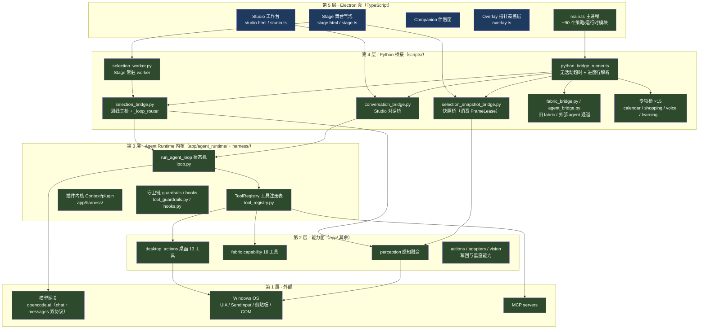

---

## 图 2：捕获与感知链路（手势 → 证据）

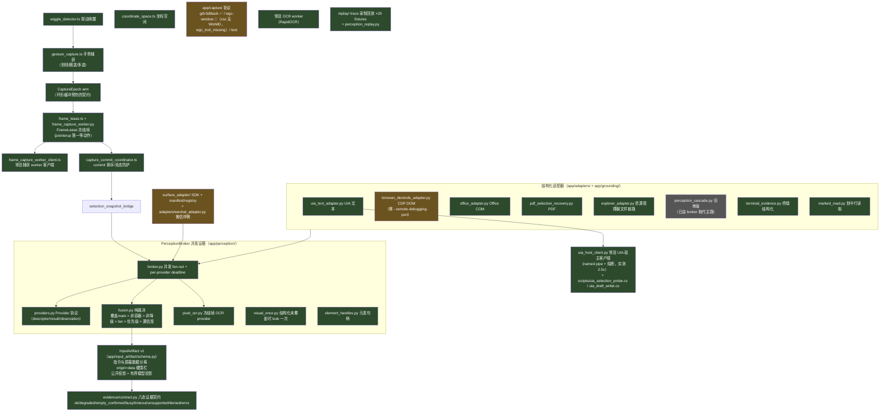

---

## 图 3：插件内核（app/harness/，DSH 移植）

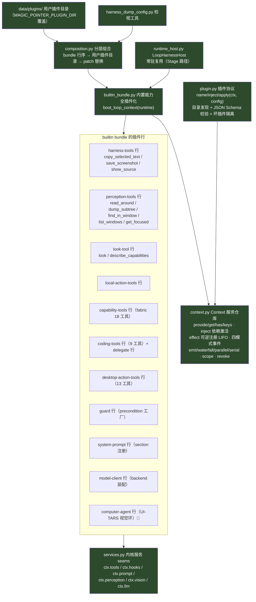

---

## 图 4：Agent Loop 内核（loop.py 状态机 + 全部支撑件）

这是 MP 的心脏。一轮的完整路径：

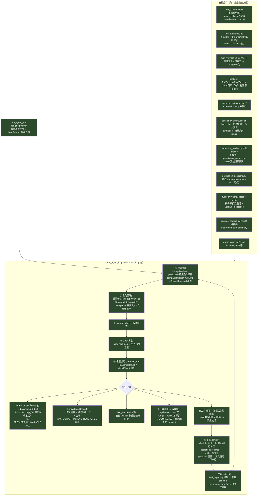

---

## 图 5：工具面全景（58 个静态注册工具逐个列出）

分组标注：`[效果档] 并发安全? deferred?`

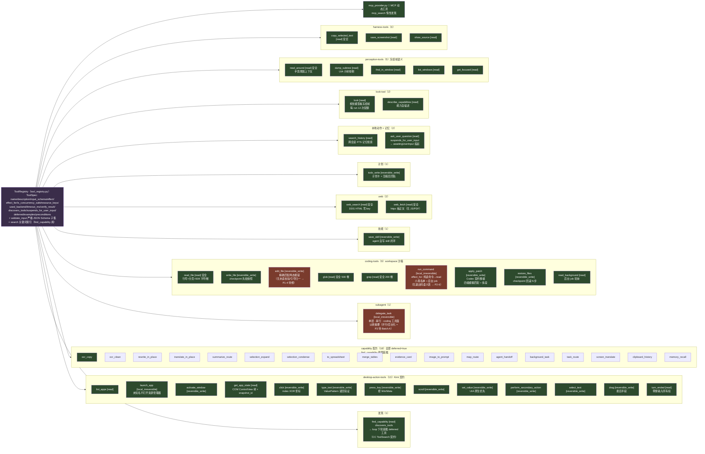

---

## 图 6：模型客户端栈（model_client.py + 模型接入）

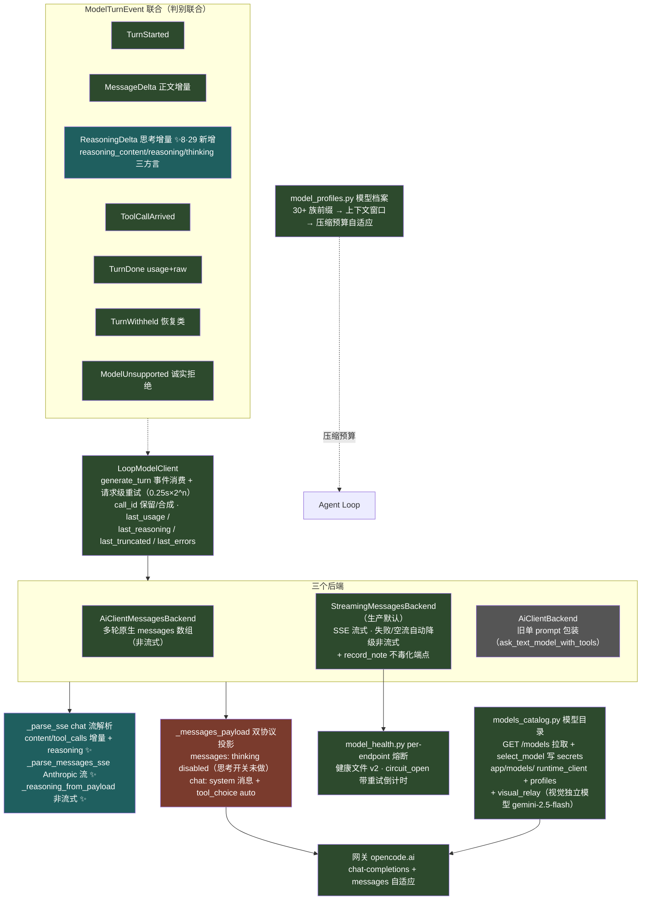

---

## 图 7：上下文管理与记忆

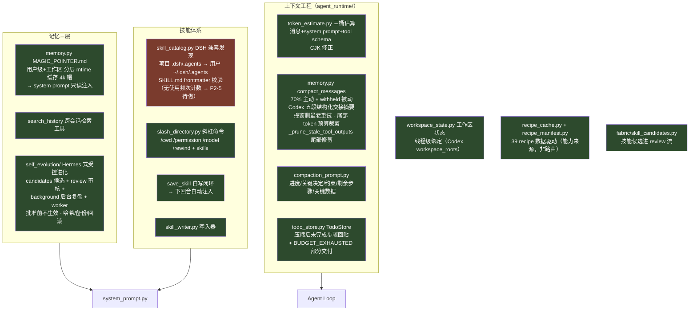

---

## 图 8：治理与安全层

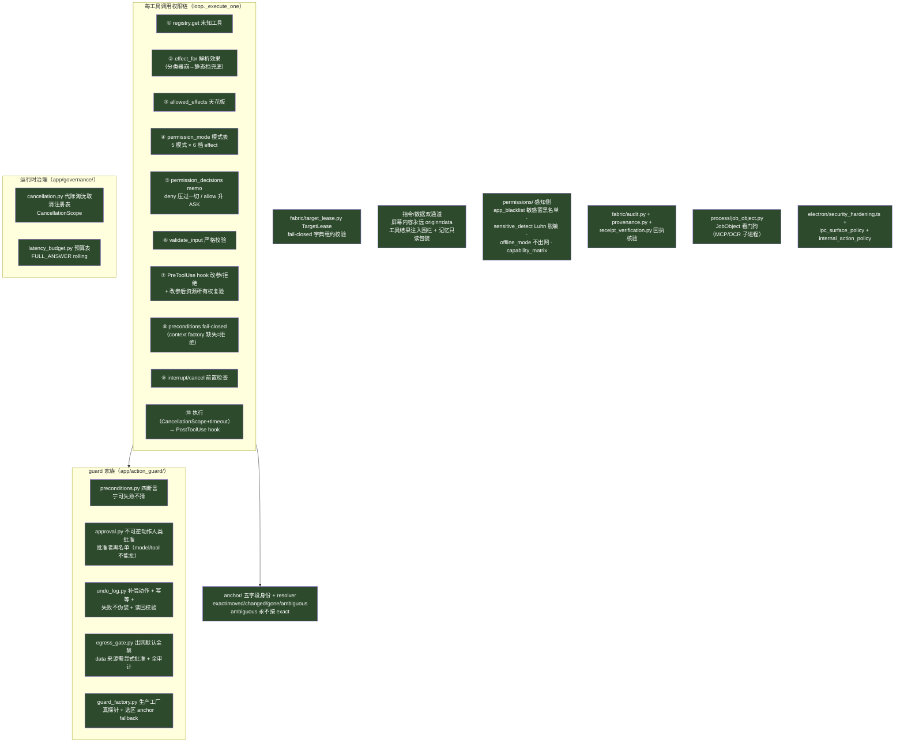

---

## 图 9：桌面动作面细部（desktop_actions/）

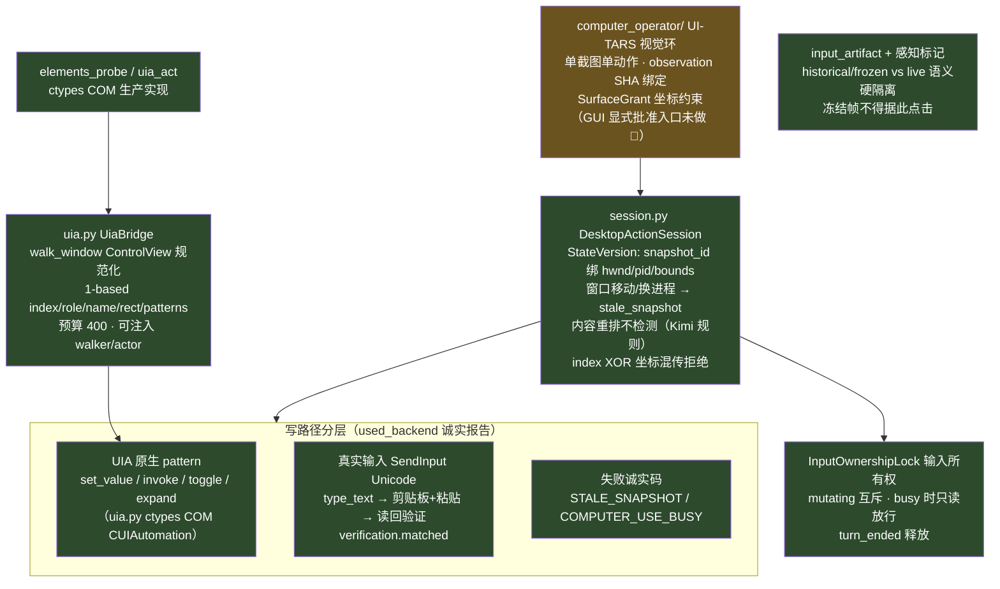

---

## 图 10：持久化与产物（会话/回执/草稿）

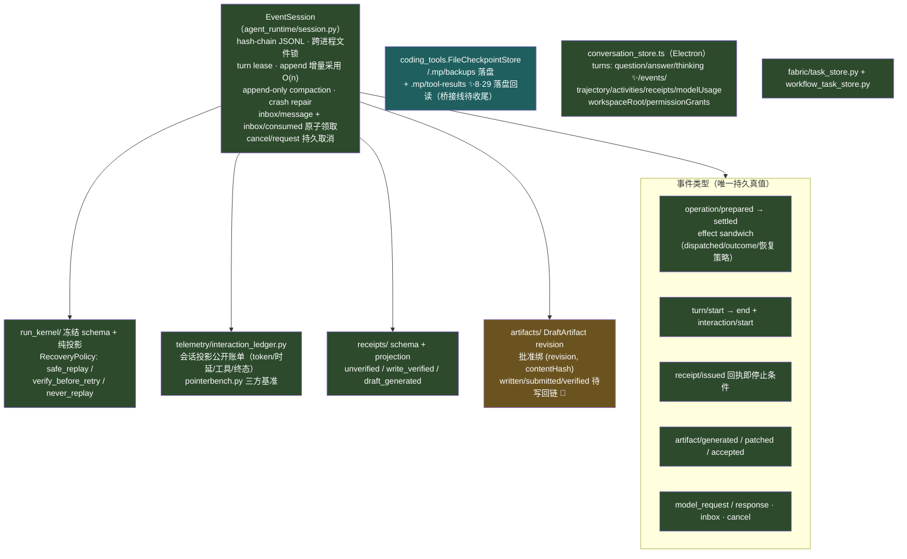

---

## 图 11：Electron 壳层（main + renderer）

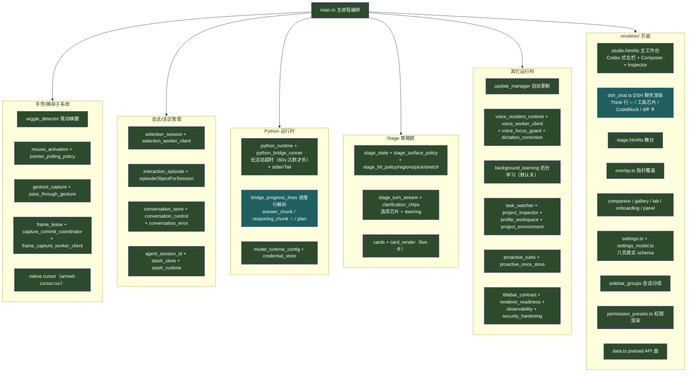

---

## 图 12：桥接层全图（scripts/ 每座桥的职责）

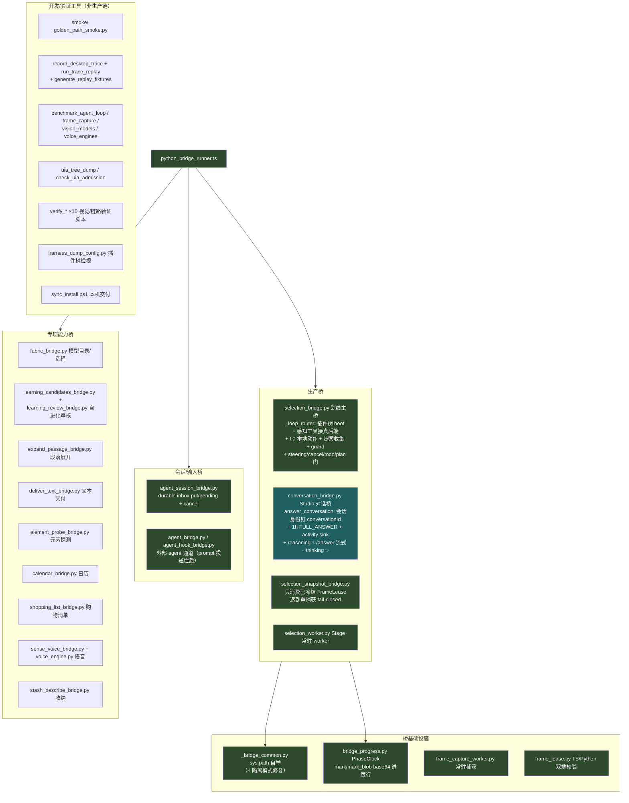

---

## 附：fabric/ 其余模块（能力引擎层）

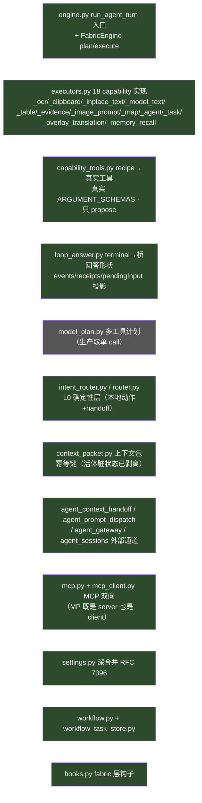

---

## 已知缺口索引（图中 🚧/P 标注的汇总）

| 缺口 | 图 | 优先级来源 |
|---|---|---|
| edit_file 无未读校验/引号归一化/错误阶梯 | 图 5 | P1-4（8·29 交接） |
| run_command 无退出码语义表 | 图 5 | P2-6 |
| 未知工具错误不附可用列表 | 图 5 | P2-6 |
| skill_catalog 无使用频次计数 | 图 7 | P2-5 |
| delegate_task 单层串行、无后台化 | 图 5 | P3（依赖 Batch A） |
| tool-results 落盘桥接线未收尾 | 图 10 | P1-3 尾巴 |
| messages 协议 thinking 硬编码 disabled | 图 6 | 思考开关（展示流已通） |
| WGC 原生捕获未编译 | 图 2 | wgc_tool_missing |
| ComputerOperator GUI 批准入口 | 图 9 | 产品验收项 |
| DraftArtifact written/submitted/verified | 图 10 | 写回链 |
| crash 从 program counter 续跑 | 图 10 | 长任务批次 |
| 300 步长任务真机基准 | 全局 | LONG_RUN_GAP 文档 |
| macOS 未实机验证 | native/ | STATUS |
```
