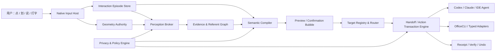

# Magic Pointer 成熟底座

> 版本：2026-08-01  
> 结论：它不应该是一个新的桌面 Agent。它应该成为人、屏幕对象、语音和既有 Agent 之间的低延迟输入控制平面。

## 0. 先把结论说死

Magic Pointer 真正的机会，不是“鼠标旁边再放一个 Gemini”，也不是“让模型看完整个屏幕后替人点击”。这两条路都很容易做出演示，也都很容易在真实使用中失败。

用户真正缺少的是一种输入方式：当语言难以精确描述对象时，允许人直接指出对象；当上下文散落在屏幕、文档、终端和 Agent 会话中时，系统替人把这些上下文编译成一份可检查的请求；当请求准备好时，不再要求用户切换窗口、复制截图、找到正确会话、粘贴并按回车。

所以，产品的核心不是“替用户思考”，而是降低人把意图可靠地交给机器的摩擦。

这份设计给出六个不可再摇摆的决定：

| 决定 | 结论 |
|---|---|
| 底座形态 | 建立 **Grounded Interaction Runtime（GIR，可证据交互运行时）**，不是常驻自治 Agent |
| 首发楔子 | **Point-to-Agent Prompt Handoff**：点、划、说、预览、选 Agent、确认发送 |
| 感知路线 | UIA / DOM / Office 对象 / 文本 / OCR / 本地视觉并行取证；云视觉永不作为静默兜底 |
| Overlay | 原生 Input Gate 与显示层分离，另设独立交互气泡；拒绝一个永久全屏透明窗包办一切 |
| 坐标 | 由一个原生 Geometry Authority 统一管理 Per-Monitor-V2、显示拓扑和全部坐标变换 |
| 安全 | 用户手势创建一次性捕获租约；默认零持续录屏、零持续监听、零截图外发；执行必须是类型化事务 |

我不建议承诺“没有视觉模型也能完成所有多模态任务的 80%”。这是一个无法定义、无法审计、也无法诚实兑现的承诺。可以承诺的是：在明确定义的生产力任务集上，Structure-only 模式不向任何模型厂家发送像素，并用真实基准验证它的成功率达到发布门槛。照片、画面风格、自由画布、地图和视频等任务天生依赖视觉；假装它们不依赖视觉，只是在把风险藏起来。

真正危险的系统，不是模型不够聪明，而是系统在不知道自己看见了什么时仍然行动。

---

## 1. 用户要的不是“AI 鼠标”，而是少走四段路

今天一个开发者看到界面错误，想让正在运行的 Codex 修复，通常要经过：

1. 截图或描述对象；
2. 切到终端或 Agent GUI；
3. 找到正确会话和工作区；
4. 粘贴、补上下文、检查附件，再提交。

困难不在推理。困难在上下文搬运。

Magic Pointer 应把它压缩为：

1. 按住一个键；
2. 点或划出对象，同时说“这里在缩放后错位，去当前项目修掉”；
3. 松开，在鼠标旁检查系统编译出的 prompt、引用对象和目标 Agent；
4. 点对号。

这不是一个更漂亮的聊天入口。它是一条从现实指向到可执行请求的短路径。

### 1.1 外部讨论中反复出现的真实信号

这些信号来自论坛、项目 issue 和产品实践，不等于统计学市场研究，但它们高度一致：

- 指向一个具体对象，明显优于用语言描述“右边第二个蓝色按钮”。这是 AI Pointer 讨论中最稳定的正面反馈。
- 语音不是普适入口。共享办公室、隐私、口音、长文本修改都会让键盘仍然占主导；产品必须允许语音、键盘、既有听写软件和外接按键并存。
- “截图问答”很快会退化为更昂贵的复制粘贴。用户会问：为什么不直接在网页或 CLI 里做？
- 用户对持续录屏、后台读取登录状态页面、模糊的云端处理极其敏感。权限弹窗不是安全模型。
- 真正有吸引力的流程都减少了切换：从运行中的 UI 跳到负责它的源代码；把屏幕对象直接交给当前 Agent；在原应用里完成变换并可靠写回。
- 对重复任务，用户希望把成功的交互固化为一个快捷动作，而不是每次重新和模型聊天。

Google 的 AI Pointer 官方叙事是“point, speak, act”，方向并没有错；问题是演示把最难的部分藏起来了：定位是否稳定、屏幕何时被捕获、像素去了哪里、操作失败时如何恢复，以及真实任务是否真的比键盘更快。[Google DeepMind](https://deepmind.google/blog/ai-pointer/) 的原始介绍应当被当作交互方向，不应当被当作工程答案。

实际试用和讨论更有价值：有人发现圈选不可靠，输入文字反而更快；有人遇到多标签页语境混乱；也有人认为它只是用昂贵模型重做右键菜单。[Hacker News 讨论](https://news.ycombinator.com/item?id=48111581)、[PCWorld 试用](https://www.pcworld.com/article/3138080/google-wants-gemini-to-reinvent-the-mouse-im-skeptical.html)、[Android Police 试用](https://www.androidpolice.com/i-tried-googles-new-magic-pointer-it-changed-how-i-use-a-laptop/) 共同说明：新奇不是留存，缩短任务才是。

---

## 2. Clicky 深度解剖：应该继承什么，必须抛弃什么

### 2.1 Clicky 做对了人机回路

本地项目：`external/clicky`

Clicky 最值得学习的不是 Claude 调用，而是它让用户感到系统“就在指针旁”：

- 一个简单的全局按住说话动作；
- 光标附近有立即可见的状态变化；
- 语音、当前屏幕和回答被组织为一次短交互；
- 回答不会迫使用户进入一个新的大型应用。

这解释了它为什么能让人产生“未来已经来了”的感觉。交互反馈比模型聪明更先被感知。

但源码揭示了它不是可直接继承的定位底座：

- `CompanionManager.swift` 的主路径会在一次查询中抓取全部显示器，然后把图像和转写交给云端模型。
- `OverlayWindow.swift` 使用全屏高层级窗口，并长期 `ignoresMouseEvents = true`；它适合显示，不适合承载真正可拖动、可编辑的交互气泡。
- `ElementLocationDetector.swift` 中较完整的 Computer Use 坐标逻辑没有接入主路径。实际主路径依赖普通视觉回答里的 `[POINT:x,y]` 标记。
- 捕获图像被缩放到最大边 1280。对回答“屏幕大概在哪里”有用，对跨显示器精确定位和可重复执行远远不够。

因此，Clicky 应当作为**交互节奏的参考实现**，不能作为**Grounding 真值系统**。

它自己的 issue 也给出了产品边界：用户直接抱怨它比浏览器里的同一个 LLM 更慢，并认为如果它不能替自己输入或执行，就很难说明独特价值；另有 issue 指出 token、转写和鉴权风险。[速度反馈 #35](https://github.com/farzaa/clicky/issues/35)、[执行诉求 #38](https://github.com/farzaa/clicky/issues/38)、[安全反馈 #44](https://github.com/farzaa/clicky/issues/44)。

### 2.2 clicky-windows 展示了“功能堆积架构”的终点

本地项目：`external/clicky-windows`

Windows 版本比原版更接近我们的问题域。它加入 UIA、OCR、视觉定位、隐私规则、热键和 Windows overlay，值得逐个拆开研究。但它也清楚展示了为什么不能沿着现有结构继续加功能。

它的核心问题不是 Python，也不是 PyQt6，而是系统边界没有被定义：

- `companion_manager.py` 同时承担录音、意图判断、搜索、截图、定位、模型调用、TTS 和 overlay 编排，已经成为不可推理的中心。
- `hybrid_pointer.py` 把 UIA、RapidOCR、视觉模型串成顺序兜底。能力越加越多，最坏延迟越长，而且前一层给出的低置信错误会阻止更可靠证据进入。
- UIA 探测依赖名称模糊匹配和有限节点遍历；它可以是证据源，不能是像素真值。
- `screen/capture.py` 使用系统级 DPI 比例处理全部显示器。混合 DPI 多屏环境中，这会系统性地产生偏移。
- `ui/overlay.py` 同时设置窗口和控件的鼠标穿透。这样不会阻挡原应用，却也决定了气泡无法真正拖动、选中和编辑。
- 两阶段网格视觉定位增加调用次数和延迟，却没有一套公开、可复现的多显示器误差基准。

这不是对作者的否定。它恰好证明了一个重要规律：当一个系统没有统一的坐标真值、交互事件模型和事务边界时，多加一个 fallback 只会多一种不确定性。

实际 issue 已经反映这种结构性问题：overlay 会破坏自动隐藏任务栏，USB 耳机与本地 STT 会卡在 Listening 状态。[任务栏 #4](https://github.com/Bitshank-2338/clicky-windows/issues/4)、[语音状态 #6](https://github.com/Bitshank-2338/clicky-windows/issues/6)。

### 2.3 OpenClicky 提供了另一个重要线索

本地项目：`external/openclicky`

OpenClicky 将结构化集成放在 computer use 之前，并通过本地 bridge 暴露受限能力。这比“把屏幕都交给模型”成熟得多。它说明 agent 协作的正确边界是：已有 Agent 负责长推理；Pointer 负责收集和交付经过确认的上下文；两者通过明确协议连接。

---

## 3. 三条底座路线，只有一条值得做

### 路线 A：常驻 Pointer Agent

让一个专用 Agent 在后台观察输入、理解屏幕、维护记忆、决定何时调用工具。

优点是概念简单，演示灵活。缺点更根本：

- 每次微小动作都可能触发模型成本；
- 首 token 延迟会污染最频繁的交互；
- 它与 Codex、Claude Code、IDE Agent 的职责重复；
- 常驻观察扩大隐私攻击面；
- “Agent 自己认为用户指的是谁”很难审计；
- 多个 Agent 同时存在时，谁拥有意图和副作用会变得模糊。

**结论：拒绝作为底座。** 它可以是未来的可选插件，不能拥有默认权限。

### 路线 B：纯规则 / Workflow Graph

为每类选择和动作写节点、分支、正则与 few-shot，模型只在特定节点被调用。

它成本低、可测试，但会在真实语言中迅速崩溃。用户会说“把这里和刚才终端里那个报错一起交给第二个 Codex，让它只改前端”，这不是有限规则可以长期覆盖的。规则图擅长执行确定步骤，不擅长把含糊的人类表达变成结构化意图。

**结论：不能单独成立。** 它应成为运行时内部的确定性执行骨架。

### 路线 C：可证据交互运行时 + 可选语义编译器 + 既有 Agent

这是推荐路线。

运行时不持续思考。它只在用户明确开始一次交互后：

1. 收集指向、划线、文字、语音和当前结构化上下文；
2. 将每个“这里”“那个”“第二个”绑定到带证据的 referent；
3. 用规则或本地小模型把表达编译成可编辑 Draft；
4. 让用户确认引用、目标和副作用；
5. 通过本地协议把 Draft 交给已经运行的 Agent，或交给受限的 Office / 系统适配器；
6. 返回 ACK、验证结果和可撤销凭证。

这里的模型是编译器，不是君主。执行器只接受结构化、经过权限检查的事务。

| 维度 | 常驻 Agent | 纯规则图 | GIR 推荐路线 |
|---|---:|---:|---:|
| 高频路径延迟 | 高 | 低 | 低 |
| 模糊语言处理 | 强 | 弱 | 强 |
| 可审计性 | 弱 | 强 | 强 |
| 与既有 Agent 协作 | 容易冲突 | 被动 | 原生职责 |
| 默认隐私面 | 大 | 小 | 小 |
| 新功能扩展 | 容易失控 | 规则爆炸 | 通过类型化插件扩展 |
| 真实产品上限 | 演示强、稳定性弱 | 稳定但僵硬 | 稳定与智能可分层演进 |

---

## 4. 推荐总架构：Grounded Interaction Runtime



### 4.1 Native Input Host

一个小型原生 Windows 进程拥有：

- 全局单键触发和外设触发；
- 鼠标 / 触控笔轨迹与时间戳；
- 三类 surface 的生命周期和 hit testing；
- Per-Monitor-V2 DPI 初始化；
- 显示器拓扑与坐标变换；
- 麦克风会话的开始、结束和设备状态；
- 对其他进程只暴露窄协议，不暴露任意窗口控制。

这个进程必须小、可预测、无模型依赖。它是神经系统的反射弧，不是大脑皮层。

### 4.2 Interaction Episode Store

Magic Pointer 当前已经存在 `InteractionEpisodeStore`、`SelectionSessionStore`、`PointerSelection`、`GroundedObject` 和 `TargetLease` 等重叠概念。不要再创建第六个 `ReferentSession`。

应当统一成一个 append-only 的 episode 事件流：

```text
EpisodeStarted
InputSourceArmed
SpeechPartial / SpeechFinal
PointerMoved
StrokeStarted / StrokePoint / StrokeEnded
CandidateObserved
ReferentBound / ReferentRevised
DraftCompiled / DraftEdited
TargetSelected
ConfirmationGranted
DispatchStarted / DispatchAcknowledged
ActionVerified / ActionFailed / UndoIssued
EpisodeClosed
```

当前状态是事件流的派生视图。这样多次划线、转写修订、坐标重算和用户改选都不会互相覆盖，也能完整回放失败原因。

### 4.3 Evidence & Referent Graph

每个对象不是一个坐标，而是一组证据：

```typescript
type Referent = {
  id: string
  episodeId: string
  kind: "text" | "control" | "image" | "region" | "window" | "file" | "agent" | "office-object"
  labels: string[]
  geometry?: TypedRect
  sources: Evidence[]
  confidence: number
  validUntil: number
  displayTopologyEpoch: string
  applicationEpoch: string
  sensitivity: "normal" | "personal" | "secret" | "blocked"
}
```

一个按钮可能同时有 UIA AutomationId、DOM selector、可见文字、窗口句柄、截图 crop 和一次用户点击。模型可以解释证据，但不能删掉证据来源。执行前必须选出一种可复验的锚点。

### 4.4 Perception Broker

感知不应是 UIA → OCR → Vision 的串行阶梯，而应是按能力并行发起、按证据质量融合：

- Windows UIA：原生控件、名称、角色、状态、AutomationId；
- DOM / CDP / 浏览器扩展：网页 selector、CSS rect、可访问文本；
- Office 对象模型 / OfficeCLI：单元格、段落、形状、公式和文档语义；
- 应用插件：IDE 里的文件、symbol、diagnostic、选区；
- 本地 OCR：只有像素文本可用时；
- 本地视觉：画布、图像、图表或结构来源互相矛盾时；
- 云视觉：仅本次、明确预览 crop、明确供应商后才能使用。

Broker 返回候选和证据，不直接点击。运行时可以在 120 ms 内先显示一个暂定边框，随后用更强证据修订；感知速度和最终确定性不必互相阻塞。

### 4.5 Semantic Compiler

语义编译器只做三件事：

1. 把“这里”“前两个”“别改右边那个”绑定到 referent；
2. 把语音和文字变成结构化 Draft；
3. 判断缺少的是用户确认、更多证据还是目标选择。

四级智能路线：

| 层级 | 何时使用 | 成本与隐私 |
|---|---|---|
| L0 确定性编译 | 已选对象、固定动作、已有目标 | 无模型、毫秒级 |
| L1 本地文本小模型 | 消歧、改写、提取约束 | 本地、低成本 |
| L2 本地视觉模型 | 像素画布、图片、版式 | 本地、按需加载 |
| L3 既有 Agent | 长推理、改代码、复杂工具执行 | 交给用户已选择的 Agent |

L3 不是 Magic Pointer 自己再启动一只 Agent。它把上下文交给已经存在的会话。

### 4.6 Preview / Confirmation Bubble

气泡不是聊天窗口。它是一次事务的提交面板，只显示：

- 编译后的请求，可直接编辑；
- 引用了哪些对象，以编号 chips 显示；
- 是否包含截图、文件或敏感数据；
- 将发送到哪个 Agent / 会话 / 工作区；
- 会发生“只发送”“写入”“外部副作用”中的哪一种；
- 对号确认、撤销、展开高级信息。

用户原来使用 Handy、Wispr Flow 或系统听写时，只要能向标准文本框输入，就能继续使用，不需要迁移习惯。

### 4.7 Target Registry & Router

“检测到三个 CLI 和一个 GUI Agent”不能靠窗口标题猜测。每个可接收目标应主动注册：

```typescript
type AgentTarget = {
  targetId: string
  kind: "codex" | "claude-code" | "ide-agent" | "managed-pty" | "generic-input"
  workspace?: string
  sessionId?: string
  processId?: number
  transport: string
  capabilities: ("message" | "attachments" | "structured-context" | "cancel" | "ack")[]
  authProvenance: string
  lastSeenAt: number
}
```

发现顺序：

1. 官方或本地会话协议，例如 app-server、Channel、IDE extension；
2. Magic Pointer 自己启动并管理的 PTY；
3. 显式 MCP / A2A inbox；
4. 最后才是 accessibility 向文本输入框写入。

第 4 层默认不自动模拟 Enter。盲目粘贴并提交不是集成，只是把 race condition 包装成能力。

开源 `agent-bridge` 已经证明，常驻本地 daemon 可以维护 Codex app-server 和 Claude Channel 之间的会话映射，并在不另买 API key 的情况下向既有会话发送消息；它的单会话限制也说明正式产品必须把 session、workspace、ACK 和授权做成一等公民。[agent-bridge](https://github.com/yigitkonur/agent-bridge)、[claude-codex-collab](https://github.com/AlessioZazzarini/claude-codex-collab)。

### 4.8 Handoff / Action Transaction Engine

向 Agent 发消息和修改 Office 文档都应被视为事务：

```text
prepare -> policy_check -> preview -> confirm -> commit -> acknowledge -> verify -> receipt
                                                   \-> fail -> compensate/undo
```

发送前锁定 targetId、sessionId 和 workspace；ACK 必须来自对应协议，而不是“键盘事件发出成功”。

OfficeCLI 应作为受约束的类型化适配器：固定版本、工作副本、原子 batch、执行后 readback、差异预览、receipt 和 undo。模型不能得到任意 shell 字符串，也不应直接得到整个 OfficeCLI 命令面。现有 `docs/research/officecli-integration-assessment.md` 的边界判断是正确的，应保留并纳入统一事务引擎。

### 4.9 进程拓扑与故障隔离

成熟架构不能把所有模块重新塞进另一个 manager。推荐至少分成四个故障域：

| 进程 | 常驻性 | 权限 | 崩溃影响 |
|---|---|---|---|
| Native Input Host | 常驻、极小 | 只持输入、窗口和必要 accessibility 能力 | 立即释放 hook / surface，当前 episode 取消 |
| Runtime Service | 常驻 | 普通用户、本地数据库与策略 | 可重启并从事件日志恢复未提交 Draft |
| UI Shell | 按需或轻量常驻 | 无工具执行权 | 气泡消失，事务不会被自动提交 |
| Provider / Plugin Worker | 按需 | 每个插件独立受限 | 单项感知或动作失败，不拖垮输入与 UI |

进程间协议必须版本化，使用长度限制和 schema 校验；图片通过只读 shared memory / 临时句柄传递，而不是反复 base64 复制。所有请求携带 `episodeId`、`topologyEpoch`、deadline 和 cancellation token。迟到的 OCR / VLM 结果如果 epoch 已变化，只能作为历史证据，不能覆盖当前 referent。

高频 pointer sample 不逐点写入长期事件库：Native Host 先写有界环形缓冲区，stroke 完成后压缩成轨迹 artifact 和摘要事件。这样既能回放，又不会让 event sourcing 变成磁盘写放大器。

Runtime Service 对 provider 实施 deadline、并发上限和背压。用户取消 episode 后，所有下游任务必须收到 cancellation；不能让已经不可见的 OCR、STT 或云请求继续耗费资源。

---

## 5. 交互范式：一个 Pointer Key，一次 Episode

### 5.1 默认动作

默认只需要一个可配置的 **Pointer Key**。它可以是右 Ctrl、鼠标侧键、Caps Lock、脚踏板、Stream Deck 或辅助开关。

- **按住**：开始一次 episode，同时启动本地流式转写和指针反馈；
- **移动**：只是指出当前位置，不破坏原应用 hover；
- **左键点一下**：选择一个语义元素；
- **左键拖动**：生成一条 stroke，Native Input Gate 拦截这组按钮事件，原应用没有收到合法的 drag 序列，因此不会出现蓝色文字选区；
- **重复点击或拖动**：继续向同一 episode 加对象，每个对象立即出现 1、2、3 编号；
- **松开 Pointer Key**：结束采集，弹出可编辑预览；
- **点对号或在气泡内按 Enter**：发送给选中的 Agent，而不是切到 CLI 再按 Enter；
- **Esc**：任何阶段取消，不留下截图或转写。

短按且没有轨迹、语音或选择时，可进入锁定模式，照顾无法持续按住的用户和外接设备；再次按键结束。锁定状态必须有明显的光标环、颜色和轻声音提示，不能只依赖一个微小图标。

这不是“三键快捷键”。它是一个模式键加普通鼠标动作。用户也可以完全不说话，释放后直接打字。

### 5.2 多次划线不是多个请求

一次 episode 可以包含多个 referent 和一段连续表达：

```text
[1 价格列] [2 右侧图表] “把这两处统一成千分位，但第二处不要小数。”
```

绑定不能靠固定的“语音后 1.5 秒归属上一条线”。正确做法是保留：

- 每个语音 token 的起止时间与稳定性；
- 每条 stroke 的时间区间、轨迹和候选对象；
- “这个、那个、前两个、除了三号”等指代语法；
- 用户注视/悬停只能作为弱证据，不能成为必要条件；
- 后续语音可以修订早先绑定，气泡 chips 同步变化。

系统不确定时，应在气泡中高亮“这里可能指 2 或 3”，而不是默默选一个。

### 5.3 重复成功的流程可以固化，但不能反过来绑架首用

用户完成一次“选择报错 → 发给当前前端 Agent”的事务后，可以选择保存成单键 recipe。Recipe 保存的是类型、目标规则、权限和预览策略，不是绝对坐标。

这会形成真正的可扩展性：智能负责第一次理解，确定性 workflow 负责以后快速复用。

---

## 6. Overlay：不要再试图让一个透明全屏窗既穿透又可交互

“气泡需要可拖动”和“全屏层必须不抢鼠标”本来就是冲突目标。继续切换同一个窗口的 click-through 状态，只会制造边界 bug、任务栏问题、焦点丢失和竞态。

划线并不必然需要一个“接收输入的透明全屏窗口”。Windows 底座应先把输入和显示分开：`Native Input Gate` 是一个只在 Pointer Key 激活期间工作的低层输入控制器；surface 只负责让用户看见状态和轨迹。

Input Gate 的策略是：

- Pointer Key 未激活时完全退出路径，不改变正常鼠标行为；
- 激活后观察鼠标，但移动事件仍让底层应用获得 hover，系统光标可以继续呈现 text / resize / link 等语义；
- 左键按下后，Gate 立即锁定本次按钮序列并阻止底层应用得到有效的 down / drag / up；
- 小于拖动阈值时，将其解释为一次语义 hit-test；超过阈值时，记录原始轨迹并显示 stroke；
- 抬起或 watchdog 超时时一定释放锁；进程崩溃时操作系统不能留下全局鼠标锁定；
- callback 中不做 UIA、OCR 或模型工作，只写入无锁缓冲区，由运行时异步消费；
- 管理员窗口、受保护桌面、独占全屏和反作弊环境默认 fail closed，不能为了“支持”而静默提权。

如果某种触控笔、触摸或远程桌面环境无法可靠使用 Input Gate，再启用**瞬时、单显示器 Capture Surface** 作为能力降级，而不是让它成为所有用户的永久默认路径。

显示侧拆成三种基础 surface 和一种可选 fallback：

| Surface | 范围 | 是否接收输入 | 生命周期 | 用途 |
|---|---|---:|---|---|
| Cursor Surface | 光标附近或每屏小窗口 | 否 | 常驻但极轻 | 光环、录音、置信度、忙碌状态 |
| Stroke / Annotation Surface | 每屏局部或全屏 | 否 | 仅 episode 内 | 轨迹、编号、边框、执行结果 |
| Bubble Surface | 小型普通窗口 | 是 | 预览到提交 | 编辑、拖动、选择 Agent、确认 |
| Capture Surface（fallback） | 单个显示器全屏 | 是 | 仅特定输入环境 | 无法用 Input Gate 时捕获输入 |

关键原则：

- 每个显示器独立创建 surface，不建立一个跨虚拟桌面的巨大窗口；
- 常规鼠标路径不创建可输入的全屏窗；Capture Surface 只在能力探测明确要求时出现，抬键立刻销毁；
- Bubble Surface 是正常的原生 hit-test 窗口，不做 click-through；
- 自己的所有 surface 必须从截图和 referent 探测中排除；
- 不全局替换或隐藏系统光标。保留原应用的 resize、text、link 等光标语义，在其外侧叠加清晰 halo；
- 只有 Native Input Host 管理 z-order、焦点与 hit testing，Electron 不再控制这些底层事实。

Electron 官方 API 的 `setIgnoreMouseEvents` 是整窗语义，`forward: true` 只补充移动事件，并没有提供可靠的任意像素交互区域。[Electron 文档](https://www.electronjs.org/docs/latest/tutorial/custom-window-interactions) 和长期的 [per-pixel hit test issue](https://github.com/electron/electron/issues/1335) 都说明，交互子窗与穿透父窗分离才是可维护的路线。

---

## 7. 坐标：建立唯一真值，否则所有模型都会被冤枉

大屏偏移、混合 DPI 偏移、缩放后漂移经常被误判为视觉模型不准。实际上，很多错误在模型输出之后才被软件制造出来。

Windows UI Automation 的点和矩形使用物理屏幕坐标；如果客户端不是正确的 DPI-aware，鼠标与 UIA 会落在不同坐标空间。[Microsoft UIA 屏幕缩放文档](https://learn.microsoft.com/en-us/windows/win32/winauto/uiauto-screenscaling) 明确说明了这一点。Chromium / WebView2 的 accessibility bridge 在混合 DPI 下还可能返回错误矩形，不能盲信单一来源。[Accessibility Insights issue](https://github.com/microsoft/accessibility-insights-windows/issues/1688)、[WebView2 issue](https://github.com/MicrosoftEdge/WebView2Feedback/issues/3608)。

### 7.1 Geometry Authority

必须由一个原生模块在进程创建任何窗口、UIA client 或 capture session **之前**设置 Per-Monitor-V2 awareness，并独占以下职责：

- 枚举显示器物理区域、DIP 区域、缩放、旋转和工作区；
- 维护 `DisplayTopologyEpoch`；
- 提供带类型的 Point / Rect 变换；
- 将 pointer、UIA、DOM、capture、overlay 和 model 输出统一到明确空间；
- 处理显示器热插拔、远程桌面、缩放变化与窗口跨屏；
- 提供 round-trip invariant 和可视化校准工具。

禁止 JavaScript、Python、C# 各自推导一个 `dpi_scale`。

```typescript
type CoordinateSpace =
  | "virtual-physical-px"
  | "monitor-physical-px"
  | "window-client-physical-px"
  | "dip"
  | "capture-px"
  | "dom-css-px"
  | "model-normalized"

type TypedRect = {
  x: number; y: number; width: number; height: number
  space: CoordinateSpace
  displayId?: string
  topologyEpoch: string
  transformChain: string[]
}
```

任何 API 如果接收裸 `{x, y}`，都应被视为设计缺陷。

### 7.2 定位不是得到一个点，而是建立转换链

例如把视觉模型在 crop 上返回的坐标映射到屏幕：

```text
model-normalized
  -> letterboxed-model-px
  -> crop-px
  -> monitor-physical-px
  -> virtual-physical-px
```

每一步都记录缩放、padding、origin 和 epoch。图像只允许等比缩放加 letterbox，禁止拉伸。显示器拓扑一变，旧 geometry 自动失效，不允许“差不多还能点”。

### 7.3 多证据校准

UIA 的矩形需要与 HWND / DWM frame、DOM rect、鼠标命中和局部截图比较。若来源之间超出容差：

- 降低该来源的 geometry trust；
- 仍保留它的名称、角色等语义证据；
- 请求 DOM 插件、局部 OCR 或本地视觉补充；
- 在执行前重新解析，而不是使用几秒前的坐标。

### 7.4 必须通过的坐标测试矩阵

- 100% + 100%、100% + 150%、125% + 175%、150% + 200%；
- 主屏在左 / 右 / 上 / 下，包含负坐标；
- 横屏 + 竖屏、显示器旋转；
- 窗口跨屏、拖动中缩放改变；
- 远程桌面重连、睡眠唤醒、显示器热插拔；
- Electron、Chromium、WPF、Win32、Office、Java、游戏 / Canvas；
- 每条坐标链做 `A -> B -> A` 误差断言；
- 自动截取 crosshair fixture，比较预期中心与真实绘制像素。

坐标误差没有通过这组测试之前，不应谈“Computer Use 准确率”。

---

## 8. 没有云视觉时，究竟能做多少

### 8.1 应当提供三种清晰模式

#### Structure-only

- 使用 UIA、DOM、Office 对象、剪贴板显式选区、文件与 Agent 上下文；
- 可选本地 OCR，但不把像素送入任何模型；
- 网络层阻止图片 MIME、base64 图像和 capture artifact 离开设备；
- 最适合代码、网页、表格、文档、控件和可访问文本。

这时可以做出一个可验证承诺：**零截图字节发送给模型厂家**。承诺来自网络策略、数据类型和自动化测试，不来自隐私政策里的形容词。

#### Local-vision

- 局部截图只交给本地 OCR / VLM；
- 模型按需加载，不常驻占用 GPU；
- 适合图片、图表、Canvas、没有 accessibility 的应用；
- 本地 artifact 短期加密保存或立即销毁。

#### Per-turn cloud vision

- 默认关闭；
- 用户在气泡中看到精确 crop、分辨率、供应商和数据策略；
- 每次单独确认，不继承为永久“允许所有屏幕”；
- 失败时不从局部 crop 自动扩大到全屏；
- receipt 记录发送了哪个 crop 的 hash，而不默认保存原图。

### 8.2 80% 应如何定义

不能写“多模态任务 80%”。应建立 `No-Cloud-Vision Benchmark`：

| 任务族 | 示例 | Structure-only 预期 |
|---|---|---:|
| Agent handoff | 指 UI 报错并发给当前项目 Agent | 高 |
| 网页 / 桌面控件 | 解释、改写、选择结构化控件 | 高 |
| 文档 / 表格 | 指单元格、段落、图表对象并下达变换 | 高 |
| IDE / 终端 | 指 diagnostic、终端区和文件 symbol | 高 |
| 像素画布 | 图像编辑器局部、游戏、远程桌面 | 低到中 |
| 视觉内容 | 描述照片风格、地图、视频帧 | 低 |

发布承诺只能是：在首发目标任务族、指定应用矩阵和明确硬件上，Structure-only / Local-vision 达到测得的完成率。若首发套件 100 个真实任务中至少 80 个无需云视觉完成，就可以公开说“首发生产力任务 80% 不需要云视觉”。这与“所有多模态任务的 80%”完全不同。

用户担心模型厂家拿走截图。唯一强保证不是选择一家更可信的厂家，而是默认根本不发送。

持续截图工具的讨论已经反复暴露两个问题：工作数据和私人页面会被意外纳入，持续 OCR / capture 还会带来热量和资源开销。[Screenpipe 讨论](https://news.ycombinator.com/item?id=41695840)。一个 Codex 用户报告的全桌面截图 fallback 还说明，失败兜底本身可能扩大数据范围；无论个案最终归因如何，这都应成为我们的负面测试。[相关社区报告](https://community.openai.com/t/a-codex-screenshot-fallback-exposed-private-browser-content/1383634)。

---

## 9. 语音：不追求一个神奇模型，追求一个不会碍事的输入系统

微信语音输入顺滑，并不仅仅因为模型准确。它同时拥有流式 partial、稳定化、端点判断、网络调度、设备适配和长期数据优势。小团队不应在第一天与它的云规模竞争，应把系统设计成“任何好的语音引擎都能被接进来”。

### 9.1 语音运行时

```typescript
interface SpeechProvider {
  capabilities(): { streaming: boolean; languages: string[]; local: boolean }
  start(config: SpeechSessionConfig): AsyncIterable<SpeechEvent>
  stop(): Promise<SpeechFinal>
}

type SpeechEvent =
  | { type: "partial"; text: string; stablePrefix: number; t0: number; t1: number }
  | { type: "revision"; text: string; replaces: [number, number] }
  | { type: "final"; text: string; words?: TimedWord[] }
  | { type: "device" | "error"; code: string }
```

核心规则：

- Pointer Key 的释放决定 PTT 结束；VAD 只辅助分段，不擅自提前结束用户；
- partial 一到就显示，稳定前缀和修订文本视觉上区分；
- app / repo glossary 为专有名词、文件名和包名提供上下文；
- 后处理只在确实降低修改量时启用，不能为了“更像 prompt”增加数秒延迟；
- 麦克风和模型错误不能让 UI 永久停在 Listening；所有 session 有 watchdog 和确定结束路径；
- 本地模型懒加载并保温有限时间，空闲后释放；音频默认不落盘。

### 9.2 引擎策略

- 中文 / 中英混说优先接入可流式的 sherpa-onnx / Paraformer / X-ASR 类本地引擎；
- SenseVoice 可做高质量短段落，但通过重复解码模拟 streaming 时要诚实标注资源成本；
- whisper.cpp 是跨平台可靠 fallback，支持 VAD 和实时示例；
- NVIDIA Parakeet v3 对英语及部分欧洲语言很有吸引力，但不覆盖中文，不能成为中国用户默认方案；
- 用户可选自己的云 STT，凭证由系统安全存储，供应商不能得到屏幕上下文；
- 标准 preview 文本框天然兼容 Handy、Wispr、系统听写和输入法。

主要本地项目都已经具备 Windows 或实时能力：[sherpa-onnx](https://github.com/k2-fsa/sherpa-onnx)、[whisper.cpp](https://github.com/ggml-org/whisper.cpp)、[Parakeet TDT 0.6B v3](https://huggingface.co/nvidia/parakeet-tdt-0.6b-v3)。

### 9.3 外部按键不是特殊功能

输入统一成：

```text
TriggerPressed(sourceId)
TriggerReleased(sourceId)
TriggerLatched(sourceId)
TriggerCancelled(sourceId)
```

键盘、鼠标侧键、WebHID 设备、脚踏板和辅助开关都只是 Trigger Provider。GoogleChromeLabs 的 [dictation_support](https://github.com/GoogleChromeLabs/dictation_support) 已经展示了如何用 WebHID 读取设备按钮位变化；类似能力应进入插件协议，而不是写死某个品牌。

论坛中的真实用户更偏好按住说话，因为自动端点仍会打断语速变化；他们也反复要求 F3、鼠标侧键或硬件键、清晰状态提示、本地模型和中英混说。语音应提升 thought-to-task 带宽，不应强迫所有用户改变工作场合。[V2EX LazyTyper 讨论](https://www.v2ex.com/t/1154365)、[本地 ASR 讨论](https://www.v2ex.com/t/1228707)、[HN 本地音频讨论](https://news.ycombinator.com/item?id=46999285)。

---

## 10. 安全模型：从“授权一个应用”改成“授权一次事务”

### 10.1 七条不可破坏的安全不变量

1. **没有用户手势，不创建捕获租约。** 后台不持续读屏、不持续监听。
2. **租约限定应用、窗口、区域、模态和时间。** 一次失败不能扩大边界。
3. **感知与执行分离。** 模型输出 Draft，类型化执行器决定是否能做。
4. **发送前可见。** 用户看到准确对象、附件、目标会话和副作用级别。
5. **默认最小数据。** 能发送 selector、文本和文件引用，就不发送截图；能发 crop，就不发窗口；能发窗口，就不发桌面。
6. **写操作可验证、尽量可撤销。** 外部消息、支付、删除、提交代码等不可逆动作提高确认等级。
7. **绝不静默降级。** UIA 失败不能自动变成全屏云视觉；协议发送失败不能自动变成键盘粘贴加回车。

### 10.2 副作用分级

| 等级 | 示例 | 默认策略 |
|---|---|---|
| S0 感知 | 读取显式选区、局部结构 | 手势租约内自动 |
| S1 草稿 | 生成 prompt、翻译、建议 | 自动生成，用户可改 |
| S2 可逆写入 | 修改工作副本、输入未提交文本 | 预览 + 一次确认 |
| S3 外部副作用 | 发消息、提交表单、运行 Agent turn | 明确目标 + 确认 + receipt |
| S4 高风险不可逆 | 删除、支付、发布、发送敏感数据 | 二次确认或禁止 |

“只读本地环境”不代表没有外部副作用。一个后台 Agent 如果能访问已登录的浏览器，它即使不写本地文件，也可能读取私人邮件或触发远端动作。Codex 的一个公开 issue 就报告了类似的权限边界争议；它至少证明我们必须按应用、数据域和动作授权，而不是用一个宽泛的“只读”标签。[Codex issue #24433](https://github.com/openai/codex/issues/24433)。

### 10.3 MCP 与插件边界

MCP 是连接协议，不是安全边界。不能把任意 MCP tool 列表直接暴露给语义模型后宣称“支持一切”。

每个插件必须声明：

- 输入和输出 schema；
- 所需 capability；
- 可访问的数据域；
- 是否联网；
- 是否产生外部副作用；
- 最大运行时间、内存和输出；
- verify、receipt、undo 能力；
- 版本、签名和供应链来源。

插件进程放入受限 token / Job Object，使用长度前缀 IPC 和 schema validation；安装、升级和权限变化需要显式批准。正式环境固定版本，不允许后台自动换二进制。

---

## 11. 首发需求排序：解决真实问题，不做功能陈列室

### P0：Point-to-Agent Prompt Handoff

这是最强楔子，也是 Magic Pointer 与 Web / CLI 直接竞争时最容易形成净优势的场景。

典型任务：

- 圈出运行中网页的错位组件，说“在当前项目修复，保持移动端不变”；
- 指终端报错和另一个窗口中的设计稿，把两者交给正确的 Codex 会话；
- 指向文档的一段需求，告诉 Claude Code“按这里补测试，不改 public API”；
- 多选三个 UI 元素，说“统一 spacing，以 2 为基准”。

系统只需交付经过 grounding 的请求，不需要自己改代码。它可以复用用户已经购买、登录和信任的 Agent，不增加第二份推理成本。

### P1：全局选中内容变换与可信写回

翻译、改写、摘要、结构化提取、格式转换不是新功能。价值来自：任何应用可用、指向精确、预览短、写回可撤销。

如果任务在普通复制粘贴中已经只需三秒，Magic Pointer 不应插入模型。L0 recipe 必须比聊天更快。

### P1：Office 对象级协作

单元格、公式、段落、表格、图表和形状是非常好的 referent，因为 Office 能提供结构化对象，避免全屏视觉。结合受约束 OfficeCLI，可以形成“指出对象 → 说变化 → 看 diff → 应用”的高价值闭环。

### P2：复杂软件的即时教学

Clicky 在 DaVinci、设计软件和陌生专业工具中的“指出这里，告诉我下一步”是真需求。它适合成为一个模式，但不适合作为唯一产品定位：使用频次和付费强度不如开发 / 知识工作流稳定。

### P2：Global Image-to-Prompt

浏览器扩展已经证明“右键图片生成 prompt”有稳定的小需求，例如 [PromptLens](https://github.com/wildbyteai/promptlens) 和 [image2prompt](https://github.com/doducan71037-hue/image2prompt)。Magic Pointer 可以把它扩展到全局：圈选任意图像，局部本地视觉生成结构化 prompt，预览后复制或发送给图像 Agent。

它应该复用同一个 `Referent -> Draft -> Target -> Receipt` 管线，而不是成为新的一套功能。它不是首发底座的理由。

### 不应作为首发核心

- 通用截图问答；
- 购物、食谱、随手总结等演示型场景；
- 持续记录整个桌面；
- 无约束“替我点任何东西”；
- 把长篇回答堆在鼠标旁；
- 强制语音；
- 依靠云视觉才勉强工作的定位。

---

## 12. 性能与成本：用任务时间裁决，不用 demo 感觉裁决

用户要求“同任务必须比 Web / CLI 快”，这是正确的。但必须把它写成可淘汰功能的验收门，而不是营销句子。

### 12.1 交互 SLO（候选发布门槛）

在明确的参考硬件上测 p50 / p95：

| 指标 | 目标 |
|---|---:|
| 按键到可见光标反馈 | p95 < 50 ms |
| stroke 绘制帧时间 | p95 < 16.7 ms |
| 结构化 referent 首候选 | p95 < 120 ms |
| 松键到气泡可编辑 | p95 < 200 ms，不等待所有深层感知 |
| 本地 STT partial | p95 < 250 ms |
| 松键到本地 STT final | p95 < 700 ms |
| 本地协议发送到 Agent ACK | p95 < 300 ms，不含 Agent 推理 |
| 无交互空闲 CPU | < 0.5% |
| 常驻内存 | < 250 MB，不含按需本地模型 |
| 空闲屏幕捕获 / 音频上传 | 0 |

这些是设计目标，不是当前实现事实。它们必须进入自动化 benchmark，达不到就降低功能范围，而不是隐藏 spinner。

### 12.2 “比 Web / CLI 快”的任务门

对每个准备发布的 workflow 做三路盲测：

1. 当前最佳 Web 方法；
2. 当前最佳 CLI / Agent 方法；
3. Magic Pointer 方法。

从用户产生意图开始，到正确 Agent 收到完整上下文并 ACK，或到目标动作验证成功为止。记录：

- 总时间；
- 窗口切换数；
- 键鼠动作数；
- prompt 修改量；
- 错误目标 / 错误 referent；
- 云端 token、图片和估算成本；
- 任务完成率与撤销次数。

建议发布门：目标 workflow 的 p50 至少快 30%，p90 不得比最佳基线慢，成功率不得下降。用户不是来奖励新交互的；如果只有 5% 优势，学习成本会把它吃掉。

### 12.3 成本路线

- L0 快路径不调用模型；
- L1 本地文本模型批量、缓存 glossary，但不缓存敏感 prompt；
- 感知按需并行，候选足够确定即取消昂贵分支；
- 本地视觉模型按需加载；
- 不让 Pointer 自己启动第二个长推理 Agent；
- 只向目标 Agent 发送它无法自己取得的上下文：运行态对象、用户选择、跨应用引用和约束；代码文件让 Agent 在自己的 workspace 读取。

Computer Use 用像素完成结构化 API 能完成的事情，会同时增加成本、延迟和错误面。相关讨论甚至给出了 45 倍成本的个案估算，具体倍数不应直接当作普遍事实，但方向没有争议：结构化通道优先。[HN 讨论](https://news.ycombinator.com/item?id=48024859)。

---

## 13. 代码库该保留什么、推翻什么

### 保留并升格

- `InteractionEpisode` 的事件思想；
- `GroundedObject`、`PointerSelection` 中已有的类型化 schema；
- `TargetLease` 的租约思想；
- `capture_policy.py` 的截图默认禁用方向；
- receipt、验证、撤销与受约束 OfficeCLI 适配器；
- Electron 气泡和设置页中可复用的产品 UI；
- 最近多次划线形成链的交互探索，作为 episode UX 原型。

### 合并或替换

- 合并 `InteractionEpisodeStore`、`SelectionSessionStore` 和新规划中的 `ReferentSession`；
- 用原生 Geometry Authority 替换 Electron、Python、C# 分散的 DPI 换算；
- 用 Native Input Host 管理 surface，Electron 不再创建永久全屏输入层；
- 将 monolithic 主流程拆成 Perception、Compiler、Policy、Router、Transaction 深模块；
- 把 UIA / DOM / OCR / Vision 从串行 fallback 改为 capability routing + evidence fusion；
- 所有坐标结构加 space、display、epoch，禁止裸坐标跨进程；
- Agent 发现从进程扫描升级为显式注册与本地协议握手。

### 暂停继续加功能

在下面四项完成前，不再扩充新的小插件：

1. Geometry Authority 通过混合 DPI 测试矩阵；
2. 三类 surface 在任务栏、焦点、拖动和文字误选场景稳定；
3. Episode / Referent 数据模型统一；
4. 至少 Codex 与一个 CLI Agent 完成本地 ACK handoff。

底座不稳时加 image-to-prompt，只会增加另一个难以定位的失败路径。

---

## 14. 分阶段验证路线：先证明骨骼，再长肌肉

### Phase 0：测量与失败样本

- 录制 30 个真实工作任务，不是宣传 demo；
- 建立 Web / CLI 基线；
- 收集多屏、多 DPI、窗口跨屏和 accessibility 异常 fixture；
- 定义首发应用矩阵与 Structure-only 任务集。

退出条件：我们能清楚说出哪类任务能快 30%，哪类不能。

### Phase 1：原生输入与坐标骨架

- Native Input Host；
- Geometry Authority；
- Native Input Gate，以及 Cursor / Stroke / Bubble 三类基础 surface；
- 事件化 episode；
- 不接任何 LLM，也能完成多次划线、预览和取消。

退出条件：混合 DPI 下 crosshair / stroke / bubble 一致，底层应用无蓝色误选，气泡可拖动可编辑。

### Phase 2：结构化 grounding

- UIA、DOM、Office / IDE 插件并行证据；
- typed coordinates；
- referent chips、置信度和过期；
- policy lease。

退出条件：首发结构化应用中 referent 选择成功率达到预设门槛，且没有截图外发。

### Phase 3：Agent handoff

- AgentTargetRegistry；
- Codex app-server / Claude Channel 或等价本地协议；
- target / session / workspace 锁；
- ACK、失败恢复和 receipt；
- 气泡编辑与确认。

退出条件：Point-to-Agent 真实任务相对最佳基线 p50 快至少 30%，p90 不变差。

### Phase 4：语音与本地智能

- Provider-neutral streaming STT；
- PTT + VAD；
- token / stroke 时间绑定；
- 本地 L1 semantic compiler；
- 外接 Trigger Provider。

退出条件：语音不是必需条件；开启语音后零编辑率、final 延迟和失败恢复达到门槛。

### Phase 5：受限执行与插件

- OfficeCLI 类型化适配器；
- recipe 固化；
- 本地视觉；
- image-to-prompt 等插件；
- 云视觉单次 consent 模式。

退出条件：每个插件都经过 capability、verify、undo、resource 和 privacy 审查。

---

## 15. 这套架构为什么具有长期扩展性

扩展性不是“可以继续在 manager 里加 if”。真正的扩展性来自稳定的中间表示：

```text
Human Signal
  -> Episode
  -> Evidence-backed Referent
  -> Editable Intent Draft
  -> Typed Target / Action
  -> Confirmed Transaction
  -> Receipt
```

以后加入任何功能，只需要回答六个问题：

1. 它产生或消费哪种 referent？
2. 它需要什么证据？
3. 它编译成哪种 Draft / Action？
4. 它要发给哪个 Target？
5. 它有什么副作用和权限？
6. 它如何验证、撤销和生成 receipt？

Image-to-prompt 是 `image-region -> prompt-artifact -> image-agent`。

Office 修改是 `office-object -> edit-plan -> office-adapter`。

代码修复是 `runtime-ui + diagnostic -> grounded-prompt -> coding-agent`。

教学模式是 `ui-control -> explanation/next-step -> cursor-annotation`。

它们共用同一条骨骼，所以功能可以增加，系统复杂度不必线性爆炸。

---

## 16. 最终产品判断

Magic Pointer 不应和 Codex、Claude、Gemini 竞争“谁更会思考”。这场竞争小团队没有必要参加。

它应该占据一个更基础、更难被替代的位置：**成为用户向任何 Agent 表达现实上下文的最快方式。**

鼠标提供空间指代，语音提供关系和意图，键盘提供精确修订，结构化感知提供证据，既有 Agent 提供推理和执行。它们不是互相替代，而是像视觉、语言和运动皮层一样分工。把所有东西塞给一个模型，并不叫智能；让每种能力只承担自己擅长的责任，才会产生可靠行为。

如果这套底座完成，用户不会因为“Magic Pointer 里面又有一个 Agent”留下。他会因为从看见问题到让正确 Agent 开始处理，只需要一次指向、一句话和一个对号而留下。

这才是可以赢的东西。

---

## 附录 A：最重要的研究来源

证据按强度使用：本地源码和官方平台文档用于判断“系统实际上怎么工作”；项目 issue、HN、V2EX 用于发现反复出现的痛点；媒体试用只作为产品信号，不作为技术事实。此次环境没有可用的 X / Reddit 直连后端，因此本文没有假装读取无法核验的原帖，也没有把媒体转述写成用户原话。

### 原始项目与官方文档

- [farzaa/clicky](https://github.com/farzaa/clicky)
- [Bitshank-2338/clicky-windows](https://github.com/Bitshank-2338/clicky-windows)
- [OpenClicky](https://github.com/jasonkneen/OpenClicky)
- [Google DeepMind: AI Pointer](https://deepmind.google/blog/ai-pointer/)
- [Microsoft: UI Automation and screen scaling](https://learn.microsoft.com/en-us/windows/win32/winauto/uiauto-screenscaling)
- [Microsoft: LogicalToPhysicalPointForPerMonitorDPI](https://learn.microsoft.com/en-us/windows/win32/api/winuser/nf-winuser-logicaltophysicalpointforpermonitordpi)
- [Electron: Custom window interactions](https://www.electronjs.org/docs/latest/tutorial/custom-window-interactions)
- [sherpa-onnx](https://github.com/k2-fsa/sherpa-onnx)
- [whisper.cpp](https://github.com/ggml-org/whisper.cpp)

### 用户与开发者讨论

- [HN: Reimagining the mouse pointer for the AI era](https://news.ycombinator.com/item?id=48111581)
- [HN: Julie, screen-aware assistant](https://news.ycombinator.com/item?id=46415057)
- [HN: Screenpipe](https://news.ycombinator.com/item?id=41695840)
- [HN: Voice dictation tools](https://news.ycombinator.com/item?id=46256656)
- [V2EX: 本地 OpenASR](https://www.v2ex.com/t/1228707)
- [V2EX: Windows PTT 语音输入](https://www.v2ex.com/t/1154365)
- [XDA 对 Magic Pointer 的产品批评](https://www.xda-developers.com/magic-pointer-wont-save-googlebook-because-google-doesnt-understand-pc-users-want/)
- [BGR 对 Magic Pointer 数据边界的质疑](https://www.bgr.com/2173683/google-magic-pointer-frustrating-trend/)

## 附录 B：需要在下一阶段明确回答的工程问题

这些不是产品方向上的待定项，而是实现前必须通过原型和测量回答的问题：

- Native Input Host 选 C++ / Rust / C# 中哪一种，哪一种能最小代价覆盖 Win32、UIA、WASAPI 和 Job Object；
- Codex 桌面 / CLI 当前可用的正式本地会话协议与版本兼容策略；
- Chromium / Electron 应用中 DOM bridge 的安装和权限 UX；
- 中文本地流式 ASR 在三档参考硬件上的延迟、WER 和内存；
- 语音 token 与 stroke 的最佳绑定模型是否需要微调，还是启发式 + 小模型足够；
- Capture Surface 在独占全屏、管理员窗口、游戏反作弊和远程桌面中的降级策略；
- Structure-only 首发任务集的明确组成与 80% 门槛是否达成。

这些问题必须用实验回答，不能再用架构文档假装已经解决。
