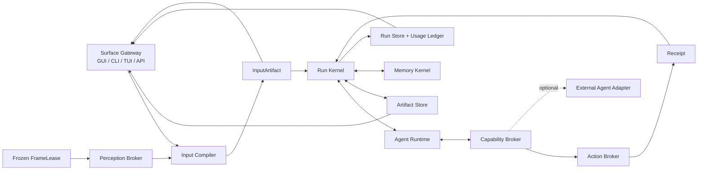

# Magic Pointer 主权 Agent 后端重构蓝图

> **同组文件：**问题空间、竞品与创新候选的完整底稿见 [《Magic Pointer 下一代真实工作流 Agent Harness》](./2026-08-17-magic-pointer-next-generation-agent-standalone-brief.md)；按“商业存活与最低迁移阻力”目标做出的反方审议见 [《Magic Pointer 下一代 Harness：审议结果》](./2026-08-17-magic-pointer-harness-deliberation-verdict.md)。本文件是在用户进一步明确“即使暂不商用，也要亲手做出完整、开源、超前的自有 Agent”后形成的最终方向与可执行后端蓝图。
>
> **文件角色：**这是方向裁决、架构边界和实施地图，不是对现状完成度的宣传。文中“现状”来自 2026-08-17 对 Magic Pointer 当前工作树、最新 Hermes Agent 与最新 Pi Mono 官方源码的只读审计；“决策”是本轮用户目标下的工程选择；“假设”必须由真实任务数据验证。
>
> **一句话裁决：**Magic Pointer 要做完整 Agent，但不 fork Hermes，也不把 Hermes 当默认后端；它要拥有自己的任务、会话、推理循环、工具、权限、产物、记忆、回执与成本真相，以 Hermes 的工作系统覆盖面为下限、以 Pi 的运行时深度为内核参照，再把“人类指代编译、冻结帧多证据感知、最省充分执行、回执准入学习、可撤销主动性”做成别人没有的主轴。

---

## 0. 这次目标为什么与上一份审议不同

上一份审议并没有简单地说“不要做 Agent”。它在当时的目标函数下选择的是：确定性内核 + 自有 Runtime 承接短任务 + 长任务外接现有 Agent。那是以商业存活、迁移成本和最短成环路径为优先级的合理答案。

用户这次明确改变了目标函数：

1. 项目本身是一次重要经历与能力积累，不以短期商业成功作为唯一裁决标准。
2. 目标就是亲手做出一个完整、开源、前沿的 Agent，而不是只做输入外设或伴随层。
3. Hermes 已有的综合能力应当成为下限；Magic Pointer 应吸收公开实现中真正优秀的部分，同时拒绝它的臃肿和高 token 消耗。
4. 人类指代与桌面感知不是附属功能，而是自有 Agent 的原生输入层。
5. 后端必须先建立完整而干净的纵向闭环；GUI 随后把重要事实清楚展示出来，而不是把内部复杂度倾倒给用户。

因此，本文件正式否决两种极端：

- **否决纯外设化：**Magic Pointer 不能只负责编译 Prompt 后把真正工作永久交给别的 Agent。
- **否决整体 fork：**Magic Pointer 不能把 Hermes 的当日快照搬进来，再背负它的巨大模块、历史耦合和上游分叉成本。

最终选择是：**主权 Runtime + 精确吸收 + 资产兼容 + 可选联邦执行。**

“主权”不是拒绝互操作。它表示 Magic Pointer 对一次任务的真相拥有最终解释权；外部 Agent 即使参与，也只是受控的能力提供者，不是任务、记忆或完成状态的所有者。

---

## 1. 产品定义：不是聊天壳，而是可见、可控、可验证的完整 Agent

### 1.1 用户看到的完整产品

一个任务不离开 Magic Pointer 就可以完成以下闭环：

1. 用户通过文字、语音、点击、框选、晃动、文件或当前应用状态表达意图。
2. 系统冻结手势结束瞬间的目标画面，并从多个感知源读取证据。
3. 系统把“你说了什么、你指了什么、当前有什么事实、哪里仍有歧义”编译成一个可查看、可修正的输入对象。
4. 自有 Agent 判断任务、制定下一步、调用工具、必要时向用户追问，并能被用户中途 steer。
5. 对写入、发送、删除、运行等动作，确定性系统重新验证目标和权限。
6. 产出进入可编辑、可版本化的 DraftArtifact，而不是只剩聊天气泡。
7. 系统用真实读回证据判定结果，不接受模型单方面宣称完成。
8. 任务的成本、关键决策、产物、失败与用户纠正进入同一条可回放记录。
9. 只有达到准入条件的信息才进入长期记忆或可复用经验。

这才叫“完整 Agent”。模型是否在本地、云端或临时由某个外部 Agent 协助，是执行细节，不改变上述产品所有权。

### 1.2 GUI 为什么必须存在

GUI 不是 Agent 的聊天皮，而是三个终端很难承担的界面：

- **感知仪表盘：**让用户一眼看到“系统认为我指的是谁、依据是什么、哪里不确定”。
- **产物工作台：**直接编辑、比较和接受 DraftArtifact；用户的改动是一级事件。
- **控制与回执面：**展示高影响动作的许可范围、当前运行状态和完成证据。

GUI 不应默认展示 UIA 树、DOM selector、OCR 原文、调用栈或几十条工具轨迹。默认层只展示一个完整、可触摸的“输入对象”：

- 目标名称与类型；
- 带标记的冻结画面预览；
- 关键上下文摘要；
- 来源徽标，如 UIA + OCR，或 DOM + 像素；
- 冲突/不确定提示；
- “不是这个”与直接修正入口。

技术细节放在“查看依据”中按需展开。解释性来自可核对的证据，不来自把复杂代码打印给用户。

### 1.3 CLI 为什么也必须是一等公民

同一个 Runtime 必须同时支持 GUI、CLI/TUI 和未来的其他入口。CLI 不是“把 GUI 功能缩水”，GUI 也不是“给 CLI 套壳”。两者只负责表达和渲染：

- GUI 可传入手势与视觉锚点；
- CLI 可传入工作目录、文件引用和终端选区；
- 两者都创建同一种 Task、InputArtifact、Operation、DraftArtifact 与 Receipt；
- 两者都能 observe、steer、answer、cancel、resume；
- Runtime 不读取某个界面进程的全局变量来推断能力。

---

## 2. 最新源码对照后的真实结论

### 2.1 审计范围与证据边界

本轮读取的官方最新快照为：

- Hermes Agent：官方 `main` 提交 `4323c67`，提交时间 2026-08-17 14:11 UTC。
- Pi Mono：官方 `main` 提交 `6db110e6`，提交时间 2026-08-17 14:58 UTC。
- Magic Pointer：当前工作树、设计真相文档、STATUS、既有重构计划与核心后端源码。

源码规模本身不代表质量，但揭示了可维护性边界：

| 项目/区域 | 文件数 | 约代码行 | 结论 |
|---|---:|---:|---|
| Hermes `agent` | 195 | 145k | 覆盖广，核心循环仍大 |
| Hermes `tools` | 142 | 137k | 工具与真实工作流资产丰富 |
| Hermes `gateway` | 90 | 108k | 多渠道能力强，但不应成为 MP 第一阶段负担 |
| Hermes `plugins` | 204 | 138k | 生态能力强，同时存在多套发现/优先级机制 |
| Hermes `desktop` | 1,612 | 369k | 产品面完整，不适合作为轻量内核直接 fork |
| Pi `packages/agent/src` | 50 | 12.6k | 核心状态机明显更紧凑、更适合作为深度参照 |
| Pi coding core | 76 | 32k | 会话、扩展、工具与模型组织清晰 |
| Magic Pointer `agent_runtime` | 23 | 8k | 已有真实循环，不是从零开始 |
| Magic Pointer `fabric` | 37 | 13k | 能力丰富，但与 Runtime/产物/路由存在边界重叠 |
| Magic Pointer `electron` | 89 | 27.5k | 表面能力不少，主进程与桥接文件已过大 |

需要特别诚实的一点：Pi 最新约 2,900 行 Harness 设计文档非常先进，提出 durable entry tree、register、lane、usage ledger、operation program counter 和 effect sandwich；但其当前 `agent-harness.ts` 仍有多项公开操作直接抛出 `HarnessNotImplemented`。因此我们吸收的是明确的状态语义和不变量，不是假装它已交付了一套可直接搬来的成品。

### 2.2 Hermes 应吸收与应拒绝的部分

**吸收：**

- 完整工作系统意识：模型、工具、技能、记忆、配置、渠道、定时任务和后台协作不是散件。
- Skills 的 `SKILL.md + scripts + references + assets/templates` 资产形态。
- 模型/provider、工具、插件的配置资产与用户迁移习惯。
- delegation 的 leaf/orchestrator 区分、深度与并发上限。
- session capability 属于会话而非进程环境的原则。
- prompt cache 的稳定性原则：不要在同一会话中无意义地改写历史上下文和工具集合。
- 功能进入核心前的 Footprint Ladder：先扩展既有能力，再考虑 skill、受控 service、plugin、MCP，最后才是 core tool。

**拒绝：**

- 整体 fork 与长期追 upstream merge。
- 8k–30k 行级别的核心/网关/CLI 巨型文件成为新常态。
- general plugin、memory provider、model provider 各自拥有独立发现与优先级规则。
- 通过 process-global 状态传递 surface capability。
- 为追求 parity 而把 Telegram、Discord、Kanban、Cron、Swarm 同时塞进第一版主链。
- 把高 token 消耗当作“综合能力必然成本”。

### 2.3 Pi 应吸收与应拒绝的部分

**吸收：**

- 小而清晰的 turn loop 与 steer/follow-up 队列语义。
- append-only session tree，而不是复制聊天记录来制造分支。
- operation 是持久化程序计数器，而非内存中的临时函数调用。
- 外部副作用采用“意图提交 → 执行 → 结算提交”的 effect sandwich。
- 崩溃恢复按工具效果分类：安全读可以重放，不安全写不能盲目重放。
- entries、mutable registers、usage 三种不同写入语义，避免把所有东西混成一份 JSON。
- lane 是任务/分支的拥有关系，不是默认启动一群 Agent。
- race catalog 与可证明不变量，而不是只写 happy-path 单测。

**拒绝：**

- 把尚未实现的 Harness 文档当成现成依赖。
- 为了形式优雅一次性推翻 Magic Pointer 已工作的 session 与 loop。
- 把 coding-agent 的文件中心世界观直接套在桌面指代输入上。

### 2.4 Claude Code、Codex、Kimi/DSH 等应吸收的横向能力

- 工具 effect/read/write/destructive/concurrency 元数据必须是确定性字段，不靠模型猜。
- 流式工具调用必须保持输出与提交次序，允许安全并发但不打乱会话真相。
- session log 是恢复与复盘真相；UI state 只是 projection。
- Inbox/steer 是运行时原语，不是聊天框临时拼接字符串。
- maintenance/compaction 发生在明确边界，不能偷偷改变当前动作依据。
- 插件失败要有清晰的隔离和卸载语义。

---

## 3. Magic Pointer 当前真正拥有的资产

不能因为闭环没完成就把现有工程说成空壳。当前已经有几条很难得的底层边界：

1. **FrameLease：**手势完成时先冻结历史像素，后续 UIA/DOM/COM/OCR 或 overlay 不能把“后来画面”冒充当时证据。
2. **ActionLease：**高影响动作在执行前重新核验目标、权限和现场。
3. **屏幕内容是 data，不是 instruction：**感知结果不会天然升级为系统指令。
4. **真实 Agent loop：**已有模型回合、工具调用、session、Inbox、verification gate、compaction 和 usage 汇总。
5. **有版本的 Draft/Artifact 方向：**不是只把输出扔进聊天消息。
6. **Harness scope：**已有 process/run/surface scope、插件 mount/unload 与工具/Prompt registry。
7. **SurfaceAdapter 与 Capability contract：**已经意识到新应用不能继续写 core if/else。
8. **大量确定性执行能力：**Fabric、actions、computer operator 和本地工具并非 Demo。

这些应该保留并收束，而不是推倒重来。

---

## 4. 当前后端的致命断链：精确到文件与调用关系

### 4.1 感知仍是串行“第一个非空即胜出”

`app/grounding/perception_cascade.py` 的 `resolve_structured_perception()` 当前按 priority 顺序调用 adapter；第一个 `context_has_usable_structure()` 的结果会立即返回。后果是：

- UIA 返回一个容器名，也可能挡住后面的 DOM/COM/OCR；
- 无法比较多个来源是否一致；
- 无法展示“UIA 说 A、OCR 说 B”的真实不确定性；
- 慢源会阻塞后续源，而不是与其他证据并发；
- 规范文档要求的 concurrent evidence fusion 尚未进入生产路径。

### 4.2 Evidence contract 是孤岛

`app/evidence/contract.py` 已经能区分 `ok / degraded / empty_confirmed / busy / timeout / unsupported / denied / error`，也有 container heuristic 和 `merge_for_decision()`；但生产感知链几乎没有调用它。测试证明了一个好类型，用户路径仍传递裸 `AdapterReadContext` 和松散 dict。

正确处理不是再建一套 contract，而是让每个 perception provider 的出口强制归一为 EvidenceObservation，并让 fusion 只消费这个形状。旧 helper 在最后一个生产 caller 消失后删除。

### 4.3 InteractionLedger 是孤岛

`app/telemetry/interaction_ledger.py` 可以保存 token、延迟、证据层、置信度、look、成功与失败，但生产链没有 caller。与此同时，`app/agent_runtime/session.py` 已经记录 model request/response usage 和 tool call。继续维护两套持久化真相会制造漂移。

决策：**保留 ledger 的投影视图，不保留第二本独立账。**所有原始事件进入 RunStore/SessionStore；InteractionLedger 由事件投影得到。只有不能从事件推导的阶段耗时，需要在对应阶段写一个 typed event。

### 4.4 Snapshot 不是 InputArtifact

`scripts/selection_snapshot_bridge.py` 当前在 `capture_snapshot()` 中正确地先绑定冻结帧，但之后：

- 每次捕获临时 `boot_surface_context()`，重复插件发现/装载；
- surface adapter 先尝试 claim，再进入 general adapter 读取；
- structured read 串行；
- frozen visual/OCR 更晚进入，仍具有 fallback 味道；
- 最终输出是不断增长的 dict，不是有明确版本、证据、冲突、展示投影的领域对象；
- `_suggested_commands` 仍包含“让 Pi 处理这个”等外部身份文案，和主权 Agent 目标冲突。

### 4.5 两套能力世界正在形成

`app/adapters`、`app/surface_adapter`、`app/fabric`、`app/actions`、`app/computer_operator` 与 Harness plugin 都掌握一部分“什么能力存在、如何路由、如何执行”的真相。它们当前不是简单重复，但边界没有收紧：

- Adapter 应只负责把某个外部表面翻译成统一 contract；
- Capability 应只描述可用操作和前置条件；
- ActionBroker 应只负责许可、租约、执行与验证；
- Fabric 不应再同时承担产品路由、计划、执行、审计、Agent 启动和产物拼装。

### 4.6 Session 有韧性，但还不是完整 Run Kernel

`app/agent_runtime/session.py` 已有 append-only JSONL、turn lease、崩溃修复、model/tool event 和 fork。缺口是：

- 没有持久化 operation program counter；
- unsafe tool 崩溃后的“已执行但未写回”不能被精确区分；
- fork 复制既有事件，而不是引用共享历史形成树；
- model surface replacement 与 raw events、mutable runtime state 仍混在同一抽象；
- hash chain 付出了复杂度，但没有改变当前受支持用法的关键决策，不应继续扩张。

这里不做立即重写。先补 operation/effect seam，使新旧 session 可以共存迁移；待新 RunStore 覆盖现有恢复行为后，再删旧路径。

### 4.7 纵向产品闭环仍断在四处

现有 STATUS 已明确记录：

- `ask_user` 没有完整到达 GUI 并回到原 run；
- 跨进程 steer 尚未真正成为 durable Inbox；
- DraftArtifact 到编辑、差异、再执行的链路未闭合；
- 账本没有接入生产。

因此，当前最大问题不是“少一个更聪明的 planner”，而是已有聪明模块之间没有同一条任务真相。

---

## 5. 目标架构：少量深模块，一条任务真相



架构只设十个主 Module；每个 Module 暴露少量深接口，复杂度藏在内部：

| Module | 唯一职责 | 绝不拥有 |
|---|---|---|
| SurfaceGateway | 接收用户输入、投影运行状态、传递 steer/answer | 任务调度、工具权限、长期记忆 |
| PerceptionBroker | 在同一 FrameLease 上调度并归一多源证据 | 用户意图、模型 Prompt、动作执行 |
| InputCompiler | 把人类表达 + 证据编译成 InputArtifact | 调用任意有副作用工具 |
| RunKernel | 任务生命周期、operation 状态、队列、恢复 | 应用特定读写逻辑 |
| AgentRuntime | 模型回合、上下文、工具选择、停止判断 | 坐标真相、权限真相、结果真相 |
| CapabilityBroker | 统一发现与选择工具/skill/provider/adapter | 执行许可与会话持久化 |
| ActionBroker | effect 分类、ActionLease、许可、执行、验证 | 模型推理、记忆巩固 |
| ArtifactStore | Draft/文件/表格等有版本产物与差异 | 聊天历史、工具发现 |
| MemoryKernel | 检索、候选、冲突、巩固、遗忘 | 原始运行日志 |
| RunStore | append-only 事件、register、usage、projection | 产品策略和 UI 布局 |

ExternalAgentAdapter 不是第十一个核心真相。它只是 CapabilityBroker 下的一类 provider，与 shell、browser、Office adapter 同级；默认自有 Runtime，只有显式路由或能力缺口才调用外部 Agent。

---

## 6. 七个核心领域对象

### 6.1 InputArtifact：把“这个 + 半句话”变成可见的正式输入

建议 v1 最小形状：

```json
{
  "schemaVersion": 1,
  "id": "input_...",
  "createdAtUtc": "...",
  "utterance": "把这个整理成表格",
  "gesture": {
    "kind": "region",
    "screenRect": [100, 200, 640, 480],
    "frameLeaseId": "frame_..."
  },
  "target": {
    "label": "订单列表",
    "kind": "table",
    "bounds": [110, 220, 620, 460],
    "confidence": 0.91
  },
  "facts": [
    {"kind": "text", "value": "...", "sources": ["uia", "ocr"]}
  ],
  "conflicts": [],
  "attachments": ["frozen://frame_.../target-preview"],
  "routeHint": "deterministic_or_small_model",
  "display": {
    "title": "订单列表",
    "summary": "23 行 × 6 列",
    "sourceBadges": ["UIA", "OCR"],
    "needsConfirmation": false
  }
}
```

硬规则：

- InputArtifact 只能引用 gesture 当时的 FrameLease，不可在编译阶段晚截图。
- raw evidence 可保留在本地 artifact/store，但模型默认只拿“最小充分投影”。
- evidence 冲突不能被 fusion 偷偷抹掉；`conflicts` 必须可见。
- `confidence` 不直接授权动作，只影响追问、感知加深和模型档位。
- `display` 是后端提供的稳定 projection，GUI 不自行猜领域语义。
- 用户修正目标时创建 revision，不改写历史 InputArtifact。

### 6.2 Run 与 Operation：任务不是一串临时函数

Run 是用户意图的持久化生命周期；Operation 是一个可恢复的程序计数器。

建议状态：

`created → compiling_input → ready → reasoning → awaiting_user | executing → verifying → completed | failed | cancelled`

Operation 至少记录：

- `operationId / runId / turnId`；
- 当前 `phase` 与单调递增 `revision`；
- tool/capability id 与 effect 分类；
- arguments 的稳定快照；
- permission decision 与 ActionLease reference；
- execution started/settled；
- Receipt reference；
- crash recovery policy。

### 6.3 Receipt：完成证明、transport、学习门票与账本行

Receipt 不是日志字符串。它至少包含：

- `status`: succeeded / failed / partial / interrupted / unknown；
- `effect`: read / reversible_write / irreversible_write / external_send；
- `observedBefore` 与 `observedAfter` 的必要引用；
- `verificationMethod` 与 `usedBackend`；
- `artifactIds`；
- `cost`: latency、model tokens、vision tokens、tool calls；
- `failureType`；
- `memoryEligible`: 由规则计算，不能由模型自授。

Receipt 同时解决四件事：UI 如何证明完成、Agent 之间如何传递结果、哪些经验可晋升、如何衡量是否真的比 Hermes 省。

### 6.4 DraftArtifact：用户编辑不是聊天外事件

DraftArtifact 必须具备：

- stable id + revision；
- content type；
- provenance：由哪个 InputArtifact/Run/Operation 生成；
- model patch 与 user patch；
- accepted/rejected/partially accepted；
- target application/export status；
- 相关 Receipt。

用户把模型输出改了三处，这三处差异是最有价值的偏好与纠错信号之一，不能只留下最终文本。

### 6.5 Capability：统一能力语言

工具、skill、recipe、MCP、surface adapter 和外部 Agent 都通过同一份 capability descriptor 被发现：

- identity/version/provider；
- input/output schema；
- effect 与 concurrency；
- requirements/platform/surface；
- permission scope；
- latency/cost hint；
- failure semantics；
- lifecycle scope；
- provenance/license。

统一 descriptor 不表示统一实现。它消除的是发现、路由和权限的重复真相。

### 6.6 MemoryRecord：长期记忆不是第二份聊天历史

长期记忆只保留五类：

1. 用户明确陈述的稳定偏好；
2. 可验证的环境事实与工作约定；
3. 被用户接受、重复成功的程序性经验；
4. 失败模式与有效修复；
5. 未解决的承诺/任务状态。

每条记录必须有来源事件、适用范围、置信度、最后验证时间和冲突关系。顺利完成一次的普通任务不自动写长期记忆。

### 6.7 UsageRecord：成本必须成为运行时一等状态

UsageRecord 不另建一份手写账本；它随 model/tool/perception/verification 事件写入 RunStore，再投影为：

- 输入编译 token 与原始输入估算差；
- text/vision token；
- 感知各 provider 延迟；
- reasoning 回合数；
- tool call 数与重复调用数；
- look/深视觉是否触发；
- 用户纠正次数；
- 最终成功、部分成功或失败；
- Receipt 的验证强度。

---

## 7. 感知层：第一优先级的正确实现

### 7.1 从 cascade 改为 broker

新的 PerceptionBroker 不是简单地把串行循环丢进线程池。它包含五步：

1. **计划：**根据 surface、gesture、provider capability 和预算选择本轮允许的证据源。
2. **并发采集：**所有 provider 绑定同一个冻结 FrameLease；每个源有自己的 deadline 和取消语义。
3. **归一：**每个结果转换为 typed observation，明确 ok、空、busy、timeout、unsupported、denied、error。
4. **融合：**生成目标、事实、冲突与剩余不确定性；不能只返回“最佳字符串”。
5. **投影：**同时生成 model projection、GUI display projection 和完整本地 evidence reference。

### 7.2 Provider 输出契约

当前 `Evidence.value: str | None` 太窄，适合第一阶段文本判断，不足以承载 DOM 节点、表格范围、UIA element、OCR box 与视觉关系。演进为：

```text
EvidenceObservation[T]
  source
  status
  confidence
  payload: T | None
  targetCandidate
  capturedFrameLeaseId
  latencyMs
  freshness
  limitations
  rawArtifactRef
```

不要一开始做复杂泛型框架。v1 可以用 frozen dataclass + JSON-safe payload；等至少三类 provider 真正接入后再决定是否抽 protocol 泛型。

### 7.3 并发不等于全源永远启动

“并发证据融合”与“节省 token/调用”并不冲突：

- 便宜且结构化的 UIA/DOM/COM 可并发启动；
- OCR 使用冻结帧，本地执行，可根据区域大小与表面先验启动；
- 大视觉模型只在结构源冲突、都不可用、或用户任务本身需要视觉语义时启动；
- 所有源完成后保留一致性信息，而不是因某个源先返回就取消其余便宜源；
- route policy 是确定性代码，可由账本数据校准，但不能退化为关键词 if/else 堆。

### 7.4 真实可靠性验收

第一批支持面不追求“所有 Windows 应用”。先把项目文档真实承诺的表面跑通：

- 浏览器正文/表格；
- Explorer 文件项；
- Word/Excel/WPS 选区；
- 普通 Win32/UIA 文本控件；
- 终端选区与附近命令上下文；
- 纯像素应用的 OCR/视觉兜底。

每个表面至少验证：目标对、文字对、FrameLease 对、冲突可见、超时不伪装空、失败时可修正。不能再用“返回非空”作为成功标准。

---

## 8. Agent Runtime：完整，但不把一切塞进大循环

### 8.1 Loop 只负责认知状态机

`app/agent_runtime/loop.py` 应逐步缩为：

- 接收 RunKernel 提供的当前 operation 和 model projection；
- 发出 assistant content、tool intent、ask_user 或 stop proposal；
- 接收工具 Receipt；
- 管理 steer/follow-up 的回合边界；
- 报告 usage；
- 不直接做持久化、权限判断、应用路由或产物写入。

目标不是追求某个行数，而是让 loop 不再同时拥有五种真相。拆分以 seam 为依据，不做纯文件美容。

### 8.2 最省充分执行

完整 Agent 不等于每个任务都跑完整大模型循环。InputCompiler 输出 route hint，RunKernel 选择最小足够执行层：

1. 确定性转换/查询；
2. 单模型调用，无工具循环；
3. 小模型 + 有界工具；
4. 主模型完整 loop；
5. 显式 delegation/外部 specialist。

升级条件来自可观察事实：歧义、工具需求、验证失败、用户纠正、上下文规模，而不是“任务里出现某个关键词”。降级不能绕过权限、租约和 Receipt。

### 8.3 停止条件

Agent 只有在以下之一成立时停止：

- Receipt 验证任务目标已满足；
- 用户明确接受 DraftArtifact；
- 需要用户提供缺失信息并进入 durable `awaiting_user`；
- 可重试预算耗尽且给出诚实失败；
- 用户取消。

“模型说 done”不是停止条件。

---

## 9. 主权会话、崩溃恢复与副作用

### 9.1 RunStore 的三种写入语义

借鉴 Pi 的深层思想，但落在 MP 自己的领域：

- **Entries：**不可变事件，如 user input、model response、tool intent、Receipt、artifact revision。
- **Registers：**可覆写的小状态，如当前 run phase、active operation、待回答问题、surface connection。
- **Usage：**追加式成本事件，可独立聚合，不污染模型上下文。

三者可以先共用同一目录，不必为了概念立刻引入数据库。区别是语义，不是部署数量。

### 9.2 Effect sandwich

任何有外部副作用的 operation 都按顺序：

1. 持久化 tool intent、参数、effect、permission 和 ActionLease 引用；
2. 标记 execution started；
3. 调用 adapter/executor；
4. 读回验证；
5. 持久化 settlement + Receipt；
6. 推进 operation program counter。

崩溃后：

- read-only 可以按 policy 重放；
- reversible write 先观察现场，再决定继续、回滚或请求用户；
- send/delete/run 等不能自动重放；状态为 interrupted/unknown，并把现场事实交给用户或恢复逻辑。

### 9.3 跨进程 steer 与 ask_user

Inbox 必须从进程内队列升级为 RunStore 上的 durable message：

- `steer_now`：在安全边界改变当前 run；
- `follow_up`：当前 run 结算后开始下一意图；
- `answer`：绑定明确的 question id；
- `cancel`：请求取消，不能伪装成一条普通用户消息。

GUI/CLI 都只写这种消息；Runtime 在明确 checkpoint 消费。这样界面重启、Agent 进程重启与长工具调用都不会丢失用户控制。

---

## 10. 兼容 Hermes，但不依赖 Hermes

### 10.1 兼容目标

用户从 Hermes 迁入时，最有价值的是资产而不是代码：

- model/provider 配置映射；
- MCP server 配置；
- Skills 目录与 frontmatter；
- memory 文本的只读索引或显式导入；
- 常用命令/工作目录习惯；
- 可选 channel identity；
- 导入报告：哪些原样支持、哪些降级、哪些拒绝。

默认策略是“索引不摄取”：能从原目录读取的资产不复制，不修改；需要 MP 专属元数据时写 sidecar 到 MP 自己的数据目录。这样既继承用户资产，又不制造双向同步地狱。

### 10.2 不做伪兼容

- 不声称支持 Hermes plugin 就直接执行任意内部 Python 对象。
- 不复制 Hermes memory provider 的优先级规则。
- 不为了一个配置字段建立永久兼容层；先支持真实用户资产中的高频子集。
- 不在核心里写 `if backend == hermes`。
- 外部 Hermes 进程 adapter 保留为可选 specialist，但不是主路径，也不决定 MP session 和记忆。

---

## 11. 记忆与自我改进：先建立准入，不先堆向量库

### 11.1 三层存储

- **工作记忆：**当前 InputArtifact、任务事实、operation、最近 Receipt；任务结束即可释放。
- **情节记录：**RunStore 中可回放的事实，不默认塞进 Prompt。
- **长期记忆：**经过准入和冲突处理的少量 MemoryRecord。

### 11.2 “惊奇”门控

以下事件产生长期记忆候选：

- 用户明确说“以后都这样”；
- 用户纠正了目标、内容、工具或格式；
- verification 失败但找到有效修复；
- route 误判导致不必要的大模型/视觉/工具开销；
- 同一程序性做法被多次 Receipt 证明成功；
- 环境事实改变，导致旧记忆冲突。

普通顺利任务只保留情节记录，不自动写长期记忆。

### 11.3 记忆晋升

Receipt 是必要条件但不是充分条件：

- 偏好需要用户明确表达或多次编辑差异一致；
- 程序性经验需要成功 Receipt 和适用范围；
- 失败修复需要保存失败条件，不能只记“以后用 X”；
- 冲突先并存并标注 scope，不用模型随意覆盖旧事实；
- 自动生成 skill 必须先进入 review/候选区，不能直接获得工具权限。

---

## 12. 主动性：可撤销的未来，而不是擅自替用户生活

主动性分四级：

1. **补全理解：**利用 gesture、当前任务和稳定偏好，减少用户组织 Prompt 的负担。
2. **准备候选：**在后台生成可丢弃 Draft、计划或局部 patch，不产生外部副作用。
3. **建议下一步：**根据 Receipt 和任务事实给出一个高相关建议，用户选择是否执行。
4. **执行已授权例程：**只有用户对明确 scope 做过授权，且 ActionLease 仍有效时才执行。

“可撤销的未来”是核心机制：系统可以提前准备多个低成本、可回滚分支；用户的选择、编辑和拒绝用于校准意图。它把主动性收益前置，把错误代价压低。

动态超图暂不作为核心数据结构。当前任务事实先用 ownership table：每个事实由哪个 run/operation/source 产生、谁正在使用、何时失效。只有当真实任务反复出现多主体、多关系、跨时间推理且普通索引无法表达时，才升级数据结构。

Swarm 同样不是默认形态。只有同时满足“可分解、子任务独立、并行收益大于上下文复制、结果可独立验证、transport 不丢关键证据、失败可局部重试”时才创建多 lane。否则单 Agent + 并发工具更便宜、更可靠。

---

## 13. 精确文件级改造地图

### 13.1 新增的深模块

| 建议路径 | 内容 | 第一批是否实现 |
|---|---|---|
| `app/input_artifact/schema.py` | InputArtifact、target、fact、conflict、display projection | 是 |
| `app/perception/broker.py` | provider 计划、并发执行、deadline、结果归一、trace | 是 |
| `app/perception/fusion.py` | typed observations → target/facts/conflicts | 是，先做最小版 |
| `app/perception/providers.py` | provider protocol 与 adapter bridge | 是 |
| `app/run_kernel/schema.py` | Run/Operation/phase/effect/recovery policy | 下一批 |
| `app/run_kernel/store.py` | entries/registers/usage 与 durable Inbox | 下一批 |
| `app/run_kernel/runner.py` | operation program counter、effect sandwich | 下一批 |
| `app/artifacts/schema.py` + `projection.py` | DraftArtifact revision 与差异；session 事件是 store | Gate 2 本批（开发树，未升版本）
| `app/memory/kernel.py` | candidate、准入、冲突、检索 | 闭环后 |
| `app/compat/hermes_assets.py` | 配置/Skills/MCP/memory 索引兼容 | Runtime 闭环后 |

命名可以在实现时依据现有 package 调整；关键是职责边界，不是目录新颖性。若现有模块能自然承载职责，优先扩展现有模块，避免平行宇宙。

### 13.2 保留并收束

| 当前路径 | 决策 |
|---|---|
| `app/capture/frame_lease.py` | 保留为冻结像素真相，补 WGC backend 但不改 lease 语义 |
| `app/action_guard/*` | 保留确定性 ActionLease/permission/verification，未来由 ActionBroker 统一调用 |
| `app/agent_runtime/loop.py` | 保留认知循环，逐步移出 persistence、permission 与 artifact 副职责 |
| `app/agent_runtime/session.py` | 作为兼容会话层保留，等 RunStore 覆盖恢复与分支后迁移 |
| `app/harness/runtime_host.py` | 保留 process host + cheap scope，扩展给 surface 使用 |
| `app/harness/plugin.py` | 保留一套插件生命周期；其他 provider 发现最终汇入它 |
| `app/agent_runtime/tool_registry.py` | 保留工具 schema/effect/concurrency 的单一 registry 方向 |
| `app/surface_adapter/contracts.py` | 保留 surface capability contract，接入统一 provider descriptor |
| `app/evidence/contract.py` | 复用状态语义，扩为结构 payload 后迁入新 perception package |

### 13.3 替换后删除

| 当前路径/形状 | 删除条件 |
|---|---|
| `app/grounding/perception_cascade.py` 的 first-usable 路径 | 新 Broker 在冻结帧回放与支持表面测试中达到行为覆盖；所有生产 caller 切换 |
| `scripts/selection_snapshot_bridge.py` 内每次 `boot_surface_context()` | resident SurfaceHarnessHost 有生命周期测试，插件变更在 request 边界可见 |
| 独立 `InteractionLedger.save/load` 作为第二真相 | RunStore usage projection 覆盖现有汇总测试与生产展示 |
| `_suggested_commands` 中 Pi 身份文案 | 自有 Agent action suggestion 投影接入后立即删 |
| session fork 的全历史复制 | entry tree/shared ancestry 恢复、分支、压缩测试通过 |
| Fabric 中与 RunKernel 重复的 agent starter/session/audit 拼装 | 新路径承担全部生产 caller，旧调用为零 |
| 多套 capability/provider discovery | 单一 CapabilityBroker 能解释每个 provider 来源与优先级 |

“删除条件”是为了避免半迁移，不是建设长期兼容层。条件满足后直接删旧路径和旧测试，不保留 feature flag 双跑数月。

### 13.4 需要拆，但不做纯行数重构

- `scripts/selection_snapshot_bridge.py`（约 3.5k 行）：按 capture binding、provider bridge、InputArtifact projection、CLI serialization 四个 seam 拆。
- `electron/main.ts`（约 5.3k 行）：待后端 IPC contract 稳定后，按 run gateway、capture controller、artifact controller、settings 拆。
- `app/agent_runtime/loop.py`（约 1.8k 行）：先移出职责，再决定文件拆分。
- `app/fabric/engine.py`（约 1.1k 行）与 `executors.py`（约 1.6k 行）：逐项映射到 CapabilityBroker/ActionBroker/ArtifactStore，不能整体搬家换名字。

---

## 14. 实施依赖序：不用 AI 伪造日历

### Gate 0：建立可证明的任务真相

目标：每次真实交互至少能回答“输入从哪来、花了多少、做了什么、是否真的成功”。

- 感知、模型、工具、验证的阶段事件进入同一 run/session truth；
- InteractionLedger 成为 projection；
- 建立 Hermes 对照任务集，但先不追漂亮 benchmark；
- 禁止任何“更省 token”主张没有数据。

### Gate 1：打穿感知咽喉

目标：冻结帧、多源并发证据、冲突和 InputArtifact 成为唯一生产输入路径。

- typed EvidenceObservation；
- concurrent PerceptionBroker；
- InputArtifact v1；
- resident surface host；
- 浏览器/Explorer/Office/普通 UIA/终端/像素表面的真实验收；
- GUI 所需 display projection 后端完成。

### Gate 2：形成完整自有 Run 闭环

目标：不用外部 Agent，也能启动、追问、steer、执行、验证、编辑、恢复。

- Run/Operation state；
- durable Inbox；
- ask_user 往返；
- effect sandwich；
- DraftArtifact revision；
- Receipt 停止条件；
- crash recovery。

### Gate 3：收束能力系统并兼容 Hermes 资产

目标：能力丰富但不形成四不像。

- 一套 Capability descriptor/discovery/lifecycle；
- Fabric/actions/operator/adapter 职责归位；
- Hermes Skills、MCP、provider/config 的高频子集兼容；
- 每项导入有明确报告；
- 外部 Agents 仅作为可选 specialist。

### Gate 4：记忆与经验学习

目标：重复任务越来越便宜，纠正不会白费。

- 工作/情节/长期三层；
- Receipt 准入；
- 用户 edit diff；
- 失败修复与 scope；
- 冲突、遗忘与按需检索。

### Gate 5：主动性与可撤销未来

目标：用户说一半也感觉系统理解了，但错误推断不产生昂贵后果。

- 预备可丢弃分支；
- 建议阈值与打扰预算；
- scope 授权例程；
- 用户选择/编辑作为学习信号。

### Gate 6：有证据地引入多 Agent

只有真实任务账本证明单 Agent 的关键路径受到可并行子任务限制，才实现 durable lanes。先做 transport 与独立 Receipt，再做“swarm”产品文案。

---

## 15. 第一批后端实施包：现在就做什么

本轮文档完成后立即开始，不等待 GUI 设计，也不启动其他 Agent。

### 15.1 范围

1. 新建 InputArtifact v1 的纯领域 schema 和 JSON projection。
2. 新建可注入 executor 的 PerceptionBroker；同一批 provider 真正并发，输出顺序稳定。
3. 把现有 AdapterReadContext 桥接成 typed observation，区分 timeout/busy/error/empty。
4. 新建最小 fusion：保留全部 observation，选择 target/facts，并显式生成 conflict。
5. 让 `resolve_structured_perception()` 暂时成为新 Broker 的兼容入口，生产 caller 不需要一次性重写；但其语义从 first-usable 改为 collect-and-fuse。
6. 为下一步 selection bridge 产出 InputArtifact 留下单一函数，不在第一刀同时改 Electron IPC。

### 15.2 测试先行的失败样例

- 慢的高优先级 adapter 与快的低优先级 adapter 总耗时接近最大单项，而不是两者之和。
- 两个成功源都被调用，不能因第一个非空提前返回。
- 一个源 timeout、另一个成功时，成功结果可用且 timeout 仍留在 trace。
- UIA 容器名与 OCR 正文冲突时，正文不会被容器名压掉，conflict/降级可见。
- 多个 provider 完成顺序不同，输出 observation 顺序仍可重放。
- 所有源都 busy/timeout 时，结果不能伪装成 `empty_confirmed`。
- InputArtifact 的 FrameLease id 缺失时拒绝构建 gesture-bound artifact。
- InputArtifact 默认 model projection 不包含完整 raw evidence 与无关节点。

### 15.3 第一批不做

- 不改 GUI 视觉；只提供稳定 display projection。
- 不重写 session store。
- 不实现完整 memory。
- 不导入 Hermes 代码。
- 不启动 Swarm、Cron、Kanban 或多渠道。
- 不在没有生产 caller 的情况下再建一套“未来框架”。

---

## 16. 验收：怎样证明“更好”，而不是感觉更先进

### 16.1 感知指标

- target correctness；
- content correctness；
- wrong-frame rate 必须为 0；
- timeout/busy honesty；
- evidence conflict recall；
- correction rate；
- p50/p95 输入编译延迟；
- 深视觉触发率。

### 16.2 Agent 指标

- 任务成功/部分成功/失败，必须由 Receipt 判断；
- 首个有效动作时间；
- 模型回合数；
- text/vision token；
- tool call、重复 call 与无效 call；
- ask_user 次数及真正必要率；
- steer 响应边界；
- crash 后 unknown side-effect 率；
- Draft 用户修改比例。

### 16.3 与 Hermes 的公平对照

不比较“谁功能列表长”，比较一组真实个人工作流：

- 指定屏幕对象后整理、改写、提取、比对；
- 浏览器 → Office 的跨应用产物；
- 当前文件/选区的小型编码与修改；
- 需要一次追问的任务；
- 工具失败后恢复；
- 重复任务第二次执行。

同模型、同任务目标、同验证标准下记录：用户输入成本、token、工具次数、延迟、成功、纠正。Magic Pointer 的主张应当是：在保留完整 Agent 能力的同时，由于输入更准确、执行分层更克制、结果可验证，综合浪费显著更少。

---

## 17. 防止“什么都吸收，最后四不像”的七条硬律

1. 每个新能力必须归属一个且仅一个主 Module。
2. 同一种 provider 不得拥有第二套发现、配置和生命周期规则。
3. 竞品能力只有映射到真实用户闭环、明确 seam 和验收证据后才进入代码。
4. 新抽象至少替代一处现有复杂度；只增加类型而不删除旧路径的抽象不合格。
5. 核心不包含应用名或外部 Agent 名的路由 if/else。
6. 模型不拥有权限、坐标、effect、完成状态和记忆晋升权。
7. 先纵向闭环，再横向扩能力；“未来可能需要”不是进入核心的理由。

---

## 18. 最终取舍表

| 问题 | 最终决策 |
|---|---|
| 做不做完整 Agent | 做，而且拥有全任务生命周期 |
| Hermes 是否作为后端 | 否；只作为可选 specialist/provider |
| 是否 fork Hermes | 否；吸收语义与兼容资产，不继承巨型代码形状 |
| Pi 是否作为底座 | 否；吸收运行时不变量，自己实现 |
| GUI 是否保留 | 保留；作为感知、产物、控制与回执工作台 |
| CLI 是否弱化 | 否；与 GUI 共享同一 Runtime 和领域对象 |
| 第一优先级 | 冻结帧上的并发证据 → InputArtifact → 可计量回执 |
| token 优化 | 输入编译 + 最省充分执行 + 稳定上下文/工具面 + 账本校准 |
| 记忆 | Receipt/纠错门控的三层记忆，不默认全量摄取 |
| 主动性 | 可撤销的未来；先准备，后结算 |
| 动态超图 | 暂不采用；先任务事实 ownership table |
| Swarm | 条件满足后用 durable lane，不做默认产品形态 |
| 外部 Agent 接入 | 兼容但降级为 Capability provider，不让渡主权 |

---

## 19. 给未来实现者的最后一句话

不要再问“Magic Pointer 是外设还是 Agent”。它是一个完整 Agent，而它与普通 Agent 的根本差别，是把人类指代也当作可编译、可核对、可学习的正式输入，把外部副作用也当作必须结算、必须有回执的正式程序状态。

Hermes 告诉我们完整工作系统应该有多广；Pi 告诉我们运行时状态应该有多深；Magic Pointer 自己必须回答的问题是：**当人只指一下、说半句时，一个 Agent 能否比所有只吃文字和文件的 Agent 更准确、更省、更可控，而且仍然完成整个工作。**

后续每一行代码都应当服务于这个答案。
