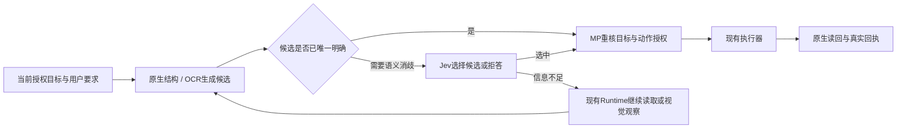

# Magic Pointer 当前开发树审计与 Jev 接入建议

日期：2026-09-20。对象：`D:\Desktop\Magic Pointer` 当前未提交工作树，package version 为 1.0.49。这是问题审计与设计建议，没有修改生产实现、安装配置或版本号，没有执行 sync，也没有把开发树等同于本机安装包。

## 结论和阅读边界

**目前最值得优先修的，是动作事实与状态记录之间的不一致。** Focus 可以没有激活却返回成功；输入的换行可以产生真实发送键；实际写入后可以留下“未写入”或错误目标的回执；聊天、摘要、会话保存和回退又能漏掉事实。这些会使一个规划正确的模型也执行错，或者使下一轮模型在错误历史上继续。Jev 可以改善候选判断，但不会自行纠正这些确定性错误。

主审与三个分区分别沿产品约定→生产装配→实际工具→状态/回执→UI和交付阅读，未阅读外部参考项目源码。已排除 external、external_zip、参考目录、_sv_sources、fast-jev-compaction-*、node_modules 等；用户指定的 Jev 文件夹只作为独立材料读取。现有未提交改动全部保留。

**没有完成“仓库所有自有文件逐行读完”。** 排除参考项目、依赖、构建/运行产物与本次审计产物后，路径盘点仍有1306项，其中app 265、electron 169、scripts 127、tests 447、docs 225。大型主进程/renderer、部分测试、历史文档和外围功能仍有未完整阅读范围；各分区末尾明确区分全文、调用链片段和未读。搜索命中、文件清单、运行测试不算读完文件。下面的具体发现有各自证据，不以问题数量冒充阅读完成度，也不对未读区域作“没有问题”的保证。

已完整或分块回读当前产品设计、PRD主线、长任务历史差距及分区必读文档；没有把旧的60/120秒硬超时、90轮保险丝或已完成FrameLease Phase A重新当作缺陷。

## 我对产品的理解

1. MP 是完整自有桌面 Harness。短任务、长任务、子任务、压缩、恢复与中断都属于 MP Runtime 的职责。
2. 手势是高质量任务入口：先冻结当时完整目标表面，再取得原生结构、OCR/视觉与对象关系；不能用后来变化的屏幕替代当时证据。
3. Runtime 主动读材料、找上下文；SourceRef、locator、引用角色和覆盖范围决定它究竟掌握了什么。读到一屏不等于读完整文档。
4. 产物是可编辑、带版本的 DraftArtifact。用户修改、Agent patch、批准和实际应用必须指向同一版本。
5. 写入前重核目标与授权；写入后用真实结果形成回执。未知结果不能自动重放，明确检查后的恢复也不能永远被挡住。
6. 新应用通过 SurfaceAdapter/Capability 接入；外部 Codex/Claude/Pi 是用户选择的投递目标，不能接管 MP 的执行循环。
7. 当前重点是办公与设计的真实结果。协议或替身测试通过，不等于微信、钉钉、Office、Figma 已完成原生验收；Figma缺少真实插件ID与原生验收的边界仍然存在。

这些主张本身清楚。需要补的是同一主张跨模块时的具体接线和失败语义，没必要为此重建一套 Harness。

## 问题总索引

每个编号表示一个独立根因或明确能力缺口，未把同一个问题的多个后果拆开凑数。P1/P2 用于修复排序，不表示已经观察到用户真实数据损坏。A 为本轮隔离复现；B 为当前生产代码/调用链直接证明；C 为明确产品能力缺口。子报告逐项有触发条件、实际/预期差异、位置、最小修复方向和证据限制。

**共85项：55项P1、30项P2。** 其中包括行为错误和明确能力缺口；证据强度见对应条目。

**Computer Use（27项）**

| 总号 | 编号 | 优先级 | 具体问题与证据入口 |
|---:|---|---|---|
| 1 | CU01 | P1 | [Focus 返回成功，但真实输入驱动没有 activate](<D:/Desktop/Magic Pointer/docs/research/audit-2026-09-20-computer-use.md:9>) |
| 2 | CU02 | P1 | [横向滚动请求变成零滚动](<D:/Desktop/Magic Pointer/docs/research/audit-2026-09-20-computer-use.md:17>) |
| 3 | CU03 | P1 | [Type 多行草稿会发送真实 Enter，submit=false 也可能发出消息](<D:/Desktop/Magic Pointer/docs/research/audit-2026-09-20-computer-use.md:24>) |
| 4 | CU04 | P1 | [快捷键中后续键失败会把 Ctrl/Alt 留在按下状态](<D:/Desktop/Magic Pointer/docs/research/audit-2026-09-20-computer-use.md:31>) |
| 5 | CU05 | P1 | [多任务输入所有权没有真正隔离](<D:/Desktop/Magic Pointer/docs/research/audit-2026-09-20-computer-use.md:38>) |
| 6 | CU06 | P1 | [RuntimeId 变了，index 点击仍通过 stale 检查](<D:/Desktop/Magic Pointer/docs/research/audit-2026-09-20-computer-use.md:45>) |
| 7 | CU07 | P1 | [裸坐标动作完全不检查窗口内部状态变化](<D:/Desktop/Magic Pointer/docs/research/audit-2026-09-20-computer-use.md:52>) |
| 8 | CU08 | P1 | [“完整缓存树搜索”实际上只能搜前 100 节点与每段前 80 字](<D:/Desktop/Magic Pointer/docs/research/audit-2026-09-20-computer-use.md:59>) |
| 9 | CU09 | P1 | [read_text 对 TextPattern 文档只有控件名字，没有文档正文](<D:/Desktop/Magic Pointer/docs/research/audit-2026-09-20-computer-use.md:66>) |
| 10 | CU10 | P1 | [act_ui 部分动作已成功后，后一步失败会丢掉成功回执](<D:/Desktop/Magic Pointer/docs/research/audit-2026-09-20-computer-use.md:73>) |
| 11 | CU11 | P2 | [act_ui 接受 path，但拖拽只走首尾两点](<D:/Desktop/Magic Pointer/docs/research/audit-2026-09-20-computer-use.md:80>) |
| 12 | CU12 | P1 | [点击/快捷键/submit 始终声明可逆写，无法落实真实发送/删除语义](<D:/Desktop/Magic Pointer/docs/research/audit-2026-09-20-computer-use.md:87>) |
| 13 | CU13 | P1 | [UIA 异常变空树，等待“控件消失”会假成功](<D:/Desktop/Magic Pointer/docs/research/audit-2026-09-20-computer-use.md:94>) |
| 14 | CU14 | P2 | [每次观察快照永久留在当前会话内存](<D:/Desktop/Magic Pointer/docs/research/audit-2026-09-20-computer-use.md:101>) |
| 15 | CU15 | P2 | [合法追加输入永远拿整字段与追加片段比较](<D:/Desktop/Magic Pointer/docs/research/audit-2026-09-20-computer-use.md:108>) |
| 16 | CU16 | P1 | [Excel 区域读取脚本四个坐标占位符从不替换](<D:/Desktop/Magic Pointer/docs/research/audit-2026-09-20-computer-use.md:115>) |
| 17 | CU17 | P1 | [Live Observe 用旧 source_id 读取同窗口的新文档/会话](<D:/Desktop/Magic Pointer/docs/research/audit-2026-09-20-computer-use.md:122>) |
| 18 | CU18 | P1 | [目标窗口被遮挡时，Live Observe 读取遮挡者像素并归给目标](<D:/Desktop/Magic Pointer/docs/research/audit-2026-09-20-computer-use.md:129>) |
| 19 | CU19 | P1 | [一张窗口视口截图被标成完整 document coverage](<D:/Desktop/Magic Pointer/docs/research/audit-2026-09-20-computer-use.md:136>) |
| 20 | CU20 | P2 | [有绑定来源时，Observe(mode=ax)也强制截图并调用视觉模型](<D:/Desktop/Magic Pointer/docs/research/audit-2026-09-20-computer-use.md:143>) |
| 21 | CU21 | P2 | [Live Observe 丢弃取消作用域，Stop不能中止视觉请求](<D:/Desktop/Magic Pointer/docs/research/audit-2026-09-20-computer-use.md:150>) |
| 22 | CU22 | P2 | [视觉元素缓存不能感知滚动或切会话，八秒内复用旧位置](<D:/Desktop/Magic Pointer/docs/research/audit-2026-09-20-computer-use.md:157>) |
| 23 | CU23 | P2 | [日常CU结构读取没有deadline/取消，单个UIA提供者可挂住工具](<D:/Desktop/Magic Pointer/docs/research/audit-2026-09-20-computer-use.md:164>) |
| 24 | CU24 | P1 | [Explorer 隐藏扩展名的准确名称可被同名前缀文件抢先匹配](<D:/Desktop/Magic Pointer/docs/research/audit-2026-09-20-computer-use.md:171>) |
| 25 | CU25 | P1 | [frozen_lease 分支绕过 deny/structured_only 的图片消费限制](<D:/Desktop/Magic Pointer/docs/research/audit-2026-09-20-computer-use.md:179>) |
| 26 | CU26 | P1 | [PDF 的“结构”适配器在内部重新截实时桌面，未使用冻结帧](<D:/Desktop/Magic Pointer/docs/research/audit-2026-09-20-computer-use.md:188>) |
| 27 | CU27 | P1 | [浏览器完整文档/搜索截断单节点正文，却报告 complete=true](<D:/Desktop/Magic Pointer/docs/research/audit-2026-09-20-computer-use.md:197>) |

**Runtime / Context（22项）**

| 总号 | 编号 | 优先级 | 具体问题与证据入口 |
|---:|---|---|---|
| 28 | RT-01 | P1 | [子 Agent 的模型调用仍落到约 4 秒默认预算](<D:/Desktop/Magic Pointer/docs/research/audit-2026-09-20-runtime.md:21>) |
| 29 | RT-02 | P1 | [Agent / Bash 丢弃工具取消 scope，中断无法穿过正在运行的长工具](<D:/Desktop/Magic Pointer/docs/research/audit-2026-09-20-runtime.md:30>) |
| 30 | RT-03 | P1 | [子任务没有持久会话，重启只能重新委派，不能恢复它的执行现场](<D:/Desktop/Magic Pointer/docs/research/audit-2026-09-20-runtime.md:39>) |
| 31 | RT-04 | P1 | [子任务没有压缩器，支持的批量读取会累积到上下文上限](<D:/Desktop/Magic Pointer/docs/research/audit-2026-09-20-runtime.md:48>) |
| 32 | RT-05 | P1 | [Read 的全局“已读”缓存把别的 Agent 读过误当成自己读过](<D:/Desktop/Magic Pointer/docs/research/audit-2026-09-20-runtime.md:57>) |
| 33 | RT-06 | P1 | [多个 CheckpointStore 顺序运行也会覆盖对方的备份](<D:/Desktop/Magic Pointer/docs/research/audit-2026-09-20-runtime.md:66>) |
| 34 | RT-07 | P1 | [Rewind 宣称恢复本会话，实际能撤掉其他会话的改动](<D:/Desktop/Magic Pointer/docs/research/audit-2026-09-20-runtime.md:75>) |
| 35 | RT-08 | P2 | [失败 Patch 仍添加 checkpoint，让“撤销上一步”撤不到最后一次真实修改](<D:/Desktop/Magic Pointer/docs/research/audit-2026-09-20-runtime.md:84>) |
| 36 | RT-09 | P2 | [Patch 文档支持的 `Move to` 语法永远进不到解析分支](<D:/Desktop/Magic Pointer/docs/research/audit-2026-09-20-runtime.md:93>) |
| 37 | RT-10 | P2 | [Patch 局部改一行会把 Windows 文件的全部 CRLF 重写成 LF](<D:/Desktop/Magic Pointer/docs/research/audit-2026-09-20-runtime.md:102>) |
| 38 | RT-11 | P1 | [Bash 将常见写操作分类为 READ，绕过正常写权限判断](<D:/Desktop/Magic Pointer/docs/research/audit-2026-09-20-runtime.md:111>) |
| 39 | RT-12 | P2 | [Bash 的持久 cwd 解析无法处理正常带空格目录，也不依据命令实际是否成功](<D:/Desktop/Magic Pointer/docs/research/audit-2026-09-20-runtime.md:120>) |
| 40 | RT-13 | P2 | [Bash 真实失败退出仍被登记为成功工具结果](<D:/Desktop/Magic Pointer/docs/research/audit-2026-09-20-runtime.md:129>) |
| 41 | RT-14 | P1 | [压缩源先保留最近内容，下一层却再只取前 48k，最近的更正被无声丢掉](<D:/Desktop/Magic Pointer/docs/research/audit-2026-09-20-runtime.md:138>) |
| 42 | RT-15 | P1 | [聊天分页按内容去重，能把不同 native ID 的真实重复消息删掉](<D:/Desktop/Magic Pointer/docs/research/audit-2026-09-20-runtime.md:147>) |
| 43 | RT-16 | P1 | [Excel 选区 locator 与磁盘读取器的匹配规则不兼容](<D:/Desktop/Magic Pointer/docs/research/audit-2026-09-20-runtime.md:156>) |
| 44 | RT-17 | P2 | [只有 URL 的聊天附件被标为可读，但注册的 reader 只接受本地路径](<D:/Desktop/Magic Pointer/docs/research/audit-2026-09-20-runtime.md:165>) |
| 45 | RT-18 | P2 | [Context.search 的 reader 错误被包进成功工具结果](<D:/Desktop/Magic Pointer/docs/research/audit-2026-09-20-runtime.md:174>) |
| 46 | RT-19 | P2 | [Read 的单行截断没有可到达的续读位置](<D:/Desktop/Magic Pointer/docs/research/audit-2026-09-20-runtime.md:183>) |
| 47 | RT-20 | P1 | [不确定结果的恢复屏障没有解除路径，用户重新确认后仍永久挡住相同动作](<D:/Desktop/Magic Pointer/docs/research/audit-2026-09-20-runtime.md:192>) |
| 48 | RT-21 | P1 | [pre-tool hook 修改了实际参数，journal 和 effect 仍记录修改前的参数](<D:/Desktop/Magic Pointer/docs/research/audit-2026-09-20-runtime.md:201>) |
| 49 | RT-22 | P1 | [后台任务的完成回执依赖短命桥接中的 daemon 线程，跨轮就可能丢失](<D:/Desktop/Magic Pointer/docs/research/audit-2026-09-20-runtime.md:210>) |

**桌面 / Figma / 交互（21项）**

| 总号 | 编号 | 优先级 | 具体问题与证据入口 |
|---:|---|---|---|
| 50 | D01 | P1 | [异步保存进行中再次修改，会永久清掉待保存状态](<D:/Desktop/Magic Pointer/docs/research/audit-2026-09-20-desktop.md:11>) |
| 51 | D02 | P1 | [有效进度也计入 256 KiB 累计上限，正常多步任务被杀](<D:/Desktop/Magic Pointer/docs/research/audit-2026-09-20-desktop.md:19>) |
| 52 | D03 | P1 | [草稿实际补丁的 dirty 会被摘要编辑覆盖](<D:/Desktop/Magic Pointer/docs/research/audit-2026-09-20-desktop.md:27>) |
| 53 | D04 | P2 | [实际写入值显示为普通文字，编辑时却强制 JSON.parse](<D:/Desktop/Magic Pointer/docs/research/audit-2026-09-20-desktop.md:35>) |
| 54 | D05 | P1 | [Figma 重选目标等待期间切换草稿，旧响应写入新草稿](<D:/Desktop/Magic Pointer/docs/research/audit-2026-09-20-desktop.md:43>) |
| 55 | D06 | P1 | [Figma 同节点批量变长替换，后续范围使用过期 offset](<D:/Desktop/Magic Pointer/docs/research/audit-2026-09-20-desktop.md:51>) |
| 56 | D07 | P1 | [Figma 当前操作在一半失败时不参与回滚](<D:/Desktop/Magic Pointer/docs/research/audit-2026-09-20-desktop.md:59>) |
| 57 | D08 | P1 | [Figma 字体加载等待后不再核对原文](<D:/Desktop/Magic Pointer/docs/research/audit-2026-09-20-desktop.md:67>) |
| 58 | D09 | P1 | [Figma 命令超时后仍会继续执行待派发写入](<D:/Desktop/Magic Pointer/docs/research/audit-2026-09-20-desktop.md:75>) |
| 59 | D10 | P2 | [Figma 已完成预览/命令结果永远留在主进程 Map](<D:/Desktop/Magic Pointer/docs/research/audit-2026-09-20-desktop.md:83>) |
| 60 | D11 | P1 | [创建分支只复制聊天展示，不复制材料和草稿所属 session](<D:/Desktop/Magic Pointer/docs/research/audit-2026-09-20-desktop.md:91>) |
| 61 | D12 | P2 | [超过 200 轮或 500 会话静默删除历史](<D:/Desktop/Magic Pointer/docs/research/audit-2026-09-20-desktop.md:99>) |
| 62 | D13 | P2 | [Studio 允许输入 12,000 字，发送时静默截成 4,000 字](<D:/Desktop/Magic Pointer/docs/research/audit-2026-09-20-desktop.md:107>) |
| 63 | D14 | P2 | [后台任务步骤更新数量不变时，UI 不再收到进度](<D:/Desktop/Magic Pointer/docs/research/audit-2026-09-20-desktop.md:115>) |
| 64 | D15 | P2 | [材料关注重启后漏掉应用关闭期间的文件变化](<D:/Desktop/Magic Pointer/docs/research/audit-2026-09-20-desktop.md:123>) |
| 65 | D16 | P2 | [“关注文件夹”无法发现子目录文档内容变化](<D:/Desktop/Magic Pointer/docs/research/audit-2026-09-20-desktop.md:131>) |
| 66 | D17 | P2 | [Git Changes 中普通中文文件名变成八进制文本，点击打不开](<D:/Desktop/Magic Pointer/docs/research/audit-2026-09-20-desktop.md:139>) |
| 67 | D18 | P1 | [预览文件先全量同步读入，再做 384 KiB 截断](<D:/Desktop/Magic Pointer/docs/research/audit-2026-09-20-desktop.md:147>) |
| 68 | D19 | P2 | [更新按钮承诺“下次启动时安装”，实现没有安排安装](<D:/Desktop/Magic Pointer/docs/research/audit-2026-09-20-desktop.md:155>) |
| 69 | D20 | P2 | [Pi 扩展仍把 MP 当外部 Harness 的上下文/执行工具](<D:/Desktop/Magic Pointer/docs/research/audit-2026-09-20-desktop.md:163>) |
| 70 | D21 | P2 | [全局导航拦截误套用内嵌浏览器，普通链接跳到外部浏览器](<D:/Desktop/Magic Pointer/docs/research/audit-2026-09-20-desktop.md:171>) |

**Office / 交付（15项）**

| 总号 | 编号 | 优先级 | 具体问题与证据入口 |
|---:|---|---|---|
| 71 | OP01 | P1 | [Word 局部替换在 run 边界继承了前一段格式（A）](<D:/Desktop/Magic Pointer/docs/research/audit-2026-09-20-office-delivery.md:7>) |
| 72 | OP02 | P1 | [live Word 一次改小片段会整段重赋值（B）](<D:/Desktop/Magic Pointer/docs/research/audit-2026-09-20-office-delivery.md:15>) |
| 73 | OP03 | P1 | [live Excel 不验证 after 矩阵大小（B）](<D:/Desktop/Magic Pointer/docs/research/audit-2026-09-20-office-delivery.md:23>) |
| 74 | OP04 | P1 | [多步原生写入的部分失败被记成 wrote=false（B）](<D:/Desktop/Magic Pointer/docs/research/audit-2026-09-20-office-delivery.md:31>) |
| 75 | OP05 | P1 | [一个 PDF 副本不能应用两个批注（A）](<D:/Desktop/Magic Pointer/docs/research/audit-2026-09-20-office-delivery.md:39>) |
| 76 | OP06 | P1 | [PDF 读回只看标识，不检查真正批注内容（A）](<D:/Desktop/Magic Pointer/docs/research/audit-2026-09-20-office-delivery.md:47>) |
| 77 | OP07 | P1 | [Figma 文本长度改变后用旧 end 读回（A）](<D:/Desktop/Magic Pointer/docs/research/audit-2026-09-20-office-delivery.md:55>) |
| 78 | OP08 | P2 | [XLSX 默认工作表名生成后被自己的验证拒绝（A）](<D:/Desktop/Magic Pointer/docs/research/audit-2026-09-20-office-delivery.md:63>) |
| 79 | OP09 | P1 | [生成 PPT 已有表格出界，仍被验证为成功（A）](<D:/Desktop/Magic Pointer/docs/research/audit-2026-09-20-office-delivery.md:71>) |
| 80 | OP10 | P2 | [PPT 无填充/无线条与颜色状态无法互转（B）](<D:/Desktop/Magic Pointer/docs/research/audit-2026-09-20-office-delivery.md:79>) |
| 81 | OP11 | P1 | [DocumentPatch 逆操作保存了，但没有可执行的恢复通路（C）](<D:/Desktop/Magic Pointer/docs/research/audit-2026-09-20-office-delivery.md:87>) |
| 82 | OP12 | P1 | [未调用/未完整输出的摘要仍可能替换历史（A+B）](<D:/Desktop/Magic Pointer/docs/research/audit-2026-09-20-office-delivery.md:95>) |
| 83 | OP13 | P1 | [干净 CI 测试先于构建，macOS 打包又漏编译（B）](<D:/Desktop/Magic Pointer/docs/research/audit-2026-09-20-office-delivery.md:103>) |
| 84 | OP14 | P2 | [sync 只增量覆盖，开发树已删模块仍留在安装版（B）](<D:/Desktop/Magic Pointer/docs/research/audit-2026-09-20-office-delivery.md:111>) |
| 85 | OP15 | P2 | [当前事实源混入相互冲突的旧结论（C）](<D:/Desktop/Magic Pointer/docs/research/audit-2026-09-20-office-delivery.md:119>) |

详细证据分为四份：

- [Computer Use](<D:/Desktop/Magic Pointer/docs/research/audit-2026-09-20-computer-use.md>)
- [Runtime、Context与恢复](<D:/Desktop/Magic Pointer/docs/research/audit-2026-09-20-runtime.md>)
- [桌面、持久化、Figma与交互](<D:/Desktop/Magic Pointer/docs/research/audit-2026-09-20-desktop.md>)
- [Office、PDF、摘要与安装交付](<D:/Desktop/Magic Pointer/docs/research/audit-2026-09-20-office-delivery.md>)

## 修复顺序

第一批收紧实际动作和数据保存：CU03/CU04/CU05/CU06、D01、RT06/RT07/RT21、OP04。先保证输入不会把内容字符当提交、按键失败能释放、不同任务不能同时拥有鼠标键盘、旧元素不能冒充新对象、已保存状态真实、回退不跨任务、回执对应实际写入。这里每一项都已有明确失败形状，可以先写失败行为再局部修复。

第二批打通可用的Computer Use主线：CU01/CU02/CU08/CU09/CU10/CU13/CU17–CU21。验收一个聚焦→结构观察→候选定位→明确输入→真实读回的连续场景，再加入切标签、滚动、同名按钮和中断。不要用fake driver有activate证明生产Win32InputDriver也有。

第三批修长任务和知识事实：D02/D11/D12/D13、RT01–RT05/RT14/RT15/RT16/RT20/RT22、OP12。子任务共享正确配置，但拥有独立上下文和持久身份；压缩不丢新更正；界面、进度和后台任务不能用另一种隐性容量限制截断长任务。

第四批完成办公/设计纵向验收：OP01–OP11、D03–D10。使用同一份含混合格式的Word/PPT、多个批注PDF、区域Excel和Figma文本变长/缩短例，验证预览、批准、局部写入、读回、部分失败和恢复。最后按项目既有verify→版本→sync要求合批交付。

这是修复依赖关系，不是建议一次重写全部模块。若Jev实验能与这些修复并行，可先离线做候选对比，暂不让它直接参与用户文件写入。

## Jev：已核实的能力和本地材料

已读取 `D:\Desktop\Jev-X-2026-09-18` 的两份Markdown材料：`official-research.md`、`2026-09-18-X点赞30条与Jev创造性应用.md`。该目录没有模型权重/SDK；这不否定用户已经拿到API访问权限，只说明本轮实际看到的本地文件。

2026-09-20核对的官方文档列出 Jev 1.13.0，主要输入是文本/结构化状态；不接收图像、音频或视频。它输出预设问题的 Choice、Score 或 yes/no 概率，不能直接替代生成式主模型或从截图生成坐标。[官方模型说明](https://docs.typesafe.ai/models)、[API参考](https://docs.typesafe.ai/api)。

API入口为 `POST https://api.typesafe.ai/v1/systemone`，请求由 state、model、questions 组成。Choice最多255个候选，Score是2–10个有序等级；一份state可配多个问题。实际接入应固定已评估的版本，记录服务实际返回的model；概率/置信度仍需在MP自己的中文UI任务上校准。[API参考](https://docs.typesafe.ai/api)。

官方披露的已知弱项包括计数/数学、日期、复杂间接关系和矛盾/干扰信息；不能把“高概率”当成事实验证，更不能当作用户授权。官方更推荐英文表现，MP大量中文指令和混合UI需要自己测。[已知弱项](https://docs.typesafe.ai/model-jaggedness/jev-1.13)、[模型说明](https://docs.typesafe.ai/models)。

本地资料第25条所述“UI分割/OCR→Jev→点击”是值得借鉴的组合方向；其中90ms是原作者对其演示的说法，不是本轮对MP端到端时延的测量。不能据此给MP承诺90ms闭环，也不能让Jev承担未具备的像素理解。

## 最适合 MP 的三个接入点

| 优先级 | 接入点 | Jev负责什么 | MP仍然负责什么 |
|---|---|---|---|
| 1 | UIA/DOM/OCR候选消歧 | 根据用户目标、role/name/value、父容器/邻近文字，从已有候选中选择，或拒答 | 候选生成、完整树可达性、窗口与对象身份、坐标、租约、输入、结果读回 |
| 2 | Context.search结果重排 | 判断授权材料片段与当前问题的相关性，减少主模型读无关块 | 原始召回、来源与locator、覆盖度、继续读取；不能因一次低分永久删掉证据 |
| 3 | 下一次读取方式选择 | 在明确候选动作中选读父容器、展开结构、继续滚动或请求视觉 | 现有Runtime计划和预算；结果不够时继续读取，不能靠Jev宣布任务完成 |

最先接第1项。`app/desktop_actions/session.py` 已有snapshot和raw_elements，`search_ui/inspect_element/read_text` 已有定位接口；先修前100节点/80字符截断，再把少量有区分力的候选上下文交给Jev。Jev返回一个现有候选ID，MP拿该ID取自己的RuntimeId和矩形，在动作前重新核验。



不会每一步都增加一次Jev调用。唯一已知ID的操作、文件值比较、坐标变换、对象不存在、确定性读回都由代码直接判断。这样才有机会减少大模型往返，而不是把一个便宜请求串到每个动作前。

## 一个具体候选请求

下面是拟接入的API形状示例，不是本轮实际调用结果。state只含当前目标附近的必要结构，坐标留在MP本地；候选说明写入criteria，而不是只传无语义ID。此例只要求选目标，不请求发送授权。

```json
{
  "model": "jev-1.13.0",
  "state": {
    "userInstruction": "把这段文字填进项目A的群聊输入框，先别发送",
    "activeSurface": "微信 / 项目A",
    "draftAvailable": true,
    "candidates": [
      {"id": "e17", "role": "Edit", "name": "消息输入", "parent": "项目A", "enabled": true},
      {"id": "e23", "role": "Edit", "name": "搜索", "parent": "联系人", "enabled": true}
    ]
  },
  "questions": {
    "target": {
      "type": "choice",
      "instructions": "Select the existing input element that matches userInstruction. Do not infer missing candidates or permission to send. Choose insufficient if the evidence cannot distinguish the target.",
      "criteria": {
        "e17": "The message input inside the project A conversation",
        "e23": "The contacts search field",
        "insufficient": "No listed target matches, or the evidence is ambiguous"
      }
    }
  }
}
```

MP拿到choice后仍核对当前snapshot/元素身份；用户已经切到群B就重新观察。`insufficient`只是让Runtime继续读必要上下文，不能直接变成每次都弹问用户。`submit=false`必须由真正输入实现保证，不能依靠这个prompt解决CU03。

若一个候选集合没有正确答案，Choice也可能在错误选项里挑一个；因此拒答选项和“正确候选是否被召回”应独立测。概率最高不等于达到本地可接受误点率。阈值应通过错误代价与实际样本决定，不凭空指定0.9/0.95。

## 实现落点与范围

- 在现有Harness服务注册中注入一个窄的Jev判断客户端；用现有配置、凭据和请求取消能力。它返回选择/分布/耗时，不暴露鼠标键盘，不承担主对话生成。
- 第一版只在已有CU候选选择处调用，不把Jev塞进当前统一文本/视觉主模型菜单。主模型仍按用户原有配置工作，Jev作为特定能力依赖显示真实启用状态。
- 记录任务、观察引用、候选ID、问题版本、实际模型、耗时、选择和后续成功/失败到既有事件/诊断记录；无需增加指纹文件或第二套任务数据库。
- 超时/429/服务不可用时，将此次语义判断标为unavailable，由现有Runtime继续常规定位；不要用旧屏幕上的成功答案继续点。用户Stop沿现有取消作用域停止后续派发。
- 远程Jev收到的是界面文字和相关任务上下文，即使截图在本地也不是完全离线处理；遵守项目已有离线/材料范围设置。没有新增通用安全模型的必要。

候选选择能降低“哪个按钮”的推理成本；主模型仍负责“这个任务下一阶段该做什么”和自由文本生成。单独建立Jev动作循环会造成两个规划者争用桌面、重复恢复账本，与项目自有Runtime约定冲突。

## 怎样证明它值得接入

先从已授权的合成/脱敏fixture中取固定候选集，至少覆盖同名按钮、隐藏/禁用控件、中文否定、同一窗口切会话、OCR错字、正确答案不在候选里、需要读父级才能区分。每个样本有明确目标或必须拒答的事实答案，不用Jev自己给自己打分。

做两种对照：现有路径，以及同一感知输入加Jev的路径。先仅记录建议而不执行，分析它改变了哪些选择；再在可恢复的测试表面执行真正闭环。观察目标准确率、错误接受率、正确拒答率、主模型往返次数、真实完成率、p50/p95总时延与总费用。必须把OCR、候选生成、网络、重试、执行和读回都计入，不能只报Jev服务时间。

上线判断应回答具体问题：它有没有减少一次昂贵的大模型往返、降低目标误选，且没有增加写错率；如果没有，就先保留为离线分析工具。对成功率有益但比原路径慢的情况，也应让任务类型决定是否用，而不是为了“已经接入”每次调用。

官方当前价格是输入每百万token 0.042美元、输出免费。作为费用示例，300次判断、每次总计2,000输入token约0.0252美元；这只是Jev调用，不含主模型、OCR/视觉与重试。[官方模型与价格](https://docs.typesafe.ai/models)。真正收益必须由上述端到端对照测得。

## 本轮验证记录

- 最初 `npm run verify` 在受限环境/宿主异常中止，不能记作通过。随后直接执行同范围ESLint，退出0；完整 `npm run typecheck` 退出0。
- 完整Node套件运行239个测试文件，只有 `python_runtime_isolation_test.js` 和 `studio_interaction_probe_test.js` 失败；其中包含缓存拒绝访问/GPU子进程错误。按环境限制重跑这两项（沙箱外），二者通过，退出0。该测试包含隔离Electron probe，不是原生应用验收，也没有启动供用户操作的开发版。
- 完整Python：**2350 passed / 7 failed / 9 warnings / 292.21s**。其中6个是两份bridge测试在受限环境初始化真实session时的model_client错误；沙箱外重跑这两个文件：**139 passed / 18.14s**。余下测试要求当前Python环境安装pyflakes，本机该解释器未提供，故不能声称本轮全量门全绿；没有为了审计擅自安装依赖。
- CU、桌面、Office各有可重复的隔离复现脚本；Runtime报告保留临时目录/假模型验证的实际输出。通过意味着确认当前错误行为，不能写成“修复通过”。
- 没有真实模型/Jev调用、没有用户文档写入、没有向别人发送消息、没有发布、没有sync；没有用协议绿灯替代W11。

## 交付文件

当前文档是总索引与接入建议；四份分区报告是逐项证据。`audit-2026-09-20-probe.py/.json`、`audit-2026-09-20-cu-repro.py/.json`、`audit-2026-09-20-desktop-repro.ts` 为复现材料。`audit-2026-09-20-inventory.csv` 是过滤后的路径盘点，仅用于说明范围，不表示每个文件已读。

主线已有正确基础：先冻结、显式来源、分离历史/实时观察、版本化草稿、事件会话、按活动续期、工具发现与原生适配。这次建议是在这些既有模块上消除真实不一致，然后用Jev缩短候选判断环节。
